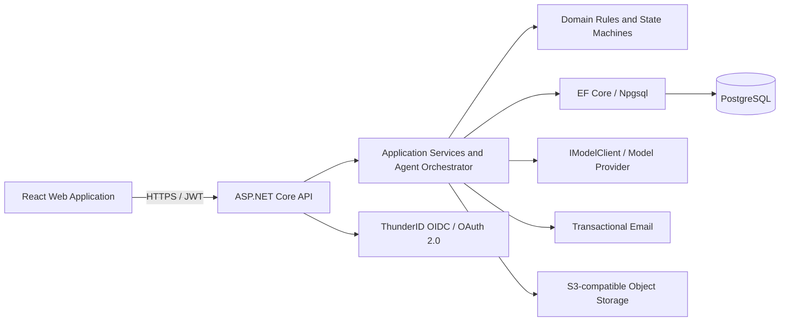
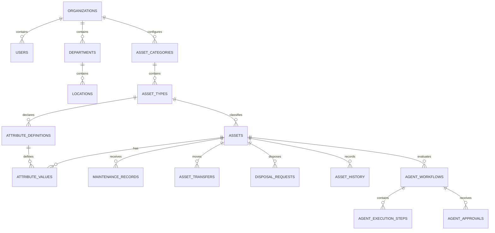
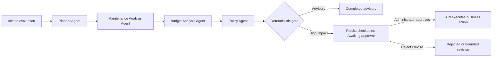

# SE3090 Assignment 1 – Consolidated Report

## 1. Cover Page

### CoreGrid — Intelligent Asset Lifecycle Management Platform

| Item | Detail |
|---|---|
| Module | SE3090 – Software Engineering Frameworks |
| Academic year | Year 3, Semester 1, 2026 |
| Group | SE3090_G&lt;NN&gt; |
| Submission version | 1.0 |
| Source baseline | CoreGrid SRS v1.1 and repository implementation |

### Group members

| Name | Student ID | Main component / responsibility |
|---|---|---|
| Jayashan Guruge | `<ID>` | Asset Registry and QR Identification; Planner Agent |
| Seneja Ramanayaka | `<ID>` | Maintenance Management; Maintenance Analysis Agent |
| Bhanuka Samarasinghe | `<ID>` | Transfer and Disposal; Budget Analysis Agent |
| Hasitha Erandika | `<ID>` | Audit and Compliance, configuration and user administration; Policy Agent; group leader |

> **Completion note:** Replace the group number and student-ID placeholders before export. This report intentionally excludes the Flutter mobile-application section, as requested. References to mobile workflows remain only where they are necessary to explain the overall system scope described in the SRS.

---

## 2. Group Report

### 2.1 Project Overview

#### 2.1.1 Project Background and Problem Statement

#### Problem

Organisations that manage vehicles, machinery, medical devices, IT equipment, furniture, and other physical assets often rely on disconnected spreadsheets and paper registers. This causes stale condition data, weak physical-verification evidence, reactive maintenance, inconsistent transfer/disposal decisions, and audit discrepancies that remain unresolved.

#### 2.1.2 Proposed Solution

CoreGrid is a configurable, role-controlled asset lifecycle management platform. It maintains one authoritative register for an organisation's assets and supports registration, QR identification, maintenance, transfer, physical verification, audit, reporting, and disposal. A controlled agentic-AI workflow assembles evidence for lifecycle decisions, but never changes business data itself. Deterministic rules and an authorised human approval checkpoint govern high-impact recommendations.

#### 2.1.3 Project Objectives

- Replace fragmented asset records with a secure, auditable digital register.
- Make asset domains configurable through categories, types, attribute definitions, locations, departments, and policies rather than source-code changes.
- Enforce lifecycle rules consistently through one ASP.NET Core API.
- Provide evidence-based, explainable recommendations for repair, retention, transfer, or disposal.
- Maintain organisation isolation, append-only history, auditability, and role-based access control.

#### 2.1.4 Project Scope and Target Users

The baseline release supports a self-hosted, single-customer deployment with four roles: Administrator, Auditor, Inventory Officer, and Department Staff. It includes assets, maintenance, transfers, disposals, verification campaigns, discrepancies, reports, notifications, and an asset-evaluation workflow. ERP integration, multi-tenant SaaS operations, and sovereign-cloud deployment are future enhancements.

### 2.2 Requirements

#### 2.2.1 Functional Requirements

#### Functional requirements

The SRS defines 86 functional requirements. The major requirement groups are summarised below.

| Requirement range | Capability | Key outcome |
|---|---|---|
| FR-001–009 | Identity and access | Authenticate through ThunderID; validate JWTs; enforce policy and organisation scope. |
| FR-010–020 | Configuration | Manage departments, locations, categories, asset types, policy thresholds, and dynamic attributes. |
| FR-021–032 | Asset registry | Register assets, generate unique codes/QR labels, search, track condition, calculate residual value, and preserve history. |
| FR-033–042 | Maintenance | Report faults, attach evidence, assign work, record cost/outcomes, and update status safely. |
| FR-043–055 | Transfer and disposal | Request, approve/reject, confirm receipt, condemn, and dispose with preconditions and segregation of duties. |
| FR-056–066 | Audit and compliance | Run verification campaigns, raise/resolve discrepancies, retain audit logs, and generate reports. |
| FR-067–076 | Agentic decision support | Initiate, inspect, validate, pause, approve/reject/revise, and execute controlled workflow decisions. |
| FR-077–080 | Notifications | Create and dispatch lifecycle notifications without blocking the business transaction. |
| FR-081–086 | Dashboard and reports | Present role-appropriate KPIs, filtered reports, and exports. |

#### 2.2.2 Non-Functional Requirements

The principal quality requirements are security, performance, reliability, maintainability, accessibility, portability, privacy, and testability. Examples include 95% of single-resource reads within 500 ms, 50 concurrent authenticated users with at least 99% success, PostgreSQL-backed transactions, server-side validation, HTTPS, structured logging, and append-only history/audit records.

#### 2.2.3 User Roles and Responsibilities

| Role | Main responsibilities |
|---|---|
| Administrator | Manages users, organisation configuration, categories/types, policy thresholds, and workflow approvals. |
| Auditor | Manages verification campaigns, reviews audit history, resolves discrepancies, and produces compliance reports. |
| Inventory Officer | Registers/manages assets, maintains records, verifies assets, and initiates lifecycle evaluations. |
| Department Staff | Performs limited operational actions such as asset lookup and fault reporting. |

#### 2.2.4 Business Rules and Requirements Traceability

- As an Inventory Officer, I want to register an asset with mandatory dynamic attributes so that the register reflects the organisation's domain.
- As an Administrator, I want to set repair-cost and service-life thresholds so that lifecycle recommendations follow organisational policy.
- As an Auditor, I want to resolve a verification discrepancy with evidence so that the register and audit trail remain accurate.
- As an authorised Administrator, I want to review the complete evidence behind a disposal recommendation before approving it.

### 2.3 System Architecture

#### 2.3.1 Architecture Overview and System Architecture

CoreGrid uses a layered, service-oriented architecture. The ASP.NET Core API is the sole authoritative application layer: it owns validation, authorisation, business rules, transactions, audit events, and agent-workflow execution. Clients never access PostgreSQL or third-party credentials directly.



#### 2.3.2 Backend, Frontend, Agentic AI, and External-Integration Architecture

- **React:** React 18/Vite, React Router, TanStack Query for server state, Zustand for small client/UI state, and IBM Carbon Design System for accessible enterprise UI.
- **ASP.NET Core:** C#/.NET 10 controllers, DTOs, FluentValidation, policy-based authorisation, EF Core, Npgsql, Swagger/OpenAPI, and dependency-injected service abstractions.
- **PostgreSQL:** relational storage, constraints, transactions, JSONB workflow artefacts, optimistic concurrency, and EF Core migrations.
- **Agentic AI:** one in-process orchestrator and four specialised `IAgentNode` implementations. Only the Planner uses the provider-neutral `IModelClient`; recommendations are constrained by deterministic validation and human approval.

### 2.4 Database Design

#### 2.4.1 ER Diagram

#### Entity-relationship overview



#### 2.4.2 Tables, Entities, and Relationships

The design includes cross-cutting entities (`Organizations`, `Users`, `Departments`, `Locations`, `OrganizationPolicies`); configuration entities (`AssetCategories`, `AssetTypes`, `AssetAttributeDefinitions`); lifecycle entities (`Assets`, `AssetAttributeValues`, `AssetHistory`, `MaintenanceRecords`, `AssetTransfers`, `DisposalRequests`); audit entities (`VerificationCampaigns`, `AuditVerifications`, `Discrepancies`, `AuditLogs`); and agent entities (`AgentWorkflows`, `AgentExecutionSteps`, `AgentApprovals`). Foreign keys express relationships explicitly. Lifecycle and audit records are retained rather than hard-deleted.

#### 2.4.3 Constraints, Indexes, and Migrations

- UUID primary keys are used for API-exposed entities; all organisation-scoped tables carry `OrganizationId`.
- `(OrganizationId, AssetCode)` is unique. Status values have database check constraints.
- Money uses `numeric(18,2)` and timestamps use UTC `timestamptz`.
- Indexes cover foreign keys plus asset status/condition/department/type, maintenance status, campaign, workflow status, and audit timestamp.
- PostgreSQL `xmin` is used as an optimistic-concurrency token; conflicting writes return HTTP 409 rather than silently overwrite data.
- Schema changes are versioned through committed EF Core migrations in `backend/Migrations/`; the repository currently contains migrations for the core schema, asset model, transfers/disposals, verification/discrepancies, workflows, audit logs, maintenance, notifications, and maintenance-analysis updates.

The custom-attribute model uses `AssetAttributeValues`, not a single JSON document, because foreign keys and typed filtering make dynamic-attribute validation and search reliable. JSONB is reserved for variable-shape agent workflow state, plans, tool traces, and validation results.

### 2.5 ASP.NET Core API

#### 2.5.1 Backend Technology, Controllers, DTOs, and Services

#### Architecture and services

Controllers receive request DTOs, validate models, enforce authorisation policies, and delegate to application services. Services own business operations such as asset creation, lifecycle transitions, transfer/disposal preconditions, policy-rule evaluation, notifications, and agent workflow orchestration. The domain layer holds entities and invariants; infrastructure supplies EF Core persistence, identity directory access, QR generation, storage, email, model access, and logging through interfaces.

#### 2.5.2 Validation, Error Handling, Authentication, and Authorization

ThunderID authenticates users using OIDC/OAuth 2.0. The API validates token signature, issuer, audience, and lifetime against JWKS, then resolves the `sub` claim to the local user mirror. CoreGrid controls permissions through policy-based authorisation and applies an organisation global query filter. FluentValidation and server-side DTO validation return structured HTTP 400 responses; unauthenticated and unauthorised requests return 401 and 403 respectively.

#### 2.5.3 API Endpoints, Status Workflows, Documentation, and Health Checks

| Area | Examples |
|---|---|
| Configuration | `GET/POST /api/departments`, `GET/POST/PUT /api/asset-types`, `GET/PUT /api/policies` |
| Assets | `GET/POST /api/assets`, `GET /api/assets/qr/{code}`, `POST /api/assets/{id}/verify`, `GET /api/assets/{id}/history` |
| Maintenance | `GET/POST /api/maintenance`, `POST /api/maintenance/{id}/assign`, `POST /api/maintenance/{id}/complete` |
| Transfer/disposal | `POST /api/transfers/{id}/approve`, `POST /api/transfers/{id}/confirm-receipt`, `POST /api/disposals/{id}/approve` |
| Audit/reports | `GET/POST /api/campaigns`, `POST /api/discrepancies/{id}/resolve`, `GET /api/reports/{type}` |
| AI workflows | `POST /api/workflows/asset-evaluation`, `GET /api/workflows/{id}/execution-summary`, `POST /api/workflows/{id}/approve` |
| Operations | `GET /health`, `GET /swagger` |

Swagger/OpenAPI provides the deployed, authoritative endpoint contract, DTO schemas, and security definitions.

### 2.6 React Web Application

#### 2.6.1 Application Overview, Components, and Routing

The web application is the management and control interface. Its feature-based React structure includes pages for dashboard/reporting, assets, maintenance, transfers/disposals, audit/compliance, configuration, users, and workflow monitoring/approval. Shared components handle status display, error states, loading states, notifications, and reusable Carbon UI primitives.

#### 2.6.2 State Management, Role-Based Access, and Core Functionality

TanStack Query manages cached server data, invalidation, error/loading states, and API requests. Zustand holds lightweight client-side session/UI preferences. Protected routes and role-aware navigation hide unavailable actions for usability; the backend remains the enforcement point. Existing test files cover shared utilities and report components/pages, while API integration modules organise report access.

#### 2.6.3 Search, Forms, Error States, and Workflow Approval

Asset and report interfaces use server-side filtering/pagination where supported by the API. Forms submit DTO-shaped data to the API and surface structured errors. The workflow page displays in-flight, awaiting-approval, and completed states; only an Administrator is presented with approval controls. The backend is the final authorisation boundary.

### 2.7 Flutter Mobile Application

#### 2.7.1 Evidence Availability

The SRS specifies a Flutter field-operations client with QR scanning, physical verification, fault reporting, and transfer receipt. However, the supplied repository contains no Flutter/Dart project, mobile source, APK, test suite, screenshots, or deployment evidence. Therefore no implementation claim, feature description, test result, or distribution detail can be made in this report. This is a material gap against the assignment requirement and against the SRS cross-platform workflow; the missing artefacts must be added and verified before submission.

### 2.8 Agentic AI

#### 2.8.1 Overview, Workflow, and Agent Roles

#### Workflow and specialised agents

The assessed asset-lifecycle evaluation uses four distinct agents, satisfying the four-student-group requirement.



| Agent | Responsibility | Allowed evidence/tools |
|---|---|---|
| Planner | Converts a sanitised asset objective into a structured plan and explains evidence needs. | Asset profile and allowed workflow context; only node allowed to call the model. |
| Maintenance Analysis | Assesses maintenance history, condition, failures, and repair context. | Read-only asset/maintenance history tools. |
| Budget Analysis | Assesses residual value, repair/replacement cost relationship, and budget evidence. | Read-only valuation and budget-summary tools. |
| Policy | Applies configured organisation policy and business rules to the evidence. | Read-only policy and evidence tools. |

#### 2.8.2 Tools, Structured Outputs, State, Validation, Approval, and Safety

`AgentWorkflow`, `AgentExecutionStep`, and `AgentApproval` records persist the objective, plan, structured outputs, tool results, validation results, errors, decision, and checkpoint. Raw prompts, chain-of-thought, tokens, credentials, and raw model responses are not persisted.

All agent tools are read-only, schema-validated, organisation-scoped from persisted state, allow-listed per agent, logged with duration/retry metadata, limited to 15 seconds, and retried at most twice. The deterministic gate validates output schema and policy/business rules. High-impact recommendations pause in `AWAITING_APPROVAL`; only an Administrator holding `workflow:approve` may approve, reject, or request revision. The API re-checks ordinary preconditions and writes audits when executing an approved action.

Failures such as malformed output, unavailable tools, timeout, policy failure, or excessive revision terminate in a safe state without changing business data. Workflow execution is bounded to 120 seconds. Prompt-injection text is treated as data, sanitised and delimited, and cannot alter tool access, organisation scope, or approval rules.

### 2.9 Third-Party Integration

#### 2.9.1 Integration Overview, Identity, Model, Email, and Storage

| Service | Why it is needed | Integration and safeguards |
|---|---|---|
| ThunderID | External user authentication and directory functions. | OIDC/OAuth 2.0 with PKCE; API validates JWTs; CoreGrid retains internal authorisation and organisation scoping. |
| Transactional email provider | Sends approval and lifecycle notifications. | Reached through `INotificationService`; failures are logged/retried and never roll back the business transaction. API keys remain in environment variables. |
| S3-compatible object storage / Cloudflare R2 default | Holds maintenance-photo evidence outside PostgreSQL. | Accessed only by the backend through `IBlobStorageService`; opaque `StorageKey` is persisted; uploads are MIME/size checked and re-encoded; retrieval uses authorised short-lived signed URLs. |
| Configured model provider | Supports structured planning where a model is genuinely needed. | Reached only by `IModelClient` from the Planner node; credentials remain in the server environment and personal data is excluded. |

### 2.10 Testing Report

#### 2.10.1 Testing Strategy

The SRS requires automated tests for deterministic rules, inspection for structural controls, demonstrations for user journeys, and measurement for performance. The repository provides test source but no supplied test-run/CI output; therefore execution outcomes are **Not verified** unless independently attached.

#### 2.10.2 Testing Environment

The SRS specifies real PostgreSQL for database integration, a seeded demonstration organisation, and an ephemeral PostgreSQL service in CI. Actual environment configuration, CI run, and test output are not provided.

#### 2.10.3 Backend Testing

**Test Case: Disposal lifecycle transaction.** `DisposalServiceTests.FullHappyPath_Condemn_Submit_Approve_TransitionsToDisposedAtomically` defines the scenario from condemnation through approved disposal. Expected behaviour is a valid transition to `DISPOSED` only when preconditions and separation of duties pass. **Actual result:** Not verified. **Evidence required:** `dotnet test` output and database/audit records. **Traceability:** FR-049–055; DR-10; `DisposalsController`.

**Test Case: Transfer receipt transition.** `TransferServiceTests.ConfirmReceipt_WhenTransferIsApproved_SucceedsAndUpdatesLocationDepartmentAndActiveStatus` verifies that confirmed receipt updates location, department, and asset status only for an approved transfer. **Actual result:** Not verified. **Evidence required:** test output and `AssetTransfers`/`Assets` records. **Traceability:** FR-043–048.

**Test Case: Workflow approval authorisation.** `AuthorizationMatrixTests.DecideAgentWorkflow_EnforcesAI14_AdministratorOnly` asserts that only the Administrator can decide a paused workflow. **Actual result:** Not verified. **Evidence required:** test output showing allow/deny role cases. **Traceability:** AI-14; FR-071–075.

#### 2.10.4 Database Testing

**Test Case: Append-only audit and history protection.** `AppendOnlyTests` exercises denied update/delete attempts on `AuditLogEntries` and `AssetHistory`. **Actual result:** Not verified. **Evidence required:** test output and database permissions/records. **Traceability:** DR-12; NFR-38.

**Test Case: Transfer atomicity.** `TransferServiceTests.AtomicityIntent_WhenInitiateFailsValidation_NoPartialStateIsSaved` documents the expected rollback behaviour when validation fails. **Actual result:** Not verified. **Evidence required:** test output and before/after database query results. **Traceability:** DR-10; NFR-23.

**Test Case: Organisation isolation and workflow persistence.** The SRS requires a global `OrganizationId` filter and persisted `AgentWorkflow`, `AgentExecutionStep`, and `AgentApproval` state. No supplied database-integration test result demonstrates this end to end. **Actual result:** Not executed/verified. **Evidence required:** real PostgreSQL integration test showing cross-organisation denial and restart/resume from a checkpoint. **Traceability:** DR-04; AI-08–12.

#### 2.10.5 React Testing

**Test Case: Audit-report role visibility.** `ReportsPage.test.tsx` checks that an Administrator sees the Audit tab while an Inventory Officer does not. **Actual result:** Not verified. **Evidence required:** Vitest output. **Traceability:** React role-aware navigation; FR-065; NFR-10.

**Test Case: Audit report loading, error, and pagination states.** `AuditReportPanel.test.tsx` defines loading, successful display, defensive empty data, error, and server-pagination scenarios. **Actual result:** Not verified. **Evidence required:** Vitest output. **Traceability:** FR-081–086; NFR-28.

**Test Case: Workflow UI role gating.** `WorkflowsPage.test.tsx` contains workflow rendering, initiation visibility, completed state, and failed-load cases. **Actual result:** Not verified. **Evidence required:** Vitest output and an Administrator workflow-approval screenshot/API response. **Traceability:** FR-067–076.

#### 2.10.6 Flutter Testing

No Flutter/Dart source, tests, APK, or screenshots are supplied. Consequently, no genuine Flutter test case can be reported. This is **Missing** evidence, not a passing result. Required evidence includes the mobile project, scanner/device test results, API-integration tests, and an APK build record.

#### 2.10.7 Integration and End-to-End Testing

The SRS defines a golden workflow: evaluation initiation → Planner → Maintenance → Budget → Policy → deterministic gate → Administrator decision → ordinary disposal service → audit/history update. No supplied E2E run proves this chain. There is also an endpoint terminology conflict: the SRS names `/api/workflows/...`, while the React implementation references `/agent-workflows/...`; this must be reconciled through Swagger and an executed E2E record. **Status:** Not executed/verified.

#### 2.10.8 Agentic AI Testing

Repository tests cover planner safe fallback/out-of-scope objective rejection, tool/depreciation logic, policy-rule scenarios, and approval authorisation. The SRS additionally specifies GC-01–GC-12 for planning/delegation, allow-list enforcement, structured outputs, policy validation, approval, injection resistance, tool timeout, revision, and safe failure. Test source is not evidence of successful execution; attach output for every claimed case.

#### 2.10.9 Performance Testing

The required profile is 50 virtual users for five minutes with a 70:30 read/write mix and at least 500 assets/1,500 maintenance records. Measurements are not provided; see Section 2.12 for targets separated from results.

#### 2.10.10 Testing Summary

Backend and React test source is available; database, workflow persistence, E2E, Flutter, CI, and performance evidence is incomplete or missing. Collect command output, screenshots only where relevant, database assertions, Swagger evidence, and benchmark reports before assigning PASS/FAIL status.

### 2.11 Agentic AI Evaluation Report

#### 2.11.1 Evaluation Strategy and Golden Cases

The following evidence should be attached as test output, screenshots, or a demonstration recording.

| Evaluation criterion | Evidence / expected behaviour |
|---|---|
| Planning and delegation | Planner produces ordered steps; all four specialised agents execute in the expected sequence. |
| Tool selection | An allow-list test refuses an unauthorised tool call and records a security event. |
| Structured outputs | Invalid/missing required fields fail schema validation before entering state. |
| Business rules | Policy gate blocks invalid disposal and records the violated rule. |
| Human approval | Disposal recommendation pauses; unauthorised approver receives 403; Administrator decision has a reason and snapshot. |
| Prompt injection | Instruction-like objective text cannot expand tool permissions, scope, or bypass approval. |
| Failure recovery | Tool timeout has bounded retries; a revision resumes from checkpoint without re-running completed work. |
| Safe failure | Schema/tool/timeout failure ends without a business-state change. |

The SRS defines twelve deterministic golden cases: correct disposal, correct repair, policy block, revision path, insufficient data, allow-list enforcement, prompt injection, schema violation, tool timeout, approval authorisation, approval execution, and rejection. They are deliberately asserted against state and rules rather than model wording.

#### 2.11.2 Planning, Tools, Validation, Approval, Security, and Failure Evaluation

The table above maps the required evaluation dimensions. No completed GC-01–GC-12 output was supplied, so evaluation results are **Not verified** rather than PASS.

### 2.12 Performance Report

#### 2.12.1 Objectives, Environment, and Acceptance Criteria

The SRS establishes the following acceptance targets. Populate the “Measured result” column only after executing the documented load test; do not substitute targets for observed results.

| Metric | Acceptance target | Measured result |
|---|---|---|
| Single-resource reads, p95 | ≤ 500 ms server-side | `TBD after benchmark` |
| Paginated list reads, p95 | ≤ 800 ms server-side | `TBD after benchmark` |
| QR lookup | ≤ 1 s server-side | `TBD after benchmark` |
| Concurrent use | 50 authenticated users; ≥99% success; no deadlocks | `TBD after benchmark` |
| Report generation | ≤ 5 s on seeded dataset | `TBD after benchmark` |
| Agent workflow | median ≤ 60 s; hard maximum 120 s | `TBD after benchmark` |

Report p50/p95/p99 response times, success/failure rate, the five slowest database queries, agent median/p95 latency, environment specifications, dataset size, and remediation for any failed target.

#### 2.12.2 Results and Analysis

No benchmark result is provided. Every value in the preceding table is an acceptance target, not a measured result.

### 2.13 Deployment Report

#### 2.13.1 Deployment Overview, Configuration, and Health Checks

The baseline is a container-friendly self-hosted deployment. Start PostgreSQL, apply EF Core migrations, seed data idempotently, start the ASP.NET Core API, then publish the React static build. The agent orchestration runs inside the API, so it does not require a separate workflow runtime. The `/health` endpoint reports dependency status and `/swagger` exposes the API contract.

Required environment-variable names include:

```text
ConnectionStrings__CoreGrid
ThunderID__Issuer
ThunderID__Audience
ThunderID__ScimClientId
ThunderID__ScimClientSecret
Email__ApiKey
Email__FromAddress
Cors__AllowedOrigins
Model__ApiKey
```

Values must be supplied by deployment configuration and never committed. Before submission, verify evaluator URLs in a private browser session, provide test accounts through the submission rather than the repository, and record a rollback path using the previous image and migration state.

#### 2.13.2 CI/CD and Access Evidence

The SRS requires CI, but no CI workflow/run, deployed endpoint, or evaluator-access record is supplied. Flutter distribution is also missing because no Flutter artefact is supplied.

### 2.15 Security

#### 2.15.1 Security Controls and Testing Evidence

- JWT bearer tokens are validated for signature, issuer, audience, and expiry; the API maps `sub` to the local user mirror.
- Policy-based authorisation is declared on endpoints and backed by role permissions; a global organisation filter prevents cross-organisation reads/writes.
- PKCE is used for public clients. Tokens, passwords, model keys, bucket credentials, and database credentials are never committed or logged.
- Server-side FluentValidation, parameterised EF Core queries, file MIME/size checks, re-encoding, safe error responses, rate limiting, HTTPS/HSTS, dependency scans, and secret scanning mitigate common web risks.
- Agent tools are read-only, allow-listed, schema-checked, time-bounded, private-network/API authenticated, and scoped from persisted workflow state rather than agent-generated text.
- Audit logs and asset history are append-only. Correlation IDs trace an action across client, API, database, and workflow execution.

### 2.14 Architecture Decision Records

#### 2.14.1 ADR Overview and Required Decisions

| ADR | Decision |
|---|---|
| ADR-001 | Use layered architecture and one authoritative public ASP.NET Core API. |
| ADR-002 | Use ThunderID for authentication/directory functions while retaining API authorisation. |
| ADR-003 | Use TanStack Query for React server state and Zustand for local client/UI state. |
| ADR-006 | Use attribute-value tables for dynamic asset attributes and JSONB for workflow state. |
| ADR-007 | Use a container-based deployment strategy for the system components. |
| ADR-008 | Use IBM Carbon Design System for the React visual language. |
| ADR-009 | Use Cloudflare R2 by default behind an S3-compatible storage abstraction. |
| ADR-010 | Use one .NET-native in-process orchestrator and four agent nodes; Planner-only model access via `IModelClient`. |

ADR-004 (Flutter/Riverpod) is intentionally omitted from this report's detailed scope. ADR-005, the original LangGraph decision, has been superseded by ADR-010.

The full submission-ready records, using the required seven-part ADR format, are in [SE3090-Assignment-1-ADRs.md](SE3090-Assignment-1-ADRs.md).

---

### 2.16 Git, Collaboration, and CI

#### 2.16.1 Repository, Collaboration, and CI Evidence

The SRS requires GitHub Actions to build and test backend and React code, scan secrets, and use PostgreSQL for database integration. The supplied repository includes Git history and test source, but no supplied CI configuration/run, pull-request review record, issue record, or branch-policy evidence. These items are **Not verified** and must be attached before submission.

### 2.17 Individual Contributions

#### 2.17.1 Jayashan Guruge

The SRS assigns Component A (Asset Registry and QR Identification) and the Planner Agent. Individual commit/PR, test, challenge, reflection, and AI-usage evidence is not provided.

#### 2.17.2 Seneja Ramanayaka

The SRS assigns Component B (Maintenance Management) and the Maintenance Analysis Agent. Individual commit/PR, test, challenge, reflection, and AI-usage evidence is not provided.

#### 2.17.3 Bhanuka Samarasinghe

The SRS assigns Component C (Transfer and Disposal) and the Budget Analysis Agent. Individual commit/PR, test, challenge, reflection, and AI-usage evidence is not provided.

#### 2.17.4 Hasitha Erandika

The SRS assigns Component D (Audit/Compliance, organisation configuration, user administration), the Policy Agent, and group-lead responsibility. Individual commit/PR, test, challenge, reflection, and AI-usage evidence is not provided.

### 2.18 Challenges, Solutions, and Learning

#### 2.18.1 Documented Challenges and Solutions

The SRS records important design challenges: configurable domains, controlled agent recommendations, organisation isolation, evidence retention, and the operational burden of multiple runtimes. The selected solutions are dynamic attribute definitions, policy/deterministic gates with approval, global organisation filters, S3-compatible evidence storage, and an in-process .NET agent orchestrator. Individual reflections and measured outcomes are not provided.

#### 2.18.2 Future Improvements

The SRS identifies multi-tenant SaaS, ERP integration, sovereign-cloud deployment, offline synchronisation, additional agents, and stronger operations as future work. These are not baseline completion claims.

### 2.19 AI Usage and Declaration

#### 2.19.1 AI Usage Evidence

The SRS includes an AI-usage disclosure appendix, but no member-specific logs or signed group declaration are reproduced in this report. Attach the required individual logs, verification records, and group declaration; until then their status is **Not verified**.

### 2.20 Conclusion

#### 2.20.1 Project Summary and Limitations

CoreGrid specifies and partially evidences a configurable asset-lifecycle platform using ASP.NET Core, PostgreSQL, React, ThunderID, controlled agentic AI, and third-party services. The repository shows backend/React source, migrations, and tests. Flutter implementation evidence, executed E2E/CI/performance evidence, deployment access, and individual evidence remain gaps that must be closed for a complete assignment submission.

### 2.21 References

- CoreGrid Software Requirements Specification, `doc/SRS/` (including architecture, requirements, data, API, validation, deployment, traceability, ADR, and AI-disclosure documents).
- CoreGrid repository source, migrations, backend tests, and React tests.

### 2.22 Appendices

Only attach appendices for evidence actually collected: Swagger/API export, ER/database queries, test output, agent evaluation output, benchmark results, screenshots, Git/PR evidence, and AI-usage logs. Do not include empty appendices.

## 3. Assignment Completeness Check

| Requirement | Report Section | Evidence Available | Missing Evidence | Status |
|---|---|---|---|---|
| ASP.NET Core API | 2.5 | Backend source/controllers/services | Executed API evidence | PARTIALLY COMPLETE |
| PostgreSQL | 2.4 | EF migrations and schema documents | Executed database evidence | PARTIALLY COMPLETE |
| React | 2.6 | React source and tests | Executed test/build evidence | PARTIALLY COMPLETE |
| Flutter | 2.7 | SRS requirement only | Source, APK, tests, screenshots | MISSING |
| Agentic AI / four agents | 2.8 | SRS and backend agent-related tests | Full executed workflow trace | PARTIALLY COMPLETE |
| Planning, delegation, structured I/O, persistence, validation, approval | 2.8, 2.11 | SRS design; selected source tests | GC-01–GC-12 output | NOT VERIFIED |
| Third-party integration | 2.9 | SRS/integration abstractions | Live configuration/operation evidence | PARTIALLY COMPLETE |
| Cross-platform workflow | 2.3, 2.7, 2.10 | SRS only | Flutter implementation and E2E run | MISSING |
| Backend/database/React testing | 2.10 | Test source | Test-run and CI output | PARTIALLY COMPLETE |
| Flutter/E2E/performance testing | 2.10, 2.12 | SRS targets | Tests and measurements | MISSING |
| Git and CI | 2.16 | Repository only | CI, PR, issue, review evidence | NOT VERIFIED |
| Deployment | 2.13 | SRS startup/design | Deployed URLs and access evidence | NOT VERIFIED |
| ADRs | 2.14 | ADR index and ADR appendix | Required cloud-platform decision detail | PARTIALLY COMPLETE |
| Security | 2.15 | SRS and implementation structure | Security-test output | PARTIALLY COMPLETE |
| Individual contributions / AI declaration | 2.17, 2.19 | SRS work allocation | Member evidence/logs/declaration | NOT VERIFIED |

## 4. Submission Evidence Checklist

Before creating the final PDF, attach or link the following evidence:

- Deployed React URL, API URL, `/health`, and `/swagger` URL.
- Screenshots of asset configuration, asset lifecycle operations, report/dashboard, and the workflow execution/approval view.
- ER diagram and migration history.
- Passing backend and React test results, plus CI run link/screenshot.
- Golden-case output for GC-01 to GC-12, including prompt-injection and safe-failure cases.
- A completed performance-test table with real measurements.
- Test accounts and startup instructions supplied separately from source control.

## 3. Source Traceability

This report is derived from the CoreGrid SRS in `doc/SRS/`, especially the architecture, functional requirements, agentic-AI requirements, data requirements, API specification, non-functional requirements, third-party integration, verification/validation, deployment/operations, traceability, and ADR index documents. Implementation evidence was cross-checked against the repository's ASP.NET Core source, EF Core migrations, React source, and test projects.
