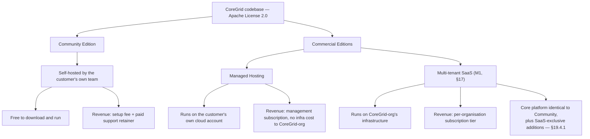
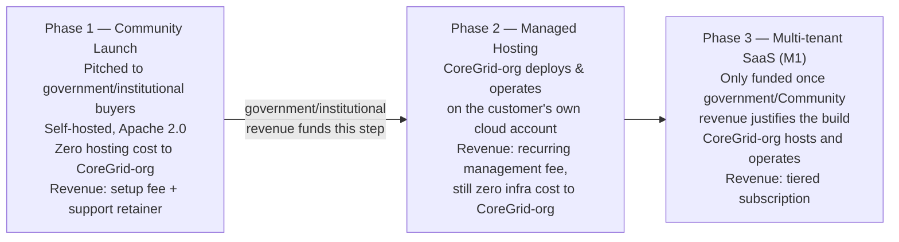
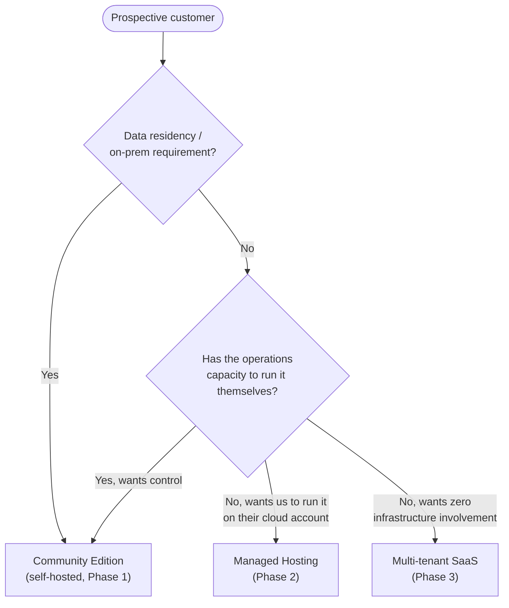
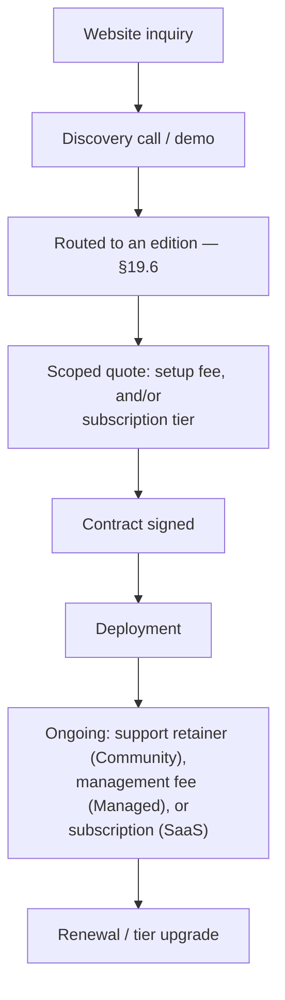
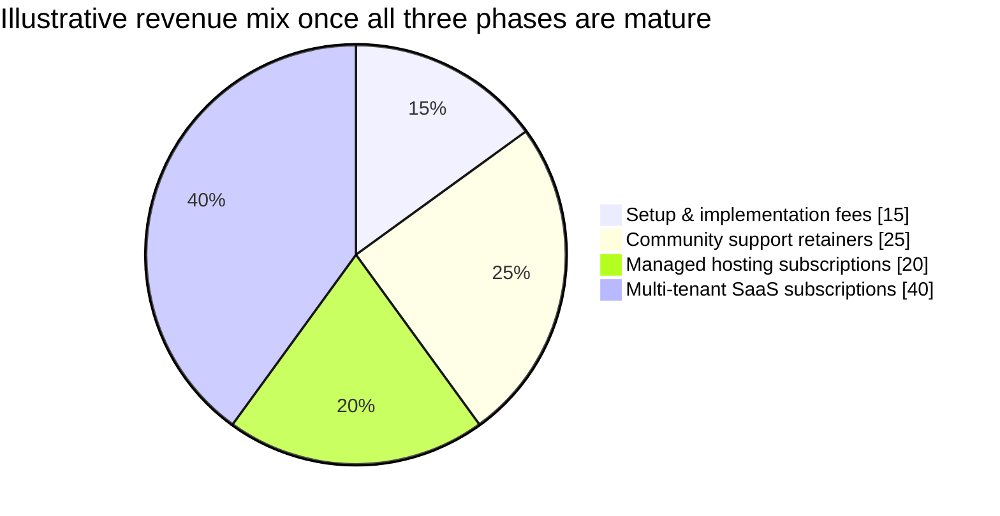
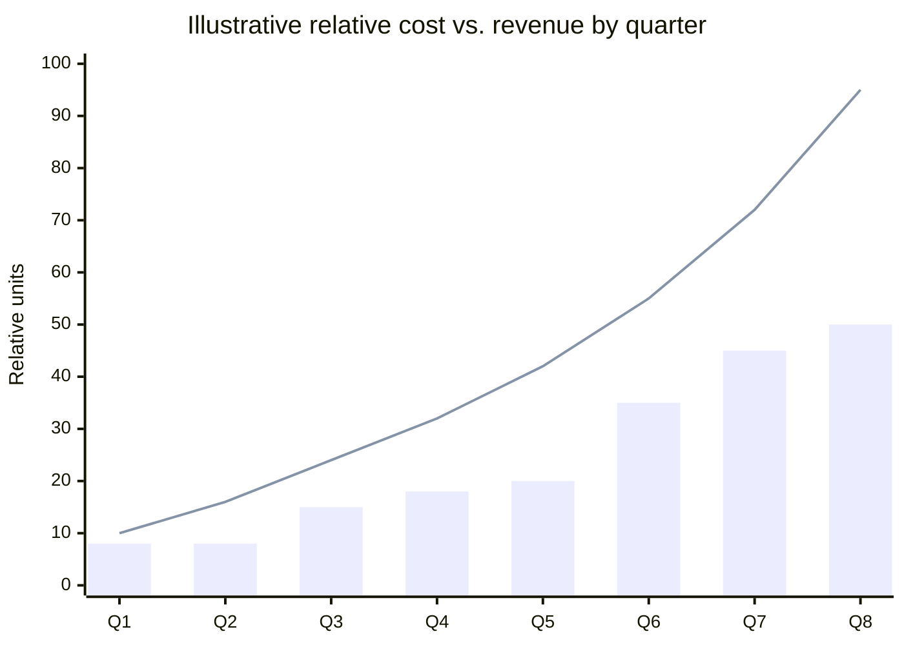

# 19. Business Plan

## 19.1 Purpose and Scope

Chapter 17 established that CoreGrid is built in two architectural stages — M0 (self-hosted, one deployment
per customer, the current baseline) and M1 (shared multi-tenant SaaS) — and that the codebase is already
shaped to make the second stage additive rather than a rewrite (every entity is organisation-scoped; see
§19.10). This chapter turns that staged architecture into a staged commercial plan: who the buyer is, how
the product is licensed and packaged, how revenue is sequenced so the group is never funding infrastructure
it cannot afford ahead of revenue, and what changes in the architecture before each stage can be sold. It
adds no functional or non-functional requirement — nothing here carries an FR/NFR ID — and does not alter
the scope defined in §6–§10. It is the commercialisation narrative the rest of the SRS supports.

## 19.2 Market and Buyer Profile

The four user personas in §2.3 (Department Staff, Inventory Officer, Auditor, Administrator) describe who
*operates* CoreGrid day to day. The buyer is different: typically an IT lead, finance/procurement officer,
or an auditor-general's office at an asset-heavy public-sector or institutional body — transport
authorities, hospitals, universities, municipal governments — with an existing, often manual or
spreadsheet-based, asset register and a compliance or audit obligation (FR-064, the audit-log read API)
driving the purchase. Two buyer traits shape the packaging in §19.4:

- **Data residency and procurement policy** frequently rules out a shared multi-tenant cloud service outright
  for public-sector buyers, regardless of price — self-hosting is not a discount tier for this segment, it
  is a hard requirement.
- **Operations capacity varies enormously.** A national ministry may have a platform team able to run five
  cooperating services (§3.2); a district hospital's IT department typically cannot. Packaging has to serve
  both without pretending they have the same constraints.

## 19.3 Licensing Foundation

CoreGrid is licensed under the **Apache License, Version 2.0** (`LICENSE`, `NOTICE`) — the same choice WSO2
makes across its own open-source portfolio, including the identity and integration platforms this plan is
modelled on. Apache 2.0 was chosen over the alternatives considered for three business reasons, not only a
technical one:

| Alternative considered | Why it was rejected for this plan |
|---|---|
| MIT (the project's original license) | Permissive in the same way as Apache 2.0, but carries no explicit patent grant — a detail institutional legal review in the target market (§19.2) specifically checks for before approving self-hosted deployment of third-party software. |
| GNU AGPLv3 | Would force a competitor who forked and re-hosted CoreGrid to publish their changes, but the copyleft condition is exactly the clause enterprise and government legal teams flag as a blocker, undermining Community-edition adoption (§19.4) more than it protects the SaaS edition. |
| Business Source License | Strongest protection against a third party reselling CoreGrid as a competing hosted service, but is not OSI-approved open source — it would misrepresent the Community edition's positioning as genuinely open, and complicates the licence review this market segment already performs on Apache/MIT-style terms routinely. |

Apache 2.0 is a licensing choice, not a pricing one — it governs the *code*, not what CoreGrid-org charges
for setup, support, hosting, or SaaS access. §19.4 is where the money is.

## 19.4 Business Model: Open-Core

Three models were compared before arriving at this one:

| | Model A — Self-hosted only | Model B — SaaS only | **Model C — Open-Core (adopted)** |
|---|---|---|---|
| Revenue | One-time licence/setup fee + optional ad hoc support | Recurring subscription | Both, staged |
| Hosting cost borne by CoreGrid-org | None | High, from day one | None initially, added in Phase 2–3 (§19.5) |
| Fits data-residency buyers (§19.2) | Yes | No | Yes, via the Community edition |
| Fits low-ops-capacity buyers | No — they must run five services themselves | Yes | Yes, via Managed/SaaS editions |
| Recurring revenue | Only if support is sold as a retainer, not ad hoc | Yes | Yes, from Phase 1 onward if support is retainer-based |
| Cash-flow risk | Low | High — infrastructure spend precedes revenue | Low — self-funds its own later phases |

Model C is the WSO2/Choreo pattern: the same Apache-2.0 codebase ships as a free-to-download **Community
Edition** for self-hosting, and CoreGrid-org separately sells hosting and support around it.

Community, Managed, and SaaS are **not** a stripped/full split of the same feature set. The complete
lifecycle platform — every FR in §6, everything a government buyer needs — ships in Community and stays
there permanently; nothing is held back to justify SaaS. This isn't a courtesy, it's structural: §19.2
already established that the data-residency buyer cannot use SaaS at all, so a feature only available in
SaaS is a feature that buyer can never reach regardless of price, which would quietly undo the reason this
plan goes open source in the first place. SaaS instead sells things that are **additive and infrastructure-
native** — capable only once CoreGrid-org is operating shared, multi-tenant infrastructure, not artificially
withheld from a self-hosted deployment. §19.4.1 lists them. Engineering cost still doesn't triple: the core
tree is one codebase reaching Community, Managed, and the base of SaaS identically: only the SaaS-exclusive
layer is built once and only for that edition.

### 19.4.1 What SaaS Adds

Drawn from Chapter 17's Future Enhancements — items already deferred from the baseline for being
infrastructure-dependent, not for being valuable enough to paywall:

| SaaS-exclusive addition | Why it's SaaS-native, not a removed Community feature |
|---|---|
| Cross-organisation benchmarking and analytics | Only meaningful with multiple tenants on one platform — cannot exist in a single-organisation Community deployment, not withheld from one |
| Additional agents — procurement recommendation, warranty analysis, fleet-level optimisation (§17) | New capability built on top of the same agent-graph/tool allow-list mechanism (§17 notes it's agent-agnostic), not a gated version of the four baseline agents |
| Trained predictive-failure models replacing the Maintenance Analysis Agent's statistical projection (§17) | An upgrade path behind the same stable contract (§17) — Community keeps its statistical version, nothing is removed from it |
| Offline field capture with deferred synchronisation (§17) | Needs a sync/queue service Community deployments don't run; the Flutter data layer is already provider-mediated for exactly this addition (§17) |
| Push notification alongside email (§17) | Additive channel — `INotificationService` already abstracts this for a second implementation, not a replacement |
| Computer-vision condition assessment from captured photographs (§17) | Requires a model-serving pipeline only justified at CoreGrid-org's own operating scale |
| Managed backups, automatic scaling, zero-downtime upgrades | Operational guarantees only possible when CoreGrid-org runs the shared infrastructure itself |
| Delegated administration hierarchies and access-review governance (§17) | Uses nesting ThunderID's organisation model already supports but the baseline doesn't configure (§17) — new configuration, not new gating |
| ERP and financial-system integration (§17) | Far-horizon item already deferred for build complexity, not for monetisation |

If a capability is ever proposed for this list that a government/institutional Community deployment would
need to reach parity with SaaS, that's a sign it belongs in Community instead — this table only holds
genuinely additive, infrastructure-native capability, consistent with §19.2's constraint.

## 19.5 Phased Rollout

The three edition types in §19.4 are not launched simultaneously — sequencing them is what solves the
"we cost more than the customer initially" affordability problem raised when this plan was first discussed.

**This is the deliberate, adopted decision, not one option among several**: pitch the Community edition to
government and institutional buyers first, because §19.2 already established that segment cannot use a
shared SaaS regardless of price — self-hosted is the only door open to them, so it is the door this plan
walks through first. Phase 1 requires no infrastructure spend from CoreGrid-org and validates the product
with real government/institutional customers. Multi-tenant SaaS (Phase 3) is **not** built speculatively —
it is built only once Phase 1 government/Community-edition revenue funds it, which is what removes the
"we cost more than the customer initially" affordability problem raised when this plan was first discussed.
Phase 2 (Managed Hosting) is the optional bridge for a buyer who wants Community-edition control without
running the ops themselves; it is not a prerequisite for Phase 3. §17's note that the organisation-scoping
already in the schema makes the M1 addition small, not a rewrite, is what keeps Phase 3 a bounded engineering
cost once it is funded, rather than an open-ended one.

## 19.6 Customer Routing

A prospective customer is routed to the edition that fits their actual constraint, not sold whichever one is
easiest to close:

## 19.7 Go-to-Market Flow

The website referenced in the original proposal — "anyone can reach us and ask for the software" — is the
top of this funnel (`W`), not the transaction itself; §19.6's routing happens on the discovery call, before a
quote is produced.

## 19.8 Revenue Streams and Pricing Sketch

| Stream | Edition | Basis | Notes |
|---|---|---|---|
| Setup / implementation fee | Community | One-time, scoped to org size and attribute-model complexity (§3.5) | Covers initial deployment, ThunderID registration, data migration from the customer's existing register |
| Support retainer | Community | Monthly/annual, tiered by response-time SLA | Must be sold as a retainer, not ad hoc — ad hoc support produces no recurring revenue line at all |
| Management subscription | Managed | Monthly, per deployment | Covers operating the five cooperating services (§3.2) on the customer's own cloud billing |
| SaaS subscription | Multi-tenant SaaS | Monthly, tiered (e.g. Starter / Professional / Enterprise) by asset count and/or seat count | Prices the hosting *and* the SaaS-exclusive additions in §19.4.1 — not a markup on features Community already has for free |

Illustrative revenue mix once all three phases are live and mature (not a forecast for Phase 1 alone, where
setup fees and support retainers are the only streams that exist yet):

## 19.9 Illustrative Cost and Revenue Trajectory

Relative, illustrative figures only — a planning shape for the group's own commercial reasoning, not an
audited or committed financial forecast. Units are relative, not currency, since Phase-3 pricing (§19.8) is
not yet fixed.

| Quarter | Phase active | Relative cost to CoreGrid-org | Relative revenue | Cumulative net |
|---|---|---|---|---|
| Q1 | 1 | 8 | 10 | +2 |
| Q2 | 1 | 8 | 16 | +10 |
| Q3 | 1 → 2 | 15 | 24 | +19 |
| Q4 | 2 | 18 | 32 | +33 |
| Q5 | 2 | 20 | 42 | +55 |
| Q6 | 2 → 3 | 35 | 55 | +75 |
| Q7 | 3 | 45 | 72 | +102 |
| Q8 | 3 | 50 | 95 | +147 |

Cost stays low and flat through Q1–Q2 (Phase 1: no infrastructure spend, §19.5) and only steps up at the
Phase 2 and Phase 3 transitions (Q3 and Q6), by which point cumulative net from the earlier phase is already
positive — the sequencing exists specifically so that step-up in cost is never funded ahead of revenue that
justifies it.

## 19.10 Architecture Readiness and Gaps

Two facts from elsewhere in the codebase and this SRS bound what Phase 3 can promise before engineering work
closes the gap:

| Requirement | Current state | Implication for this plan |
|---|---|---|
| Organisation scoping (relevant to FR-006) | Every entity carries an `OrganizationId`, but it is enforced manually per query rather than via an EF Core global query filter (tracked ❌ in `doc/PROGRESS.md` for exactly this reason) | Safe for Phase 1–2, where each deployment serves exactly one organisation. **Must be hardened to a global filter before Phase 3** — a missed manual filter in a shared multi-tenant database is a cross-tenant data leak, not a cosmetic bug. This is a Phase-3 entry criterion, not a nice-to-have. |
| M1 lift described in §17 | "Lifting `SetupController`'s restriction to exactly one `Organizations` row... and adding per-tenant billing" | Confirms Phase 3 is bounded, additive engineering work, not a rewrite — supports the cost shape in §19.9 |

## 19.11 Risk Register

| ID | Risk | L | I | Response |
|---|---|---|---|---|
| BR-01 | Phase 1 support is sold ad hoc instead of as a retainer, producing no recurring revenue to fund Phase 2. | M | H | §19.8 fixes support as a retainer product from the first Community-edition sale, not an afterthought. |
| BR-02 | A third party forks the Apache-2.0 codebase and resells it as a competing hosted service. | M | M | Accepted risk of the licence choice (§19.3) — mitigated by being the vendor of record for support, compliance evidence, and managed/SaaS convenience, which a fork cannot trivially replicate. |
| BR-03 | Phase 3 (multi-tenant SaaS) is sold before the organisation-scoping gap in §19.10 is closed. | L | H | Treated as a hard Phase-3 entry criterion, not a parallel workstream — no SaaS tenant onboarding until the global query filter lands and is tested. |
| BR-04 | A data-residency buyer is routed to Managed or SaaS by mistake, losing the sale or breaching their procurement policy. | L | H | §19.6's routing puts the residency question first, before operations capacity, so it can never be skipped by a keen-to-close conversation. |
| BR-05 | Phase 2 management-fee pricing is set too low to cover the operational overhead of running five services (§3.2) per customer. | M | M | Managed-hosting pricing is scoped per deployment at quote time (§19.8), not fixed as a flat rate, until real operating cost data exists from the first few Phase 2 customers. |

## 19.12 Traceability

This chapter does not introduce FR/NFR identifiers; it depends on and extends the following:

| Section | Relationship |
|---|---|
| §2.3 (User Classes) | Defines the operators; §19.2 defines the buyer, a distinct role |
| §3.2, §3.5 | Five cooperating services and the configurable platform model — what Managed and SaaS editions actually operate |
| §17 (Future Enhancements) | Source of the M0/M1 staging this chapter turns into Phase 1–3, and the direct source of every SaaS-exclusive addition listed in §19.4.1 |
| FR-006 / `doc/PROGRESS.md` | Source of the Phase-3 entry criterion in §19.10 |
| `LICENSE`, `NOTICE` | The Apache 2.0 licensing decision underwriting §19.4 |
