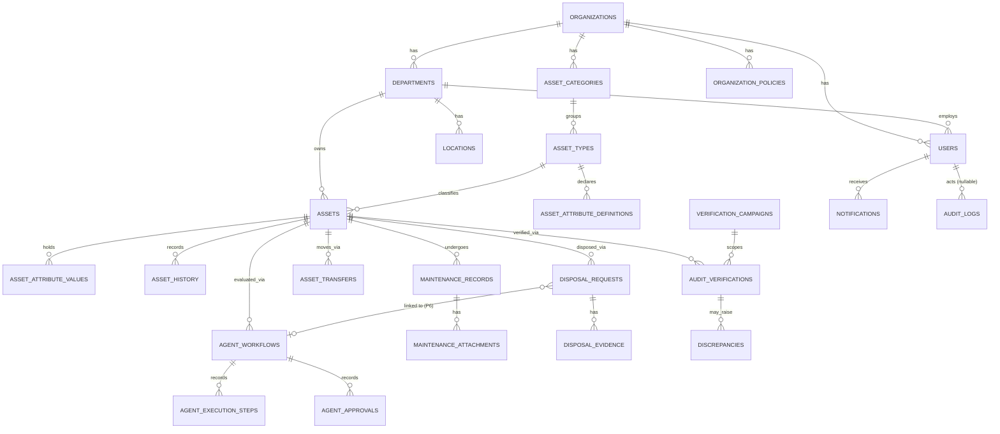

# Appendix F — Full Physical Database Schema (Reference Design)

## F.1 Purpose and Status

[§8.1–8.3](08-data-requirements.md) give the conceptual model — an ER diagram, an entity inventory, and the fifteen data requirements (DR-01 to DR-15) every table must satisfy. They deliberately stop short of physical SQL: "the full ER diagram with attributes and cardinalities accompanies the technical report." This file **is** that physical design — every table, column, type, constraint and index for every entity in the [§8.2 entity inventory](08-data-requirements.md#82-entity-inventory), written as PostgreSQL DDL, so that:

- each component owner has a concrete starting point for their EF Core entity classes and migration, instead of re-deriving column names and types independently;
- the four owners' schemas are reviewed against one consistent set of conventions (§F.3) before any of them writes a migration, the same way the agent contracts are frozen in [§18.8](18-team-roster-and-work-allocation.md#188-shared-agent-contract-freeze) before any agent is coded;
- a reviewer can check a merged migration against this document and see immediately whether it drifted.

**This is not `backend/db/schema.sql`.** That file is explained in [`backend/db/README.md`](../../backend/db/README.md): it is a **generated export** of whatever EF Core migrations actually exist, produced by `dotnet ef migrations script`, and it is overwritten every time a migration is added — hand-editing it is pointless. Today it contains only `Organizations` and `Users`, because those are the only two entities implemented so far ([PROGRESS.md](../PROGRESS.md)). This document covers all twenty-four entities across all four components and the agentic subsystem; as each is implemented, the corresponding EF Core migration should produce SQL matching what is here, and `backend/db/schema.sql` will grow to match this document one migration at a time. Nobody should ever paste this file's SQL directly into `backend/db/schema.sql` — DR-13 requires schema evolution to happen only through committed EF Core migrations.

## F.2 How to Use This Document

1. Find your component's section (§F.6–F.11).
2. Model each table as an EF Core entity in `backend/Domain/`, matching the columns, types and nullability here.
3. Configure the constraints this document adds beyond EF Core's defaults (check constraints, partial unique indexes, the `ON DELETE` behaviour) using `IEntityTypeConfiguration<T>` / Fluent API — EF Core does not infer these from C# alone.
4. Run `dotnet ef migrations add <Name>`, then regenerate the exports per `backend/db/README.md`.
5. If your migration's generated SQL disagrees with this document, either the migration is wrong or this document is stale — fix whichever is actually wrong, and if it's this document, update it in the same pull request (this is the same discipline §18.11 asks of the team roster).

## F.3 Conventions

These apply to every table below and are not repeated per table.

| Convention | Rule |
|---|---|
| Naming | PascalCase table and column names, double-quoted, matching what Npgsql/EF Core already generates (see `backend/db/schema.sql`) — not `snake_case`. |
| Primary keys | `uuid`, assigned by the API (`Guid.NewGuid()`), never a database default — matching the existing `Organizations`/`Users` tables. DR-02. |
| Timestamps | `timestamptz`, UTC, populated by an EF Core `SaveChanges` interceptor rather than a column `DEFAULT` — consistent with DR-09's "populated automatically by the persistence layer rather than by callers." No column below carries `DEFAULT now()`. DR-07. |
| Money | `numeric(18,2)`. DR-07. |
| Enumerations | `varchar(n)` with an explicit `CHECK ... IN (...)` naming every permitted value from [Appendix A](appendix-a-status-and-enumeration-reference.md), **not** a bare integer. DR-06. See §F.4 for why this differs from the `Users.Role` column that exists today. |
| Audit columns | Every table carries `CreatedAt`, `UpdatedAt`, `CreatedBy`, `UpdatedBy` (DR-09) **except** the two append-only event logs, `AssetHistory` and `AuditLogs`, which carry `CreatedAt` and a single `ActorUserId` and deliberately have no `UpdatedAt`/`UpdatedBy` — an update column on a table nothing may ever update is misleading, not merely unused, and DR-12 makes the exception explicit. |
| `CreatedBy` / `UpdatedBy` | Nullable FK to `Users("Id")`, `ON DELETE SET NULL` — history must outlive a deactivated or anonymised user (DR-15), so these can never cascade-delete or block a user deletion. |
| Organisation scoping | `OrganizationId` is a direct column with its own index on every table that is a query-filter root (DR-04). Detail/child tables that only ever reach the database through their parent (e.g. `AssetAttributeValues` via `AssetId`, `AgentExecutionSteps` via `AgentWorkflowId`) are scoped transitively through that parent's `OrganizationId` and do not repeat the column — repeating it there would be denormalisation DR-01 does not ask for. |
| Soft delete | Nothing is hard-deleted once it carries history (DR-15). Deactivatable entities (`Departments`, `Locations`, `Users`) carry `IsActive boolean`; disposed assets and resolved discrepancies simply reach a terminal `Status` value and stay in their table forever. |
| Indexes | Every foreign key is indexed; DR-08's named list filters (asset status, condition, department, asset type, maintenance status, campaign, workflow status, audit timestamp) are indexed explicitly and called out per table below. |
| Concurrency | DR-11's optimistic concurrency uses PostgreSQL's built-in `xmin` system column via EF Core's `IsRowVersion()`/`xmin` concurrency token configuration — this is not a column that appears in any `CREATE TABLE` below; every table gets it for free. |

## F.4 Corrections Applied Relative to the Current SRS and Implementation

Working through every entity end to end against DR-01 to DR-15 surfaced a few inconsistencies worth fixing rather than silently carrying forward:

1. **`Users.Role` is a bare `integer` today** (`backend/db/schema.sql`), with no constraint tying it to the four permitted values in Appendix A — a typo in application code could write `Role = 7` and the database would accept it, which is exactly what DR-06 exists to prevent. §F.6 changes it to `varchar(20)` with an explicit `CHECK`; the EF Core side is `.HasConversion<string>()` on the `CoreGridRole` enum.
2. **`Organizations` and `Users` are both missing `UpdatedAt`, `CreatedBy` and `UpdatedBy`** in the current migration, against the blanket rule in DR-09. §F.6 adds them, with `Organizations.CreatedBy`/`UpdatedBy` nullable for a documented reason: Setup creates the `Organizations` row before any `Users` row can exist to be its creator, so the row is inserted with `CreatedBy = NULL` and back-filled with the new Administrator's `Id` once that insert completes, in the same transaction.
3. **`Users` has no `DepartmentId`**, but FR-013 requires an Administrator to "assign them to a department" on invite. §F.6 adds it as nullable, because the bootstrap Administrator is provisioned by Setup before any `Departments` row exists.
4. **Appendix A's `VerificationResult` enumeration has no `SURPLUS` value**, but FR-060 explicitly requires the system to classify a discrepancy as "Missing, Surplus, Location Mismatch, Condition Mismatch or Data Mismatch." This is not an oversight to carry forward silently: `VerificationResult` (an officer's assertion about *one already-registered asset* during a scan) correctly has no `SURPLUS`, since scanning a known asset can never produce "this shouldn't exist" — but `Discrepancies.Classification` is a different vocabulary describing what the discrepancy itself *is*, and that one must include `SURPLUS`. §F.10 defines `Discrepancies.Classification` as its own enumeration, separate from `AuditVerifications.Result`, and Appendix A has been updated (below) to record both explicitly instead of conflating them.
5. **`AssetAttributeValues` needs a typed-column CHECK**, not just four nullable columns, or the attribute-value model ADR-006 chose specifically to get referential and type integrity (§8.4) would allow a row with two values set, or none. §F.7 adds a `CHECK` tying the populated column to the attribute definition's declared `DataType`.
6. **Nothing in the current design enforces FR-068's "refuse ... where an evaluation for the same asset is already running"** at the database level — it would rely entirely on an API-layer check with a race condition between the check and the insert. §F.11 adds a partial unique index on `AgentWorkflows("AssetId")` restricted to non-terminal statuses, so a concurrent double-initiation is rejected by the database itself, not just the application.
7. **`DisposalRequests` has no database-level separation-of-duties guard**, though FR-051 AC2 requires the approver never to be the requester. §F.9 adds it as a `CHECK`, so the rule holds even against a future code path that forgets to check it in the service layer.

Appendix A has been updated to match point 4:

```diff
 | VerificationResult | VERIFIED · MISSING · LOCATION_MISMATCH · CONDITION_MISMATCH · DATA_MISMATCH |
+| DiscrepancyClassification | MISSING · SURPLUS · LOCATION_MISMATCH · CONDITION_MISMATCH · DATA_MISMATCH |
```

(Applied directly to [`appendix-a-status-and-enumeration-reference.md`](appendix-a-status-and-enumeration-reference.md) in this same change.)

## F.5 Entity-Relationship Overview

This is the physical-design companion to the conceptual diagram in [§8.1](08-data-requirements.md#81-conceptual-data-model) — cardinalities only, not every column.



## F.6 Cross-Cutting — Organisations, Identity, Structure, Policy

Owner: shared foundation; organisation structure and policy are Component D's (§18.6).

```sql
-- =========================================================================
-- Organizations  (SRS §4.2, §8.2 — root of every query filter)
-- =========================================================================
CREATE TABLE "Organizations" (
    "Id"        uuid NOT NULL,
    "Name"      text NOT NULL,
    "CreatedAt" timestamptz NOT NULL,
    "UpdatedAt" timestamptz NOT NULL,
    "CreatedBy" uuid NULL,  -- nullable: Setup creates this row before any User exists (§F.4 point 2)
    "UpdatedBy" uuid NULL,
    CONSTRAINT "PK_Organizations" PRIMARY KEY ("Id")
);

-- =========================================================================
-- Departments  (FR-010, FR-012; §8.2)
-- =========================================================================
CREATE TABLE "Departments" (
    "Id"             uuid NOT NULL,
    "OrganizationId" uuid NOT NULL,
    "Code"           varchar(20) NOT NULL,
    "Name"           text NOT NULL,
    "IsActive"       boolean NOT NULL DEFAULT true,
    "CreatedAt"      timestamptz NOT NULL,
    "UpdatedAt"      timestamptz NOT NULL,
    "CreatedBy"      uuid NULL,
    "UpdatedBy"      uuid NULL,
    CONSTRAINT "PK_Departments" PRIMARY KEY ("Id"),
    CONSTRAINT "FK_Departments_Organizations_OrganizationId" FOREIGN KEY ("OrganizationId") REFERENCES "Organizations" ("Id") ON DELETE RESTRICT,
    CONSTRAINT "UQ_Departments_Organization_Code" UNIQUE ("OrganizationId", "Code")
);
CREATE INDEX "IX_Departments_OrganizationId" ON "Departments" ("OrganizationId");

-- =========================================================================
-- Users  (SRS §4.7, §8.2 — local ThunderID mirror; holds no credentials)
-- =========================================================================
CREATE TABLE "Users" (
    "Id"                uuid NOT NULL,
    "OrganizationId"    uuid NOT NULL,
    "DepartmentId"      uuid NULL,  -- FR-013; nullable — bootstrap Administrator predates any Department (§F.4 point 3)
    "ExternalSubjectId" text NOT NULL,  -- ThunderID `sub` claim
    "Email"             text NOT NULL,
    "GivenName"         text NOT NULL,
    "FamilyName"        text NOT NULL,
    "Role"              varchar(20) NOT NULL,  -- see §F.4 point 1 — was a bare integer
    "IsActive"          boolean NOT NULL DEFAULT true,
    "CreatedAt"         timestamptz NOT NULL,
    "UpdatedAt"         timestamptz NOT NULL,
    "CreatedBy"         uuid NULL,
    "UpdatedBy"         uuid NULL,
    CONSTRAINT "PK_Users" PRIMARY KEY ("Id"),
    CONSTRAINT "FK_Users_Organizations_OrganizationId" FOREIGN KEY ("OrganizationId") REFERENCES "Organizations" ("Id") ON DELETE RESTRICT,
    CONSTRAINT "FK_Users_Departments_DepartmentId" FOREIGN KEY ("DepartmentId") REFERENCES "Departments" ("Id") ON DELETE RESTRICT,
    CONSTRAINT "CK_Users_Role" CHECK ("Role" IN ('DEPARTMENT_STAFF','INVENTORY_OFFICER','AUDITOR','ADMINISTRATOR'))
);
CREATE UNIQUE INDEX "IX_Users_Email" ON "Users" ("Email");
CREATE UNIQUE INDEX "IX_Users_ExternalSubjectId" ON "Users" ("ExternalSubjectId");
CREATE INDEX "IX_Users_OrganizationId" ON "Users" ("OrganizationId");
CREATE INDEX "IX_Users_DepartmentId" ON "Users" ("DepartmentId");

ALTER TABLE "Organizations" ADD CONSTRAINT "FK_Organizations_Users_CreatedBy" FOREIGN KEY ("CreatedBy") REFERENCES "Users" ("Id") ON DELETE SET NULL;
ALTER TABLE "Organizations" ADD CONSTRAINT "FK_Organizations_Users_UpdatedBy" FOREIGN KEY ("UpdatedBy") REFERENCES "Users" ("Id") ON DELETE SET NULL;

-- =========================================================================
-- Locations  (FR-011, FR-012; §8.2)
-- =========================================================================
CREATE TABLE "Locations" (
    "Id"             uuid NOT NULL,
    "OrganizationId" uuid NOT NULL,
    "DepartmentId"   uuid NOT NULL,
    "Name"           text NOT NULL,
    "Type"           varchar(30) NOT NULL,  -- FR-011: "such as store, workshop, office or ward" — an indicative, not exhaustive, list, so deliberately no CHECK here
    "IsActive"       boolean NOT NULL DEFAULT true,
    "CreatedAt"      timestamptz NOT NULL,
    "UpdatedAt"      timestamptz NOT NULL,
    "CreatedBy"      uuid NULL,
    "UpdatedBy"      uuid NULL,
    CONSTRAINT "PK_Locations" PRIMARY KEY ("Id"),
    CONSTRAINT "FK_Locations_Organizations_OrganizationId" FOREIGN KEY ("OrganizationId") REFERENCES "Organizations" ("Id") ON DELETE RESTRICT,
    CONSTRAINT "FK_Locations_Departments_DepartmentId" FOREIGN KEY ("DepartmentId") REFERENCES "Departments" ("Id") ON DELETE RESTRICT
);
CREATE INDEX "IX_Locations_OrganizationId" ON "Locations" ("OrganizationId");
CREATE INDEX "IX_Locations_DepartmentId" ON "Locations" ("DepartmentId");
```

## F.7 Component A — Asset Registry & QR Identification

Owner: Jayashan Guruge (§18.3).

```sql
-- =========================================================================
-- AssetCategories  (FR-016; §8.2)
-- =========================================================================
CREATE TABLE "AssetCategories" (
    "Id"             uuid NOT NULL,
    "OrganizationId" uuid NOT NULL,
    "Code"           varchar(20) NOT NULL,
    "Name"           text NOT NULL,
    "CreatedAt"      timestamptz NOT NULL,
    "UpdatedAt"      timestamptz NOT NULL,
    "CreatedBy"      uuid NULL,
    "UpdatedBy"      uuid NULL,
    CONSTRAINT "PK_AssetCategories" PRIMARY KEY ("Id"),
    CONSTRAINT "FK_AssetCategories_Organizations_OrganizationId" FOREIGN KEY ("OrganizationId") REFERENCES "Organizations" ("Id") ON DELETE RESTRICT,
    CONSTRAINT "UQ_AssetCategories_Organization_Code" UNIQUE ("OrganizationId", "Code")
);
CREATE INDEX "IX_AssetCategories_OrganizationId" ON "AssetCategories" ("OrganizationId");

-- =========================================================================
-- AssetTypes  (FR-017; §8.2)
-- =========================================================================
CREATE TABLE "AssetTypes" (
    "Id"                            uuid NOT NULL,
    "OrganizationId"                uuid NOT NULL,
    "AssetCategoryId"               uuid NOT NULL,
    "Code"                          varchar(20) NOT NULL,
    "Name"                          text NOT NULL,
    "UsefulLifeYears"               int NOT NULL,
    "DefaultMaintenanceIntervalDays" int NULL,
    "CreatedAt"                     timestamptz NOT NULL,
    "UpdatedAt"                     timestamptz NOT NULL,
    "CreatedBy"                     uuid NULL,
    "UpdatedBy"                     uuid NULL,
    CONSTRAINT "PK_AssetTypes" PRIMARY KEY ("Id"),
    CONSTRAINT "FK_AssetTypes_Organizations_OrganizationId" FOREIGN KEY ("OrganizationId") REFERENCES "Organizations" ("Id") ON DELETE RESTRICT,
    CONSTRAINT "FK_AssetTypes_AssetCategories_AssetCategoryId" FOREIGN KEY ("AssetCategoryId") REFERENCES "AssetCategories" ("Id") ON DELETE RESTRICT,
    CONSTRAINT "UQ_AssetTypes_Organization_Code" UNIQUE ("OrganizationId", "Code"),
    CONSTRAINT "CK_AssetTypes_UsefulLifeYears" CHECK ("UsefulLifeYears" > 0)
);
CREATE INDEX "IX_AssetTypes_OrganizationId" ON "AssetTypes" ("OrganizationId");
CREATE INDEX "IX_AssetTypes_AssetCategoryId" ON "AssetTypes" ("AssetCategoryId");

-- =========================================================================
-- OrganizationPolicies  (FR-015; §8.2 — created here, after AssetTypes,
-- purely for FK-ordering: it is conceptually cross-cutting, owned by
-- Component D, not part of Component A)
-- =========================================================================
CREATE TABLE "OrganizationPolicies" (
    "Id"                             uuid NOT NULL,
    "OrganizationId"                 uuid NOT NULL,
    "AssetTypeId"                    uuid NULL,  -- NULL = organisation-wide default; set = per-type override (§8.2)
    "RepairToReplaceCostThreshold"   numeric(5,2) NOT NULL,   -- PR-04
    "MinimumServiceLifeYears"        numeric(5,2) NOT NULL,   -- PR-02
    "MaxAcceptableFailureFrequency"  numeric(5,2) NOT NULL,   -- failures/year, PR-08 context
    "ValuationValidityWindowDays"    int NOT NULL,             -- PR-03
    "ConfidenceFloor"                numeric(5,2) NOT NULL,   -- PR-08
    "CostVarianceTolerancePercent"   numeric(5,2) NOT NULL,   -- FR-038 BR1
    "OutstandingTransferDays"        int NOT NULL,             -- FR-048
    "ApprovalOverduePeriodHours"     int NOT NULL,             -- AI-19
    "CreatedAt"                      timestamptz NOT NULL,
    "UpdatedAt"                      timestamptz NOT NULL,
    "CreatedBy"                      uuid NULL,
    "UpdatedBy"                      uuid NULL,
    CONSTRAINT "PK_OrganizationPolicies" PRIMARY KEY ("Id"),
    CONSTRAINT "FK_OrganizationPolicies_Organizations_OrganizationId" FOREIGN KEY ("OrganizationId") REFERENCES "Organizations" ("Id") ON DELETE RESTRICT,
    CONSTRAINT "FK_OrganizationPolicies_AssetTypes_AssetTypeId" FOREIGN KEY ("AssetTypeId") REFERENCES "AssetTypes" ("Id") ON DELETE RESTRICT,
    CONSTRAINT "UQ_OrganizationPolicies_Org_AssetType" UNIQUE ("OrganizationId", "AssetTypeId")
);
CREATE INDEX "IX_OrganizationPolicies_OrganizationId" ON "OrganizationPolicies" ("OrganizationId");

-- =========================================================================
-- AssetAttributeDefinitions  (FR-018; §8.2)
-- =========================================================================
CREATE TABLE "AssetAttributeDefinitions" (
    "Id"             uuid NOT NULL,
    "AssetTypeId"    uuid NOT NULL,
    "Name"           text NOT NULL,
    "DataType"       varchar(10) NOT NULL,  -- TEXT | NUMBER | DATE | BOOLEAN | SELECT (Appendix A)
    "IsRequired"     boolean NOT NULL DEFAULT false,
    "ValidationRule" text NULL,             -- e.g. a regex or numeric range, interpreted by the API (FR-019)
    "SelectOptions"  jsonb NULL,            -- populated only when DataType = SELECT; array of permitted option strings
    "DisplayOrder"   int NOT NULL,
    "CreatedAt"      timestamptz NOT NULL,
    "UpdatedAt"      timestamptz NOT NULL,
    "CreatedBy"      uuid NULL,
    "UpdatedBy"      uuid NULL,
    CONSTRAINT "PK_AssetAttributeDefinitions" PRIMARY KEY ("Id"),
    CONSTRAINT "FK_AssetAttributeDefinitions_AssetTypes_AssetTypeId" FOREIGN KEY ("AssetTypeId") REFERENCES "AssetTypes" ("Id") ON DELETE RESTRICT,
    CONSTRAINT "UQ_AssetAttributeDefinitions_Type_Name" UNIQUE ("AssetTypeId", "Name"),
    CONSTRAINT "CK_AssetAttributeDefinitions_DataType" CHECK ("DataType" IN ('TEXT','NUMBER','DATE','BOOLEAN','SELECT')),
    CONSTRAINT "CK_AssetAttributeDefinitions_SelectOptions" CHECK ("DataType" <> 'SELECT' OR "SelectOptions" IS NOT NULL)
);
CREATE INDEX "IX_AssetAttributeDefinitions_AssetTypeId" ON "AssetAttributeDefinitions" ("AssetTypeId");

-- =========================================================================
-- Assets  (FR-021 to FR-032; §8.2 — the master record)
-- =========================================================================
CREATE TABLE "Assets" (
    "Id"                        uuid NOT NULL,
    "OrganizationId"            uuid NOT NULL,
    "AssetTypeId"               uuid NOT NULL,
    "DepartmentId"              uuid NOT NULL,
    "LocationId"                uuid NOT NULL,
    "AssetCode"                 varchar(40) NOT NULL,   -- FR-022, DR-05
    "Name"                      text NOT NULL,
    "Status"                    varchar(20) NOT NULL,   -- Appendix A: AssetStatus
    "Condition"                 varchar(15) NOT NULL,   -- Appendix A: AssetCondition
    "AcquisitionDate"           date NOT NULL,
    "AcquisitionCost"           numeric(18,2) NOT NULL,
    "ResidualValue"             numeric(18,2) NOT NULL, -- FR-030, recomputed on read or by a scheduled job — see note below
    "CumulativeMaintenanceCost" numeric(18,2) NOT NULL DEFAULT 0,  -- FR-040
    "RepairCount"               int NOT NULL DEFAULT 0,             -- FR-040
    "LastRepairDate"            date NULL,                            -- FR-040
    "QrPayload"                 text NOT NULL,                        -- FR-023
    "CreatedAt"                 timestamptz NOT NULL,
    "UpdatedAt"                 timestamptz NOT NULL,
    "CreatedBy"                 uuid NULL,
    "UpdatedBy"                 uuid NULL,
    CONSTRAINT "PK_Assets" PRIMARY KEY ("Id"),
    CONSTRAINT "FK_Assets_Organizations_OrganizationId" FOREIGN KEY ("OrganizationId") REFERENCES "Organizations" ("Id") ON DELETE RESTRICT,
    CONSTRAINT "FK_Assets_AssetTypes_AssetTypeId" FOREIGN KEY ("AssetTypeId") REFERENCES "AssetTypes" ("Id") ON DELETE RESTRICT,
    CONSTRAINT "FK_Assets_Departments_DepartmentId" FOREIGN KEY ("DepartmentId") REFERENCES "Departments" ("Id") ON DELETE RESTRICT,
    CONSTRAINT "FK_Assets_Locations_LocationId" FOREIGN KEY ("LocationId") REFERENCES "Locations" ("Id") ON DELETE RESTRICT,
    CONSTRAINT "UQ_Assets_Organization_AssetCode" UNIQUE ("OrganizationId", "AssetCode"),  -- DR-05
    CONSTRAINT "CK_Assets_Status" CHECK ("Status" IN ('ACTIVE','UNDER_MAINTENANCE','TRANSFER_REQUESTED','IN_TRANSIT','CONDEMNED','DISPOSAL_REQUESTED','DISPOSED')),
    CONSTRAINT "CK_Assets_Condition" CHECK ("Condition" IN ('NEW','GOOD','FAIR','POOR','UNSERVICEABLE')),
    CONSTRAINT "CK_Assets_AcquisitionCost" CHECK ("AcquisitionCost" >= 0)
);
-- DR-08's named filters: status, condition, department, asset type
CREATE INDEX "IX_Assets_OrganizationId" ON "Assets" ("OrganizationId");
CREATE INDEX "IX_Assets_Status" ON "Assets" ("Status");
CREATE INDEX "IX_Assets_Condition" ON "Assets" ("Condition");
CREATE INDEX "IX_Assets_DepartmentId" ON "Assets" ("DepartmentId");
CREATE INDEX "IX_Assets_AssetTypeId" ON "Assets" ("AssetTypeId");
CREATE INDEX "IX_Assets_LocationId" ON "Assets" ("LocationId");
-- FR-028: search by name
CREATE INDEX "IX_Assets_Name" ON "Assets" ("Name");
```

> `ResidualValue` is stored, not purely computed, so it can be indexed and reported on directly (FR-084/085) without recomputing straight-line depreciation for every row on every list request; a scheduled job or a write-time trigger recalculates it whenever `AcquisitionCost`, `AcquisitionDate` or the asset's `UsefulLifeYears` changes. This is a deliberate, documented denormalisation under DR-01.

```sql
-- =========================================================================
-- AssetAttributeValues  (ADR-006; §8.2, §8.4)
-- =========================================================================
CREATE TABLE "AssetAttributeValues" (
    "Id"                         uuid NOT NULL,
    "AssetId"                    uuid NOT NULL,
    "AssetAttributeDefinitionId" uuid NOT NULL,
    "ValueText"                  text NULL,
    "ValueNumber"                numeric(18,4) NULL,
    "ValueDate"                  date NULL,
    "ValueBoolean"               boolean NULL,
    "CreatedAt"                  timestamptz NOT NULL,
    "UpdatedAt"                  timestamptz NOT NULL,
    "CreatedBy"                  uuid NULL,
    "UpdatedBy"                  uuid NULL,
    CONSTRAINT "PK_AssetAttributeValues" PRIMARY KEY ("Id"),
    CONSTRAINT "FK_AssetAttributeValues_Assets_AssetId" FOREIGN KEY ("AssetId") REFERENCES "Assets" ("Id") ON DELETE RESTRICT,
    CONSTRAINT "FK_AssetAttributeValues_AssetAttributeDefinitions_DefId" FOREIGN KEY ("AssetAttributeDefinitionId") REFERENCES "AssetAttributeDefinitions" ("Id") ON DELETE RESTRICT,
    CONSTRAINT "UQ_AssetAttributeValues_Asset_Definition" UNIQUE ("AssetId", "AssetAttributeDefinitionId"),
    -- §F.4 point 5: exactly one typed column populated, never zero, never more than one
    CONSTRAINT "CK_AssetAttributeValues_ExactlyOneValue" CHECK (
        (num_nonnulls("ValueText", "ValueNumber", "ValueDate", "ValueBoolean") = 1)
    )
);
-- §8.4: composite index on (AssetId, AttributeDefinitionId) is the PK's unique index above;
-- secondary indexes support FR-028 custom-attribute search
CREATE INDEX "IX_AssetAttributeValues_Definition_Text" ON "AssetAttributeValues" ("AssetAttributeDefinitionId", "ValueText");
CREATE INDEX "IX_AssetAttributeValues_Definition_Number" ON "AssetAttributeValues" ("AssetAttributeDefinitionId", "ValueNumber");

-- =========================================================================
-- AssetHistory  (FR-027; §8.2, DR-12 — append-only, no UpdatedAt/UpdatedBy)
-- =========================================================================
CREATE TABLE "AssetHistory" (
    "Id"             uuid NOT NULL,
    "OrganizationId" uuid NOT NULL,
    "AssetId"        uuid NOT NULL,
    "ActorUserId"    uuid NULL,  -- nullable: some entries are system/agent-generated (FR-027)
    "EventType"      varchar(30) NOT NULL,  -- STATUS_CHANGE | FIELD_AMENDMENT | VERIFICATION | MAINTENANCE | TRANSFER | DISPOSAL | AGENT_RECOMMENDATION
    "Description"    text NOT NULL,
    "PreviousValue"  jsonb NULL,
    "NewValue"       jsonb NULL,
    "CreatedAt"      timestamptz NOT NULL,
    CONSTRAINT "PK_AssetHistory" PRIMARY KEY ("Id"),
    CONSTRAINT "FK_AssetHistory_Organizations_OrganizationId" FOREIGN KEY ("OrganizationId") REFERENCES "Organizations" ("Id") ON DELETE RESTRICT,
    CONSTRAINT "FK_AssetHistory_Assets_AssetId" FOREIGN KEY ("AssetId") REFERENCES "Assets" ("Id") ON DELETE RESTRICT,
    CONSTRAINT "FK_AssetHistory_Users_ActorUserId" FOREIGN KEY ("ActorUserId") REFERENCES "Users" ("Id") ON DELETE SET NULL,
    CONSTRAINT "CK_AssetHistory_EventType" CHECK ("EventType" IN ('STATUS_CHANGE','FIELD_AMENDMENT','VERIFICATION','MAINTENANCE','TRANSFER','DISPOSAL','AGENT_RECOMMENDATION'))
);
CREATE INDEX "IX_AssetHistory_OrganizationId" ON "AssetHistory" ("OrganizationId");
CREATE INDEX "IX_AssetHistory_AssetId" ON "AssetHistory" ("AssetId");
CREATE INDEX "IX_AssetHistory_CreatedAt" ON "AssetHistory" ("CreatedAt");
-- DR-12 is enforced procedurally (no API path issues UPDATE/DELETE) and should be
-- proven by the automated test DR-12 requires; PostgreSQL has no native "insert-only
-- table" constraint short of a trigger or revoked UPDATE/DELETE privileges on the
-- application's database role, which is the recommended belt-and-braces addition:
--   REVOKE UPDATE, DELETE ON "AssetHistory" FROM coregrid_app;
```

## F.8 Component B — Maintenance Management

Owner: Seneja Ramanayaka (§18.4).

```sql
-- =========================================================================
-- MaintenanceRecords  (FR-033 to FR-042; §8.2)
-- =========================================================================
CREATE TABLE "MaintenanceRecords" (
    "Id"                  uuid NOT NULL,
    "OrganizationId"      uuid NOT NULL,
    "AssetId"             uuid NOT NULL,
    "Type"                varchar(12) NOT NULL,  -- CORRECTIVE | PREVENTIVE
    "Priority"            varchar(10) NOT NULL,  -- LOW | MEDIUM | HIGH | CRITICAL
    "Status"              varchar(15) NOT NULL,  -- REQUESTED | APPROVED | IN_PROGRESS | COMPLETED | CANCELLED
    "Description"         text NOT NULL,
    "ReportedCondition"   varchar(15) NULL,       -- AssetCondition, FR-033
    "ReportedByUserId"    uuid NOT NULL,
    "AssignedToUserId"    uuid NULL,              -- set on approval, FR-036
    "EstimatedCost"       numeric(18,2) NULL,     -- FR-036
    "ActualCost"          numeric(18,2) NULL,     -- FR-038
    "WorkPerformed"       text NULL,              -- FR-038, 10-2000 chars, enforced at the API
    "ResultingCondition"  varchar(15) NULL,       -- AssetCondition, FR-038
    "RequestedAt"         timestamptz NOT NULL,
    "ApprovedAt"          timestamptz NULL,
    "StartedAt"           timestamptz NULL,
    "CompletedAt"         timestamptz NULL,
    "CancelledAt"         timestamptz NULL,
    "CancellationReason"  text NULL,              -- Fig. 7: cancel requires a recorded reason
    "CreatedAt"           timestamptz NOT NULL,
    "UpdatedAt"           timestamptz NOT NULL,
    "CreatedBy"           uuid NULL,
    "UpdatedBy"           uuid NULL,
    CONSTRAINT "PK_MaintenanceRecords" PRIMARY KEY ("Id"),
    CONSTRAINT "FK_MaintenanceRecords_Organizations_OrganizationId" FOREIGN KEY ("OrganizationId") REFERENCES "Organizations" ("Id") ON DELETE RESTRICT,
    CONSTRAINT "FK_MaintenanceRecords_Assets_AssetId" FOREIGN KEY ("AssetId") REFERENCES "Assets" ("Id") ON DELETE RESTRICT,
    CONSTRAINT "FK_MaintenanceRecords_Users_ReportedByUserId" FOREIGN KEY ("ReportedByUserId") REFERENCES "Users" ("Id") ON DELETE RESTRICT,
    CONSTRAINT "FK_MaintenanceRecords_Users_AssignedToUserId" FOREIGN KEY ("AssignedToUserId") REFERENCES "Users" ("Id") ON DELETE RESTRICT,
    CONSTRAINT "CK_MaintenanceRecords_Type" CHECK ("Type" IN ('CORRECTIVE','PREVENTIVE')),
    CONSTRAINT "CK_MaintenanceRecords_Priority" CHECK ("Priority" IN ('LOW','MEDIUM','HIGH','CRITICAL')),
    CONSTRAINT "CK_MaintenanceRecords_Status" CHECK ("Status" IN ('REQUESTED','APPROVED','IN_PROGRESS','COMPLETED','CANCELLED')),
    CONSTRAINT "CK_MaintenanceRecords_ActualCost" CHECK ("ActualCost" IS NULL OR "ActualCost" >= 0)
);
CREATE INDEX "IX_MaintenanceRecords_OrganizationId" ON "MaintenanceRecords" ("OrganizationId");
CREATE INDEX "IX_MaintenanceRecords_AssetId" ON "MaintenanceRecords" ("AssetId");
CREATE INDEX "IX_MaintenanceRecords_Status" ON "MaintenanceRecords" ("Status");  -- DR-08
CREATE INDEX "IX_MaintenanceRecords_ReportedByUserId" ON "MaintenanceRecords" ("ReportedByUserId");
CREATE INDEX "IX_MaintenanceRecords_AssignedToUserId" ON "MaintenanceRecords" ("AssignedToUserId");

-- =========================================================================
-- MaintenanceAttachments  (FR-034; §8.2)
-- =========================================================================
CREATE TABLE "MaintenanceAttachments" (
    "Id"                   uuid NOT NULL,
    "MaintenanceRecordId"  uuid NOT NULL,
    "FileName"             text NOT NULL,
    "ContentType"          varchar(100) NOT NULL,
    "StorageKey"           text NOT NULL,   -- opaque reference to blob storage; readable only by permitted users, FR-034
    "SizeBytes"            int NOT NULL,
    "UploadedByUserId"     uuid NOT NULL,
    "CreatedAt"            timestamptz NOT NULL,
    "UpdatedAt"            timestamptz NOT NULL,
    "CreatedBy"            uuid NULL,
    "UpdatedBy"            uuid NULL,
    CONSTRAINT "PK_MaintenanceAttachments" PRIMARY KEY ("Id"),
    CONSTRAINT "FK_MaintenanceAttachments_MaintenanceRecords_RecordId" FOREIGN KEY ("MaintenanceRecordId") REFERENCES "MaintenanceRecords" ("Id") ON DELETE RESTRICT,
    CONSTRAINT "FK_MaintenanceAttachments_Users_UploadedByUserId" FOREIGN KEY ("UploadedByUserId") REFERENCES "Users" ("Id") ON DELETE RESTRICT,
    CONSTRAINT "CK_MaintenanceAttachments_SizeBytes" CHECK ("SizeBytes" > 0 AND "SizeBytes" <= 1048576)  -- IF-11: compressed to 1MB
);
CREATE INDEX "IX_MaintenanceAttachments_MaintenanceRecordId" ON "MaintenanceAttachments" ("MaintenanceRecordId");

-- =========================================================================
-- Notifications  (FR-077 to FR-080; §8.2)
-- =========================================================================
CREATE TABLE "Notifications" (
    "Id"                uuid NOT NULL,
    "OrganizationId"    uuid NOT NULL,
    "UserId"            uuid NOT NULL,   -- recipient
    "Type"              varchar(40) NOT NULL,  -- e.g. MAINTENANCE_ASSIGNED, TRANSFER_APPROVAL_REQUIRED, WORKFLOW_APPROVAL_REQUIRED
    "Title"             text NOT NULL,
    "Body"              text NOT NULL,  -- FR-079: name, asset code, action, link only — never tokens or full records
    "RelatedEntityType" varchar(40) NULL,
    "RelatedEntityId"   uuid NULL,
    "IsRead"            boolean NOT NULL DEFAULT false,
    "ReadAt"            timestamptz NULL,
    "DispatchStatus"    varchar(10) NOT NULL,  -- PENDING | SENT | FAILED
    "DispatchAttempts"  int NOT NULL DEFAULT 0,
    "SentAt"            timestamptz NULL,
    "CreatedAt"         timestamptz NOT NULL,
    "UpdatedAt"         timestamptz NOT NULL,
    "CreatedBy"         uuid NULL,
    "UpdatedBy"         uuid NULL,
    CONSTRAINT "PK_Notifications" PRIMARY KEY ("Id"),
    CONSTRAINT "FK_Notifications_Organizations_OrganizationId" FOREIGN KEY ("OrganizationId") REFERENCES "Organizations" ("Id") ON DELETE RESTRICT,
    CONSTRAINT "FK_Notifications_Users_UserId" FOREIGN KEY ("UserId") REFERENCES "Users" ("Id") ON DELETE RESTRICT,
    CONSTRAINT "CK_Notifications_DispatchStatus" CHECK ("DispatchStatus" IN ('PENDING','SENT','FAILED'))
);
CREATE INDEX "IX_Notifications_OrganizationId" ON "Notifications" ("OrganizationId");
CREATE INDEX "IX_Notifications_UserId_IsRead" ON "Notifications" ("UserId", "IsRead");  -- FR-080 unread state
```

## F.9 Component C — Transfer & Disposal

Owner: Bhanuka Samarasinghe (§18.5).

```sql
-- =========================================================================
-- AssetTransfers  (FR-043 to FR-048; §8.2)
-- =========================================================================
CREATE TABLE "AssetTransfers" (
    "Id"                 uuid NOT NULL,
    "OrganizationId"     uuid NOT NULL,
    "AssetId"            uuid NOT NULL,
    "FromDepartmentId"   uuid NOT NULL,
    "ToDepartmentId"     uuid NOT NULL,
    "FromLocationId"     uuid NULL,
    "ToLocationId"       uuid NOT NULL,
    "Status"             varchar(15) NOT NULL,  -- REQUESTED | APPROVED | REJECTED | IN_TRANSIT | COMPLETED | CANCELLED
    "Reason"             text NOT NULL,
    "RequestedByUserId"  uuid NOT NULL,
    "ApprovedByUserId"   uuid NULL,
    "ApprovalReason"     text NULL,
    "ReceivedByUserId"   uuid NULL,
    "RequestedAt"        timestamptz NOT NULL,
    "ApprovedAt"         timestamptz NULL,
    "ReceivedAt"         timestamptz NULL,
    "CreatedAt"          timestamptz NOT NULL,
    "UpdatedAt"          timestamptz NOT NULL,
    "CreatedBy"          uuid NULL,
    "UpdatedBy"          uuid NULL,
    CONSTRAINT "PK_AssetTransfers" PRIMARY KEY ("Id"),
    CONSTRAINT "FK_AssetTransfers_Organizations_OrganizationId" FOREIGN KEY ("OrganizationId") REFERENCES "Organizations" ("Id") ON DELETE RESTRICT,
    CONSTRAINT "FK_AssetTransfers_Assets_AssetId" FOREIGN KEY ("AssetId") REFERENCES "Assets" ("Id") ON DELETE RESTRICT,
    CONSTRAINT "FK_AssetTransfers_Departments_FromDepartmentId" FOREIGN KEY ("FromDepartmentId") REFERENCES "Departments" ("Id") ON DELETE RESTRICT,
    CONSTRAINT "FK_AssetTransfers_Departments_ToDepartmentId" FOREIGN KEY ("ToDepartmentId") REFERENCES "Departments" ("Id") ON DELETE RESTRICT,
    CONSTRAINT "FK_AssetTransfers_Locations_FromLocationId" FOREIGN KEY ("FromLocationId") REFERENCES "Locations" ("Id") ON DELETE RESTRICT,
    CONSTRAINT "FK_AssetTransfers_Locations_ToLocationId" FOREIGN KEY ("ToLocationId") REFERENCES "Locations" ("Id") ON DELETE RESTRICT,
    CONSTRAINT "FK_AssetTransfers_Users_RequestedByUserId" FOREIGN KEY ("RequestedByUserId") REFERENCES "Users" ("Id") ON DELETE RESTRICT,
    CONSTRAINT "FK_AssetTransfers_Users_ApprovedByUserId" FOREIGN KEY ("ApprovedByUserId") REFERENCES "Users" ("Id") ON DELETE RESTRICT,
    CONSTRAINT "FK_AssetTransfers_Users_ReceivedByUserId" FOREIGN KEY ("ReceivedByUserId") REFERENCES "Users" ("Id") ON DELETE RESTRICT,
    CONSTRAINT "CK_AssetTransfers_Status" CHECK ("Status" IN ('REQUESTED','APPROVED','REJECTED','IN_TRANSIT','COMPLETED','CANCELLED'))
);
CREATE INDEX "IX_AssetTransfers_OrganizationId" ON "AssetTransfers" ("OrganizationId");
CREATE INDEX "IX_AssetTransfers_AssetId" ON "AssetTransfers" ("AssetId");
CREATE INDEX "IX_AssetTransfers_Status" ON "AssetTransfers" ("Status");
CREATE INDEX "IX_AssetTransfers_FromDepartmentId" ON "AssetTransfers" ("FromDepartmentId");
CREATE INDEX "IX_AssetTransfers_ToDepartmentId" ON "AssetTransfers" ("ToDepartmentId");

-- =========================================================================
-- DisposalRequests  (FR-049 to FR-055; §8.2)
-- AgentWorkflowId's FK is added in §F.11 once AgentWorkflows exists (P6)
-- =========================================================================
CREATE TABLE "DisposalRequests" (
    "Id"                 uuid NOT NULL,
    "OrganizationId"     uuid NOT NULL,
    "AssetId"            uuid NOT NULL,
    "AgentWorkflowId"    uuid NULL,  -- P6: set when a linked agentic evaluation exists
    "ProposedMethod"     varchar(20) NOT NULL,  -- DisposalMethod
    "Status"             varchar(20) NOT NULL,  -- DisposalStatus
    "Reason"             text NOT NULL,
    "ValuationAmount"    numeric(18,2) NULL,     -- P2
    "ValuationDate"      date NULL,              -- P2, P3 (validity window)
    "RequestedByUserId"  uuid NOT NULL,
    "ApprovedByUserId"   uuid NULL,
    "ApprovalReason"     text NULL,
    "RevisionComments"   text NULL,              -- FR-053
    "FinalMethod"        varchar(20) NULL,       -- FR-054, recorded at outcome; may differ from ProposedMethod
    "DisposalDate"       date NULL,              -- FR-054
    "Proceeds"           numeric(18,2) NULL,     -- FR-054, where applicable
    "CreatedAt"          timestamptz NOT NULL,
    "UpdatedAt"          timestamptz NOT NULL,
    "CreatedBy"          uuid NULL,
    "UpdatedBy"          uuid NULL,
    CONSTRAINT "PK_DisposalRequests" PRIMARY KEY ("Id"),
    CONSTRAINT "FK_DisposalRequests_Organizations_OrganizationId" FOREIGN KEY ("OrganizationId") REFERENCES "Organizations" ("Id") ON DELETE RESTRICT,
    CONSTRAINT "FK_DisposalRequests_Assets_AssetId" FOREIGN KEY ("AssetId") REFERENCES "Assets" ("Id") ON DELETE RESTRICT,
    CONSTRAINT "FK_DisposalRequests_Users_RequestedByUserId" FOREIGN KEY ("RequestedByUserId") REFERENCES "Users" ("Id") ON DELETE RESTRICT,
    CONSTRAINT "FK_DisposalRequests_Users_ApprovedByUserId" FOREIGN KEY ("ApprovedByUserId") REFERENCES "Users" ("Id") ON DELETE RESTRICT,
    CONSTRAINT "CK_DisposalRequests_ProposedMethod" CHECK ("ProposedMethod" IN ('TRANSFER_TO_ENTITY','AUCTION','DESTRUCTION')),
    CONSTRAINT "CK_DisposalRequests_FinalMethod" CHECK ("FinalMethod" IS NULL OR "FinalMethod" IN ('TRANSFER_TO_ENTITY','AUCTION','DESTRUCTION')),
    CONSTRAINT "CK_DisposalRequests_Status" CHECK ("Status" IN ('DRAFT','PENDING_APPROVAL','REVISION_REQUESTED','APPROVED','REJECTED','COMPLETED')),
    -- §F.4 point 7 / FR-051 AC2: separation of duties enforced by the database, not only the API
    CONSTRAINT "CK_DisposalRequests_SeparationOfDuties" CHECK ("ApprovedByUserId" IS NULL OR "ApprovedByUserId" <> "RequestedByUserId")
);
CREATE INDEX "IX_DisposalRequests_OrganizationId" ON "DisposalRequests" ("OrganizationId");
CREATE INDEX "IX_DisposalRequests_AssetId" ON "DisposalRequests" ("AssetId");
CREATE INDEX "IX_DisposalRequests_Status" ON "DisposalRequests" ("Status");
CREATE INDEX "IX_DisposalRequests_AgentWorkflowId" ON "DisposalRequests" ("AgentWorkflowId");

-- =========================================================================
-- DisposalEvidence  (FR-050: "attaching supporting evidence" — modelled the
-- same shape as MaintenanceAttachments for consistency)
-- =========================================================================
CREATE TABLE "DisposalEvidence" (
    "Id"                 uuid NOT NULL,
    "DisposalRequestId"  uuid NOT NULL,
    "FileName"           text NOT NULL,
    "ContentType"        varchar(100) NOT NULL,
    "StorageKey"         text NOT NULL,
    "SizeBytes"          int NOT NULL,
    "UploadedByUserId"   uuid NOT NULL,
    "CreatedAt"          timestamptz NOT NULL,
    "UpdatedAt"          timestamptz NOT NULL,
    "CreatedBy"          uuid NULL,
    "UpdatedBy"          uuid NULL,
    CONSTRAINT "PK_DisposalEvidence" PRIMARY KEY ("Id"),
    CONSTRAINT "FK_DisposalEvidence_DisposalRequests_DisposalRequestId" FOREIGN KEY ("DisposalRequestId") REFERENCES "DisposalRequests" ("Id") ON DELETE RESTRICT,
    CONSTRAINT "FK_DisposalEvidence_Users_UploadedByUserId" FOREIGN KEY ("UploadedByUserId") REFERENCES "Users" ("Id") ON DELETE RESTRICT
);
CREATE INDEX "IX_DisposalEvidence_DisposalRequestId" ON "DisposalEvidence" ("DisposalRequestId");
```

## F.10 Component D — Audit & Compliance

Owner: Hasitha Erandika, Group Leader (§18.6).

```sql
-- =========================================================================
-- VerificationCampaigns  (FR-056, FR-057, FR-065, FR-066; §8.2)
-- =========================================================================
CREATE TABLE "VerificationCampaigns" (
    "Id"                  uuid NOT NULL,
    "OrganizationId"      uuid NOT NULL,
    "Name"                text NOT NULL,
    "PeriodStart"         date NOT NULL,
    "PeriodEnd"           date NOT NULL,
    -- Scope is written once at creation and read whole to generate the task list (FR-057);
    -- the same JSONB rationale as §8.4 applies rather than four extra join tables.
    -- Shape: { "departmentIds": [uuid], "locationIds": [uuid], "categoryIds": [uuid], "assetTypeIds": [uuid] }
    "Scope"               jsonb NOT NULL,
    "Status"              varchar(10) NOT NULL,  -- DRAFT | ACTIVE | COMPLETED | CANCELLED
    "CreatedByUserId"     uuid NOT NULL,
    "TotalAssetsInScope"  int NOT NULL DEFAULT 0,  -- denormalised counters for FR-066's real-time dashboard (DR-01 exception, documented)
    "VerifiedCount"       int NOT NULL DEFAULT 0,
    "DiscrepancyCount"    int NOT NULL DEFAULT 0,
    "CreatedAt"           timestamptz NOT NULL,
    "UpdatedAt"           timestamptz NOT NULL,
    "CreatedBy"           uuid NULL,
    "UpdatedBy"           uuid NULL,
    CONSTRAINT "PK_VerificationCampaigns" PRIMARY KEY ("Id"),
    CONSTRAINT "FK_VerificationCampaigns_Organizations_OrganizationId" FOREIGN KEY ("OrganizationId") REFERENCES "Organizations" ("Id") ON DELETE RESTRICT,
    CONSTRAINT "FK_VerificationCampaigns_Users_CreatedByUserId" FOREIGN KEY ("CreatedByUserId") REFERENCES "Users" ("Id") ON DELETE RESTRICT,
    CONSTRAINT "CK_VerificationCampaigns_Status" CHECK ("Status" IN ('DRAFT','ACTIVE','COMPLETED','CANCELLED')),
    CONSTRAINT "CK_VerificationCampaigns_Period" CHECK ("PeriodEnd" >= "PeriodStart"),
    CONSTRAINT "CK_VerificationCampaigns_Scope" CHECK (jsonb_typeof("Scope") = 'object')
);
CREATE INDEX "IX_VerificationCampaigns_OrganizationId" ON "VerificationCampaigns" ("OrganizationId");
CREATE INDEX "IX_VerificationCampaigns_Status" ON "VerificationCampaigns" ("Status");  -- DR-08: campaign filters

-- =========================================================================
-- AuditVerifications  (FR-057 to FR-059; §8.2 — doubles as the assigned task
-- and, once actioned, the completed assertion)
-- =========================================================================
CREATE TABLE "AuditVerifications" (
    "Id"                      uuid NOT NULL,
    "OrganizationId"          uuid NOT NULL,
    "VerificationCampaignId"  uuid NOT NULL,
    "AssetId"                 uuid NOT NULL,
    "AssignedToUserId"        uuid NOT NULL,
    "DueDate"                 date NOT NULL,           -- FR-058: task list ordered by due date
    "Status"                  varchar(10) NOT NULL,    -- PENDING | COMPLETED
    "AssertedPresent"         boolean NULL,
    "AssertedLocationId"      uuid NULL,
    "AssertedCondition"       varchar(15) NULL,        -- AssetCondition
    "Result"                  varchar(20) NULL,        -- VerificationResult (Appendix A) — null until completed
    "CompletedAt"             timestamptz NULL,
    "CreatedAt"               timestamptz NOT NULL,
    "UpdatedAt"               timestamptz NOT NULL,
    "CreatedBy"               uuid NULL,
    "UpdatedBy"               uuid NULL,
    CONSTRAINT "PK_AuditVerifications" PRIMARY KEY ("Id"),
    CONSTRAINT "FK_AuditVerifications_Organizations_OrganizationId" FOREIGN KEY ("OrganizationId") REFERENCES "Organizations" ("Id") ON DELETE RESTRICT,
    CONSTRAINT "FK_AuditVerifications_VerificationCampaigns_CampaignId" FOREIGN KEY ("VerificationCampaignId") REFERENCES "VerificationCampaigns" ("Id") ON DELETE RESTRICT,
    CONSTRAINT "FK_AuditVerifications_Assets_AssetId" FOREIGN KEY ("AssetId") REFERENCES "Assets" ("Id") ON DELETE RESTRICT,
    CONSTRAINT "FK_AuditVerifications_Users_AssignedToUserId" FOREIGN KEY ("AssignedToUserId") REFERENCES "Users" ("Id") ON DELETE RESTRICT,
    CONSTRAINT "FK_AuditVerifications_Locations_AssertedLocationId" FOREIGN KEY ("AssertedLocationId") REFERENCES "Locations" ("Id") ON DELETE RESTRICT,
    CONSTRAINT "CK_AuditVerifications_Status" CHECK ("Status" IN ('PENDING','COMPLETED')),
    CONSTRAINT "CK_AuditVerifications_Result" CHECK ("Result" IS NULL OR "Result" IN ('VERIFIED','MISSING','LOCATION_MISMATCH','CONDITION_MISMATCH','DATA_MISMATCH')),
    CONSTRAINT "CK_AuditVerifications_CompletedConsistency" CHECK ("Status" = 'PENDING' OR ("Result" IS NOT NULL AND "CompletedAt" IS NOT NULL))
);
CREATE INDEX "IX_AuditVerifications_OrganizationId" ON "AuditVerifications" ("OrganizationId");
CREATE INDEX "IX_AuditVerifications_CampaignId" ON "AuditVerifications" ("VerificationCampaignId");  -- DR-08: campaign filter
CREATE INDEX "IX_AuditVerifications_AssetId" ON "AuditVerifications" ("AssetId");
CREATE INDEX "IX_AuditVerifications_AssignedToUserId_DueDate" ON "AuditVerifications" ("AssignedToUserId", "DueDate");  -- FR-058

-- =========================================================================
-- Discrepancies  (FR-060 to FR-062; §8.2)
-- =========================================================================
CREATE TABLE "Discrepancies" (
    "Id"                    uuid NOT NULL,
    "OrganizationId"        uuid NOT NULL,
    "AuditVerificationId"   uuid NOT NULL,
    "AssetId"               uuid NOT NULL,
    "Classification"        varchar(20) NOT NULL,  -- DiscrepancyClassification — see §F.4 point 4
    "Status"                varchar(15) NOT NULL,  -- OPEN | UNDER_REVIEW | RESOLVED
    "IsAutoRaised"          boolean NOT NULL,       -- FR-060 vs FR-061
    "RaisedByUserId"        uuid NULL,              -- null when system-raised (FR-060)
    "Description"           text NOT NULL,
    "ResolvedByUserId"      uuid NULL,
    "ResolutionType"        varchar(20) NULL,       -- DiscrepancyResolution
    "ResolutionExplanation" text NULL,
    "ResolvedAt"            timestamptz NULL,
    "CreatedAt"             timestamptz NOT NULL,
    "UpdatedAt"             timestamptz NOT NULL,
    "CreatedBy"             uuid NULL,
    "UpdatedBy"             uuid NULL,
    CONSTRAINT "PK_Discrepancies" PRIMARY KEY ("Id"),
    CONSTRAINT "FK_Discrepancies_Organizations_OrganizationId" FOREIGN KEY ("OrganizationId") REFERENCES "Organizations" ("Id") ON DELETE RESTRICT,
    CONSTRAINT "FK_Discrepancies_AuditVerifications_AuditVerificationId" FOREIGN KEY ("AuditVerificationId") REFERENCES "AuditVerifications" ("Id") ON DELETE RESTRICT,
    CONSTRAINT "FK_Discrepancies_Assets_AssetId" FOREIGN KEY ("AssetId") REFERENCES "Assets" ("Id") ON DELETE RESTRICT,
    CONSTRAINT "FK_Discrepancies_Users_RaisedByUserId" FOREIGN KEY ("RaisedByUserId") REFERENCES "Users" ("Id") ON DELETE SET NULL,
    CONSTRAINT "FK_Discrepancies_Users_ResolvedByUserId" FOREIGN KEY ("ResolvedByUserId") REFERENCES "Users" ("Id") ON DELETE RESTRICT,
    CONSTRAINT "CK_Discrepancies_Classification" CHECK ("Classification" IN ('MISSING','SURPLUS','LOCATION_MISMATCH','CONDITION_MISMATCH','DATA_MISMATCH')),
    CONSTRAINT "CK_Discrepancies_Status" CHECK ("Status" IN ('OPEN','UNDER_REVIEW','RESOLVED')),
    CONSTRAINT "CK_Discrepancies_ResolutionType" CHECK ("ResolutionType" IS NULL OR "ResolutionType" IN ('REGISTER_CORRECTED','ASSET_RELOCATED','CONDITION_UPDATED','WRITTEN_OFF','NO_ACTION')),
    -- FR-062: NO_ACTION requires a justification of at least 20 characters
    CONSTRAINT "CK_Discrepancies_NoActionJustification" CHECK ("ResolutionType" <> 'NO_ACTION' OR length("ResolutionExplanation") >= 20),
    -- FR-062 BR3: a resolved discrepancy is never reopened
    CONSTRAINT "CK_Discrepancies_ResolvedConsistency" CHECK ("Status" <> 'RESOLVED' OR ("ResolutionType" IS NOT NULL AND "ResolvedAt" IS NOT NULL))
);
CREATE INDEX "IX_Discrepancies_OrganizationId" ON "Discrepancies" ("OrganizationId");
CREATE INDEX "IX_Discrepancies_AuditVerificationId" ON "Discrepancies" ("AuditVerificationId");
CREATE INDEX "IX_Discrepancies_AssetId" ON "Discrepancies" ("AssetId");
CREATE INDEX "IX_Discrepancies_Status" ON "Discrepancies" ("Status");

-- =========================================================================
-- AuditLogs  (FR-063, FR-064; §8.2, DR-12 — append-only)
-- =========================================================================
CREATE TABLE "AuditLogs" (
    "Id"             uuid NOT NULL,
    "OrganizationId" uuid NOT NULL,
    "ActorUserId"    uuid NULL,  -- nullable: agent-service-principal actions (§7.9) have no human actor
    "EntityType"     varchar(40) NOT NULL,  -- polymorphic reference, e.g. "Asset", "DisposalRequest"
    "EntityId"       uuid NOT NULL,
    "Operation"      varchar(30) NOT NULL,  -- e.g. CREATE, UPDATE, APPROVE, REJECT, VERIFY, RESOLVE
    "BeforeValues"   jsonb NULL,
    "AfterValues"    jsonb NULL,
    "CorrelationId"  varchar(64) NOT NULL,  -- links API, agent and React traces, §7.8
    "CreatedAt"      timestamptz NOT NULL,
    CONSTRAINT "PK_AuditLogs" PRIMARY KEY ("Id"),
    CONSTRAINT "FK_AuditLogs_Organizations_OrganizationId" FOREIGN KEY ("OrganizationId") REFERENCES "Organizations" ("Id") ON DELETE RESTRICT,
    CONSTRAINT "FK_AuditLogs_Users_ActorUserId" FOREIGN KEY ("ActorUserId") REFERENCES "Users" ("Id") ON DELETE SET NULL
);
CREATE INDEX "IX_AuditLogs_OrganizationId" ON "AuditLogs" ("OrganizationId");
CREATE INDEX "IX_AuditLogs_EntityType_EntityId" ON "AuditLogs" ("EntityType", "EntityId");  -- FR-064 filter
CREATE INDEX "IX_AuditLogs_ActorUserId" ON "AuditLogs" ("ActorUserId");                      -- FR-064 filter
CREATE INDEX "IX_AuditLogs_CreatedAt" ON "AuditLogs" ("CreatedAt");                          -- DR-08 named filter, FR-064 date range
CREATE INDEX "IX_AuditLogs_CorrelationId" ON "AuditLogs" ("CorrelationId");
-- As with AssetHistory: REVOKE UPDATE, DELETE ON "AuditLogs" FROM coregrid_app;
```

## F.11 Agentic Subsystem (Shared, §7.5)

Owned jointly; the human-approval checkpoint and the rule engine driving `ValidationResult` are Component D's (§18.6); each agent populates its own key inside `AgentOutputs`.

```sql
-- =========================================================================
-- AgentWorkflows  (§7.5)
-- =========================================================================
CREATE TABLE "AgentWorkflows" (
    "Id"                 uuid NOT NULL,
    "OrganizationId"     uuid NOT NULL,
    "AssetId"            uuid NOT NULL,
    "Objective"          varchar(1000) NOT NULL,  -- AI-22: length-limited user-supplied text, treated as data
    "Status"             varchar(20) NOT NULL,    -- WorkflowStatus (Appendix A)
    "Plan"               jsonb NULL,               -- ExecutionPlan.steps[] from the Planner
    "AgentOutputs"       jsonb NULL,               -- keyed by agent: each agent's typed artefact
    "ToolCalls"          jsonb NULL,               -- name, agent, outcome, duration, retries (AI-07)
    "ValidationResult"   jsonb NULL,               -- verdict + per-rule expected/actual/outcome (§7.6)
    "Recommendation"     varchar(10) NULL,         -- REPAIR | REPLACE | TRANSFER | DISPOSE | RETAIN
    "IsHighImpact"        boolean NOT NULL DEFAULT false,
    "ApprovalStatus"      varchar(15) NOT NULL,     -- NOT_REQUIRED | PENDING | APPROVED | REJECTED
    "RevisionCount"       int NOT NULL DEFAULT 0,   -- AI-20: capped at 2
    "FailureReason"       varchar(30) NULL,          -- populated only on FAILED_SAFE (§7.10)
    "CorrelationId"       varchar(64) NOT NULL,
    "InitiatedByUserId"   uuid NOT NULL,
    "StartedAt"           timestamptz NOT NULL,
    "CompletedAt"         timestamptz NULL,
    "CreatedAt"            timestamptz NOT NULL,
    "UpdatedAt"            timestamptz NOT NULL,
    "CreatedBy"            uuid NULL,
    "UpdatedBy"            uuid NULL,
    CONSTRAINT "PK_AgentWorkflows" PRIMARY KEY ("Id"),
    CONSTRAINT "FK_AgentWorkflows_Organizations_OrganizationId" FOREIGN KEY ("OrganizationId") REFERENCES "Organizations" ("Id") ON DELETE RESTRICT,
    CONSTRAINT "FK_AgentWorkflows_Assets_AssetId" FOREIGN KEY ("AssetId") REFERENCES "Assets" ("Id") ON DELETE RESTRICT,
    CONSTRAINT "FK_AgentWorkflows_Users_InitiatedByUserId" FOREIGN KEY ("InitiatedByUserId") REFERENCES "Users" ("Id") ON DELETE RESTRICT,
    CONSTRAINT "CK_AgentWorkflows_Status" CHECK ("Status" IN ('PLANNING','ANALYZING','VALIDATING','AWAITING_APPROVAL','APPROVED','REJECTED','COMPLETED_ADVISORY','REVISION_REQUESTED','FAILED_SAFE')),
    CONSTRAINT "CK_AgentWorkflows_Recommendation" CHECK ("Recommendation" IS NULL OR "Recommendation" IN ('REPAIR','REPLACE','TRANSFER','DISPOSE','RETAIN')),
    CONSTRAINT "CK_AgentWorkflows_ApprovalStatus" CHECK ("ApprovalStatus" IN ('NOT_REQUIRED','PENDING','APPROVED','REJECTED')),
    CONSTRAINT "CK_AgentWorkflows_RevisionCount" CHECK ("RevisionCount" >= 0 AND "RevisionCount" <= 2)
);
CREATE INDEX "IX_AgentWorkflows_OrganizationId" ON "AgentWorkflows" ("OrganizationId");
CREATE INDEX "IX_AgentWorkflows_AssetId" ON "AgentWorkflows" ("AssetId");
CREATE INDEX "IX_AgentWorkflows_Status" ON "AgentWorkflows" ("Status");  -- DR-08 named filter
-- §F.4 point 6 / FR-068: the database itself refuses a second concurrent run for the same asset
CREATE UNIQUE INDEX "UQ_AgentWorkflows_Asset_InFlight" ON "AgentWorkflows" ("AssetId")
    WHERE "Status" IN ('PLANNING','ANALYZING','VALIDATING','AWAITING_APPROVAL','REVISION_REQUESTED');

ALTER TABLE "DisposalRequests" ADD CONSTRAINT "FK_DisposalRequests_AgentWorkflows_AgentWorkflowId"
    FOREIGN KEY ("AgentWorkflowId") REFERENCES "AgentWorkflows" ("Id") ON DELETE SET NULL;

-- =========================================================================
-- AgentExecutionSteps  (§7.5, §7.8 — one row per node execution)
-- =========================================================================
CREATE TABLE "AgentExecutionSteps" (
    "Id"              uuid NOT NULL,
    "AgentWorkflowId" uuid NOT NULL,
    "Agent"           varchar(30) NOT NULL,  -- PLANNER | MAINTENANCE_ANALYSIS | BUDGET_ANALYSIS | POLICY_COMPLIANCE
    "Sequence"        int NOT NULL,
    "InputHash"       varchar(64) NOT NULL,  -- AI-07; raw inputs are never persisted, only a hash (AI-10)
    "OutputSummary"   jsonb NULL,
    "DurationMs"      int NOT NULL,
    "Status"          varchar(10) NOT NULL,  -- SUCCESS | FAILURE
    "Error"           text NULL,
    "CreatedAt"       timestamptz NOT NULL,
    CONSTRAINT "PK_AgentExecutionSteps" PRIMARY KEY ("Id"),
    CONSTRAINT "FK_AgentExecutionSteps_AgentWorkflows_AgentWorkflowId" FOREIGN KEY ("AgentWorkflowId") REFERENCES "AgentWorkflows" ("Id") ON DELETE RESTRICT,
    CONSTRAINT "UQ_AgentExecutionSteps_Workflow_Sequence" UNIQUE ("AgentWorkflowId", "Sequence"),
    CONSTRAINT "CK_AgentExecutionSteps_Agent" CHECK ("Agent" IN ('PLANNER','MAINTENANCE_ANALYSIS','BUDGET_ANALYSIS','POLICY_COMPLIANCE')),
    CONSTRAINT "CK_AgentExecutionSteps_Status" CHECK ("Status" IN ('SUCCESS','FAILURE'))
);
CREATE INDEX "IX_AgentExecutionSteps_AgentWorkflowId" ON "AgentExecutionSteps" ("AgentWorkflowId");

-- =========================================================================
-- AgentApprovals  (§7.7, AI-13 to AI-20 — the human decision on a paused workflow)
-- =========================================================================
CREATE TABLE "AgentApprovals" (
    "Id"                uuid NOT NULL,
    "AgentWorkflowId"   uuid NOT NULL,
    "Decision"          varchar(10) NOT NULL,  -- APPROVED | REJECTED | REVISE (FR-072)
    "DeciderUserId"     uuid NOT NULL,
    "Reason"            text NOT NULL,          -- AI-16: at least 10 characters
    "WorkflowSnapshot"  jsonb NOT NULL,          -- AI-16: state at the moment of decision
    "DecidedAt"         timestamptz NOT NULL,
    "CreatedAt"         timestamptz NOT NULL,
    CONSTRAINT "PK_AgentApprovals" PRIMARY KEY ("Id"),
    CONSTRAINT "FK_AgentApprovals_AgentWorkflows_AgentWorkflowId" FOREIGN KEY ("AgentWorkflowId") REFERENCES "AgentWorkflows" ("Id") ON DELETE RESTRICT,
    CONSTRAINT "FK_AgentApprovals_Users_DeciderUserId" FOREIGN KEY ("DeciderUserId") REFERENCES "Users" ("Id") ON DELETE RESTRICT,
    CONSTRAINT "CK_AgentApprovals_Decision" CHECK ("Decision" IN ('APPROVED','REJECTED','REVISE')),
    CONSTRAINT "CK_AgentApprovals_Reason" CHECK (length("Reason") >= 10)
);
CREATE INDEX "IX_AgentApprovals_AgentWorkflowId" ON "AgentApprovals" ("AgentWorkflowId");
CREATE INDEX "IX_AgentApprovals_DeciderUserId" ON "AgentApprovals" ("DeciderUserId");
```

## F.12 Deferred Audit-Column Foreign Keys

Every `CreatedBy`/`UpdatedBy` column declared above (excluding `AssetHistory` and `AuditLogs`, which use `ActorUserId` instead per §F.3) is a nullable FK to `Users("Id")`, `ON DELETE SET NULL`. They are added here, after every table exists, rather than inline, because `Organizations.CreatedBy` and `Users.OrganizationId` are mutually dependent (§F.4 point 2) — the same circularity a straight top-to-bottom script would hit for any of these columns. `Organizations` is handled explicitly in §F.6 since it is the one genuinely bootstrap-sensitive case; the rest are mechanical, so they are generated here instead of repeating twenty near-identical `ALTER TABLE` statements by hand:

```sql
DO $$
DECLARE
    t text;
BEGIN
    FOREACH t IN ARRAY ARRAY[
        'Departments', 'Users', 'Locations',
        'AssetCategories', 'AssetTypes', 'OrganizationPolicies', 'AssetAttributeDefinitions',
        'Assets', 'AssetAttributeValues',
        'MaintenanceRecords', 'MaintenanceAttachments', 'Notifications',
        'AssetTransfers', 'DisposalRequests', 'DisposalEvidence',
        'VerificationCampaigns', 'AuditVerifications', 'Discrepancies',
        'AgentWorkflows', 'AgentExecutionSteps' -- has no CreatedBy/UpdatedBy of its own; see note below
    ]
    LOOP
        CONTINUE WHEN t = 'AgentExecutionSteps';  -- append-only execution trace; CreatedAt only, like AssetHistory
        EXECUTE format('ALTER TABLE %I ADD CONSTRAINT %I FOREIGN KEY ("CreatedBy") REFERENCES "Users"("Id") ON DELETE SET NULL', t, 'FK_' || t || '_Users_CreatedBy');
        EXECUTE format('ALTER TABLE %I ADD CONSTRAINT %I FOREIGN KEY ("UpdatedBy") REFERENCES "Users"("Id") ON DELETE SET NULL', t, 'FK_' || t || '_Users_UpdatedBy');
    END LOOP;
END $$;
```

`AgentApprovals` is intentionally left out of the loop above: it has no `CreatedBy`/`UpdatedBy` at all — `DeciderUserId` already records the one person who acted on it, and duplicating that as `CreatedBy` would be redundant. This DO-block is a convenience for keeping this reference document short; an actual EF Core migration will generate one explicit `ALTER TABLE` per foreign key as usual, and that generated form — not this loop — is what belongs in `backend/db/schema.sql`.

## F.13 Turning This Into Migrations

Each component owner's week-1 deliverable (§18.9) is a vertical slice, not the whole component's schema — so nobody adds every table in this document in one migration. The expected sequence per table is:

1. Add the C# entity to `backend/Domain/`, matching this document's columns and nullability.
2. Add an `IEntityTypeConfiguration<T>` for anything EF Core's conventions won't infer alone: every `CHECK` constraint, the partial unique index in §F.11, the `ON DELETE` behaviour on each relationship (EF Core defaults to `Cascade`, which DR-03 forbids for anything carrying history — set it explicitly), and `.HasConversion<string>()` for every enum column.
3. Register the entity's `DbSet<T>` on `CoreGridDbContext`.
4. `dotnet ef migrations add <ComponentName_TableName>`.
5. Diff the generated migration's SQL against this document. A mismatch means one of the two is wrong — resolve it before merging, the same discipline §F.2 step 5 describes.
6. Regenerate `db/migrations/*.sql` and `db/schema.sql` per `backend/db/README.md`.
