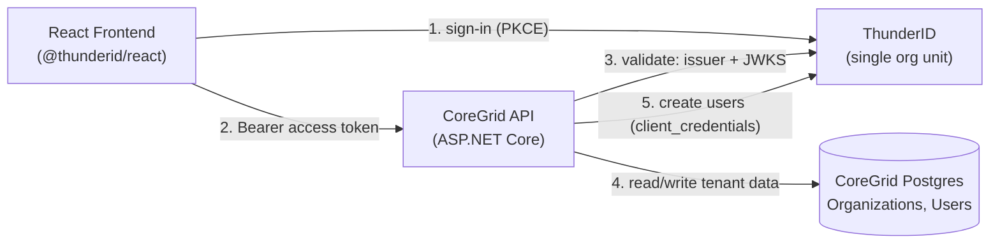
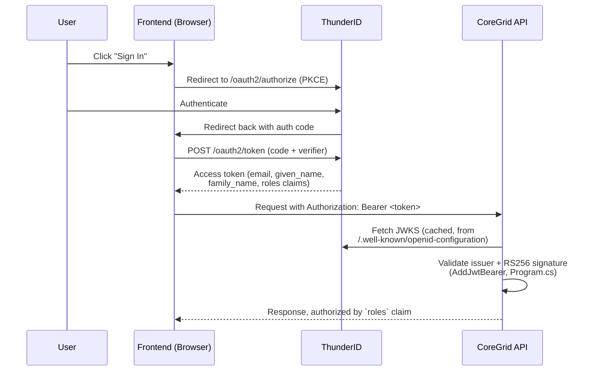
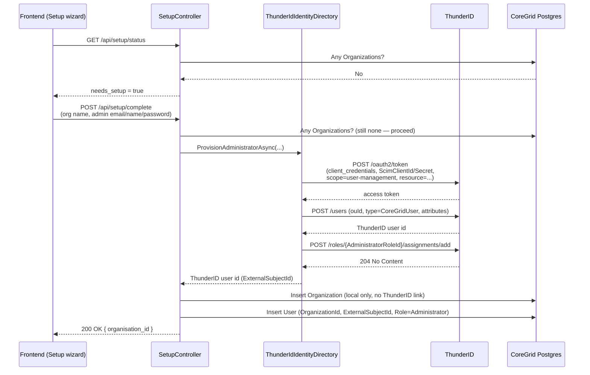

# ThunderID Integration

CoreGrid delegates authentication and identity storage to [ThunderID](https://github.com/thunder-id), an external OIDC provider. This document explains how the integration actually works, then walks through setting it up from scratch.

> **Deployment model:** CoreGrid is **self-hosted, one full stack per government department** — each department runs its own CoreGrid frontend/backend, its own Postgres, and its own ThunderID instance (the same `docker-compose.yml` bundle this guide sets up). It is not a shared multi-tenant SaaS platform serving multiple departments from one deployment. SRS §4.2 and ADR-002 have been updated to reflect this; see below for what that means for ThunderID specifically.

## How It Works

ThunderID is used for exactly two things:

1. **Signing users in.** The React frontend redirects to ThunderID's own hosted login (authorization code + PKCE), and gets back a JWT access token. The backend validates that token on incoming API requests — it never sees a password.
2. **Creating accounts.** When CoreGrid needs to create a new ThunderID account (currently: only the first Administrator, via the Setup wizard), the backend calls ThunderID's management API directly, authenticating as its own registered application (`client_credentials`) rather than as any user.

### One Department, One Deployment, One ThunderID Organisation Unit

Because each department gets its own dedicated deployment, there is nothing for ThunderID to isolate — every user who ever signs into a given deployment belongs to that same one department. ThunderID is therefore run with a single organisation unit per deployment, and every user is created inside it. This isn't CoreGrid's database doing the isolation work instead of ThunderID (a design compensating for a missing per-tenant boundary) — there's simply only ever one tenant per deployment, so no boundary is needed in the first place.

CoreGrid's own `Organizations` table still exists — Setup creates exactly one row per deployment and refuses to create a second (`backend/Features/Setup/SetupController.cs`) — but it represents *this deployment's* department, not a list of separate customers sharing infrastructure. `User.OrganizationId` and the EF Core global query filter that reads it remain in place as good practice, not as the thing standing between two different governments' data.



### Sign-In Flow

The browser talks to ThunderID directly for the OAuth dance — the backend is only involved once a token already exists.



### Setup / First-Administrator Provisioning Flow

This is the one place the backend creates a ThunderID account, via `ThunderIdIdentityDirectory` (`backend/Identity/ThunderIdIdentityDirectory.cs`).



Note what's *not* in this flow: no ThunderID organisation is created, and no `ExternalOrgId` is stored — `Organization` (`backend/Domain/Organization.cs`) has no ThunderID-side counterpart at all.

## One-Time Console Setup

Everything below is done once per ThunderID instance, in the console. It does not need repeating per tenant.

### Start ThunderID and PostgreSQL

**Brand-new machine — nothing pulled or started before:** pull and bootstrap ThunderID on its own first —

```bash
docker compose -f oci://ghcr.io/thunder-id/thunderid-quick-start:latest -p coregrid up -d
```

This pulls the (large — several minutes, not a hang) ThunderID image, runs its one-shot `thunderid-db-init` and `thunderid-setup` containers (they exit after running — normal, not an error), and starts the server under the `coregrid` project name. The container ends up named `coregrid-thunderid-1`.

Then, from the repo root, bring up CoreGrid's own database alongside it:

```bash
docker compose up -d
```

`docker-compose.yml` pins the same project name (`coregrid`) and includes the same ThunderID bundle, so Compose only creates what's missing — `coregrid-postgres`, on host port `5433`.

**To restart later, don't re-run `up -d`** — use `docker compose start`, or `docker start coregrid-thunderid-1` / `coregrid-postgres` individually. Re-running `up -d` re-executes the one-shot `thunderid-setup` container against the already-initialized volume; its bootstrap isn't idempotent and fails with a user-type conflict, which also keeps `thunderid` itself from starting.

**The admin password is not `admin`.** It's randomly generated on first setup and printed once to the setup container's own logs:

```
Admin credentials:
  Username: admin
  Password: <random string>
```

Retrieve it any time after the fact with `docker logs coregrid-thunderid-setup-1` (the container stays around after exiting). Console: `https://localhost:8090/console`.

### Create the CoreGridUser Type

**User Types** → create one type covering all four CoreGrid roles (the claim contract, [SRS §4.4](../SRS/04-identity-and-access-management.md#44-token-model-and-claim-contract), is uniform across them, so one shared type is enough):

| Field | Value |
|---|---|
| Name | CoreGridUser |
| Self-Registration | Disabled |

Self-registration is disabled — FR-013 makes an Administrator invite the only path a user enters CoreGrid by.

Attributes:

| Property Name | Display Name | Type | Required | Unique | Credential |
|---|---|---|---|---|---|
| email | Email Address | String | Yes | Yes | No |
| given_name | First Name | String | Yes | No | No |
| family_name | Last Name | String | Yes | No | No |
| password | Password | String | Yes | No | Yes |

Don't reuse the console's built-in `Person` type — `Person` accounts can't be added to an application's Allowed User Types and never pick up app roles.

**Note down the User Type's ID** (shown in the console alongside its name) — this is `ThunderID:UserType` below.

### Note the Organisation Unit ID

Go to **Organisations**, open the root organisation (it exists by default — nothing to create), and note its **Organisation Unit ID**. This is `ThunderID:OuId` — every `POST /users` call uses it, since there's only ever the one OU.

### Create the Four CoreGrid Roles

**Roles** → create:

- Administrator
- InventoryOfficer
- Auditor
- Staff

These are plain business roles CoreGrid's own policy layer reads from the `roles` claim ([SRS §4.6](../SRS/04-identity-and-access-management.md#46-role-and-permission-model), [Appendix B](../SRS/appendix-b-route-level-authorisation-map.md)). The **name** must exactly match `CoreGridRole` (`backend/Domain/CoreGridRole.cs`) — `Staff`, `InventoryOfficer`, `Auditor`, `Administrator` — since the backend does a literal string comparison. `Admin` or any other spelling never matches.

**Note down each role's ID** as you create it — `ThunderIdIdentityDirectory` assigns roles by ID (`POST /roles/{roleId}/assignments/add`), not name, so the backend needs `ThunderID:RoleIds:*` for each. Only `Administrator` is consumed by code so far (the Setup wizard is the only thing that assigns a role today); record the others now so they're ready when Officer/Auditor/Staff account creation is built.

**These are not the same object as ThunderID's own built-in `Administrator` role** (step 7 below assigns that one to the *backend application*, not to any CoreGrid user). Both happen to be named "Administrator." Confirm which one you're looking at by checking whether it appears in **your** list of four roles you just created (custom) versus a separate built-in-roles list, and whether it has a description — ThunderID's built-in role typically has one ("System administrator role with full permissions" or similar); a role you created yourself won't.

### Create the Frontend Application

**Applications** → new application, web/browser type:

- **Note down the Client ID** — not the Application ID. The console shows both per application; only the Client ID is a valid OAuth `client_id`. Using the Application ID here fails sign-in with `invalid_client`.
- Application URL: `http://localhost:5173`
- Redirect URI: `http://localhost:5173`
- **Post-logout redirect URI**: also `http://localhost:5173` — a separate whitelist from the sign-in redirect URI. If missing, `/oauth2/logout` rejects the request with `invalid post_logout_redirect_uri` and `signOut()` fails to return the user to the app.
- **Allowed User Types** (under Access): add `CoreGridUser`. Easy to miss — without it, no attributes or roles land in tokens for anyone signing in, regardless of anything else configured. This is also why the built-in console admin (`Person` type) can't be used to test sign-in.
- **Token Attributes and Response** → Access Token: add `email`, `given_name`, `family_name`, `roles`. (Not `org_id`/`org_name` — there's only ever one department per deployment, so there's no organisation concept to put in them; see "One Department, One Deployment" above.)
- **Available Scopes**: activate `roles`, alongside the default `openid`/`profile`/`email`.
- **Flows**: assign the default authentication flow.

### Allow the Frontend Origin (CORS)

The browser calls ThunderID's `/oauth2/token` and `/flow/meta` directly (PKCE requires this for a public SPA client) — separate from the backend API's own `Cors:AllowedOrigins` (SEC-ID-08), which only covers calls to the ASP.NET Core API. There's no console page for this yet — set it via the API with an admin token:

```bash
curl -k -X PUT "https://localhost:8090/server-config/cors" \
  -H "Authorization: Bearer $ADMIN_TOKEN" \
  -H "Content-Type: application/json" \
  -d '{"allowedOrigins": ["http://localhost:5173"]}'
```

Takes effect immediately, no restart. Add every other origin the frontend is served from to the same array.

### Create the Backend Service Application

The confidential credential the API uses to create/manage ThunderID accounts ([SRS §4.7](../SRS/04-identity-and-access-management.md#47-user-provisioning-and-the-local-mirror)).

**Applications** → new Backend Service application:

- Name: CoreGrid Backend
- Grant Type: `client_credentials`
- **Token Endpoint Auth Method: `client_secret_post`** — must actually be saved as this, not just selected during creation. The backend sends `client_id`/`client_secret` as form fields, not HTTP Basic Auth. Left on `client_secret_basic`, every request fails with `unauthorized_client: Client is not allowed to use the specified authentication method` even with correct credentials. Double-check this value after saving.
- Note down the Client ID and Client Secret.
- **Available Scopes**: add a `user-management` custom scope, activate it.

### Register the CoreGrid API as a Protected Resource

[Appendix C](../SRS/appendix-c-thunderid-configuration-checklist.md) item 5 calls for this, and it's not optional: `client_credentials` token requests fail with `invalid_target: No resource parameter supplied and no default resource server is configured` without it.

Go to **Resource Servers** in the console and find (or create) the resource server that the `user-management` scope from step 7 belongs to — **not** any unrelated built-in resource server the instance ships with (e.g. one for MCP tooling). Note its **Identifier** — this is `ThunderID:Resource`, sent as the `resource` form field on every `client_credentials` request `ThunderIdIdentityDirectory` makes.

> **Open item:** the exact console path for this — whether `user-management` already belongs to a resource server by default, or needs one created for it — hasn't been fully walked end-to-end yet. If `user-management` isn't listed under any existing resource server, it likely needs one created for it explicitly.

### Assign ThunderID's Built-In Administrator Role to the Backend Application

**Roles** → built-in **Administrator** → **Assignments** tab → add the CoreGrid Backend application.

Without this, the backend app can still get an access token, but every management call (e.g. creating a user) fails with `403 Forbidden`.

### The Agent Service Doesn't Register With ThunderID

The LangGraph agent service is not a ThunderID application. [SRS §4.3](../SRS/04-identity-and-access-management.md#43-application-registration-and-grant-types) allows either a ThunderID client-credentials client or "an equivalently protected internal shared secret over the private network path" for it, and [§14.2](../SRS/14-deployment-and-operations.md) settles on the latter: `AgentService__SharedSecret`, a locally generated secret (`openssl rand -hex 32`) set identically on both sides, recognised by the API's own auth pipeline. ThunderID plays no part in it.

## Environment Variables

**Backend** (`backend/appsettings.Development.json` for non-secrets, `dotnet user-secrets` for the client secret):

```dotenv
ThunderID__Issuer=https://localhost:8090
ThunderID__Resource=<Resource Server Identifier from step 8>
ThunderID__OuId=<Organisation Unit ID from step 3>
ThunderID__UserType=<CoreGridUser type's ID from step 2>
ThunderID__RoleIds__Administrator=<CoreGrid's custom Administrator role ID from step 4>
ThunderID__RoleIds__InventoryOfficer=<InventoryOfficer role ID>
ThunderID__RoleIds__Auditor=<Auditor role ID>
ThunderID__RoleIds__Staff=<Staff role ID>
ThunderID__ScimClientId=<Backend Service Client ID from step 7>
ThunderID__ScimClientSecret=<Backend Service Client Secret from step 7>
```

- Everything is `https://` — ThunderID doesn't serve plain HTTP by default.
- `ThunderID__Issuer` is the bare server URL only, no path.
- No separate JWKS or token URL to configure — `AddJwtBearer` resolves both from the issuer's `/.well-known/openid-configuration` automatically.
- **No `ThunderID__Audience`.** Inbound token validation (`Program.cs`, `AddJwtBearer`) checks only issuer and RS256 signature — `ValidateAudience = false`. `ThunderID__Resource` above is unrelated: it's for the backend's own *outbound* `client_credentials` calls only.
- `ThunderID__ScimClientSecret` must never go in `appsettings.Development.json` (it's committed to git) — `dotnet user-secrets set "ThunderID:ScimClientSecret" "<value>"` from `backend/` instead.
- Relax TLS verification for ThunderID's self-signed cert only in Development — `Program.cs` already does this, gated on `IsDevelopment()`.

**Frontend** (`frontend/.env.local`, copy from `.env.example`):

```dotenv
VITE_THUNDERID_CLIENT_ID=<frontend Client ID from step 5>
VITE_THUNDERID_BASE_URL=https://localhost:8090
VITE_THUNDERID_SCOPES="openid profile email roles"
VITE_THUNDERID_AFTER_SIGN_IN_URL=http://localhost:5173
VITE_THUNDERID_AFTER_SIGN_OUT_URL=http://localhost:5173
```

`VITE_THUNDERID_AFTER_SIGN_IN_URL` / `_SIGN_OUT_URL` must exactly match the redirect URI on the application (step 5), including scheme and trailing slash. `VITE_THUNDERID_SCOPES` should match whatever's activated under Available Scopes. Already wired into `ThunderIDProvider` in `frontend/src/main.tsx`.

## Known Gaps

- **`ThunderID:Resource`** — step 8's console path isn't fully confirmed end-to-end yet. Confirmed so far: it must be an absolute URI (`invalid_target: Invalid resource parameter: must be an absolute URI` if it isn't) — a scope name or bare identifier will not work.
- **`ThunderID:UserType`** — set to the User Type's ID rather than the literal name `CoreGridUser`, following the pattern every other ThunderID resource in this guide uses (name + separate ID, ID required at the API boundary). Not yet confirmed against a successful `POST /users` call.
- **Local-identity fallback** (SRS §4.10) isn't built — `IIdentityDirectory` exists as the seam for it, but only `ThunderIdIdentityDirectory` exists today.
- **Only Administrator provisioning is wired up.** `ThunderIdIdentityDirectory.ProvisionAdministratorAsync` is only called by the Setup wizard. Creating InventoryOfficer/Auditor/Staff accounts (e.g. via an Administrator's invite) isn't built yet.

## Troubleshooting Quick Reference

| Symptom | Likely cause |
|---|---|
| Setup fails with `invalid_target: No resource parameter supplied and no default resource server is configured` | `ThunderID:Resource` is missing/empty — see step 8 |
| Setup fails with `invalid_target: Invalid resource parameter: must be an absolute URI` | `ThunderID:Resource` is set to something other than the resource server's Identifier (a scope name, a GUID, etc.) — it must be the absolute-URI Identifier value, see step 8 |
| `403 Forbidden` calling any management API as the backend app | Backend app hasn't been assigned the built-in ThunderID Administrator role — step 9 |
| `roles` claim present but Administrator-only routes/policies still reject the user | CoreGrid's custom Administrator role isn't named exactly `Administrator` (e.g. created as `Admin`) — `CoreGridRole` does an exact string match |
| Login succeeds but `roles` claim is missing from the token | Allowed User Types isn't set on the frontend application, or the user has no role assignment |
| Frontend sign-in fails with `invalid_client` | `VITE_THUNDERID_CLIENT_ID` is the application's internal Application ID, not its Client ID |
| Backend gets `key not found` / endless JWKS retries | Issuer is `http://` instead of `https://` |
| Backend gets `certificate signed by unknown authority` | TLS verification needs relaxing for local dev against the self-signed cert |
| Backend gets `token has invalid issuer` | Issuer value includes a path; should be the bare server URL |
| Backend gets a schema-validation error creating a user | User type field name mismatch — check **User Types → CoreGridUser → schema** against `email`/`given_name`/`family_name`/`password` |
| Sign-in silently fails; CORS errors on `/oauth2/token` or `/flow/meta` | Frontend origin isn't in the `cors` server-config's `allowedOrigins` — step 6 |
| Signing out doesn't return to the app | Application's post-logout redirect URI isn't set — step 5 |
| All users/roles/data disappeared after a restart | `docker compose down -v` was used, or the stack was recreated instead of restarted |
| `thunderid-setup` fails with a user-type conflict after a restart | `docker compose up -d` was re-run against an already-initialized volume — use `docker compose start` instead |
| Console won't load, `/oauth2/authorize` redirects to an error page | An aborted `thunderid-setup` re-run partially applied. No clean recovery — `docker compose down -v`, then `docker compose up -d` fresh |
| Multiple ThunderID stacks, `invalid_client` for no obvious reason | `docker-compose.yml` pins project name `coregrid`; a *different* stack started elsewhere with `-p coregrid` collides with it. `docker compose ls`, `docker ps -a \| grep coregrid`, `docker volume ls \| grep coregrid` to find and consolidate |
