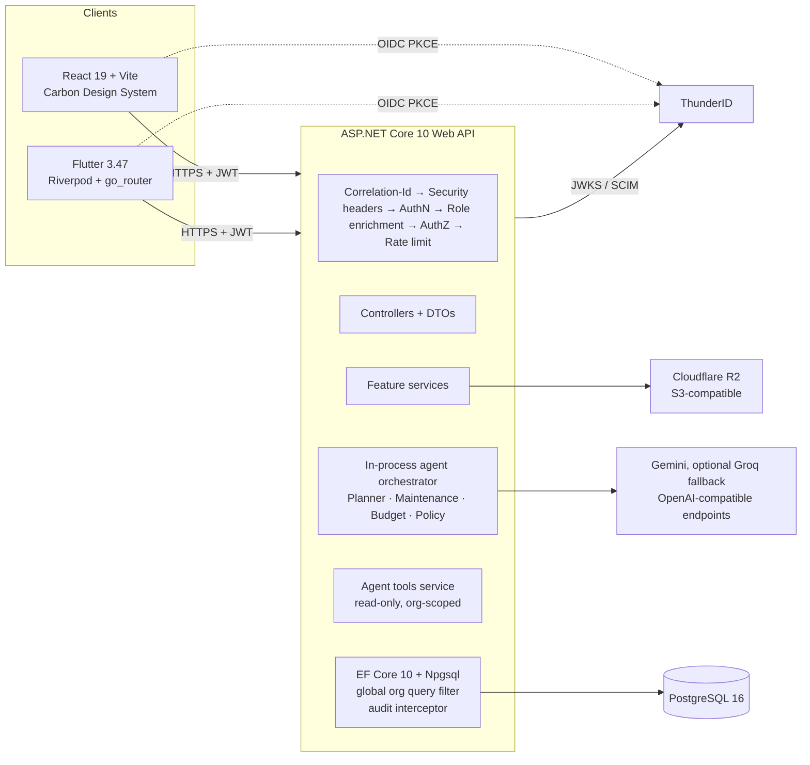
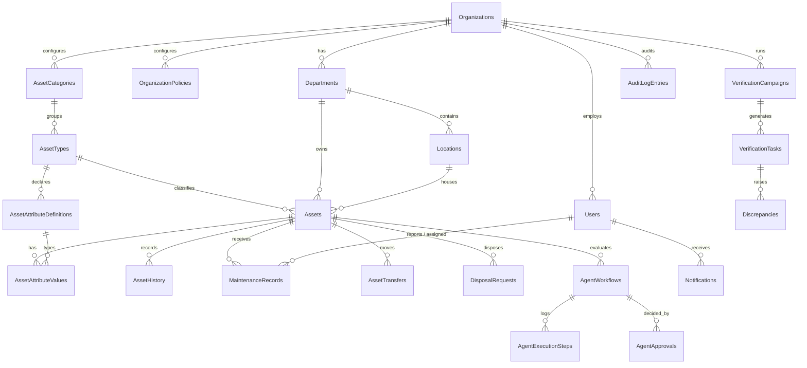
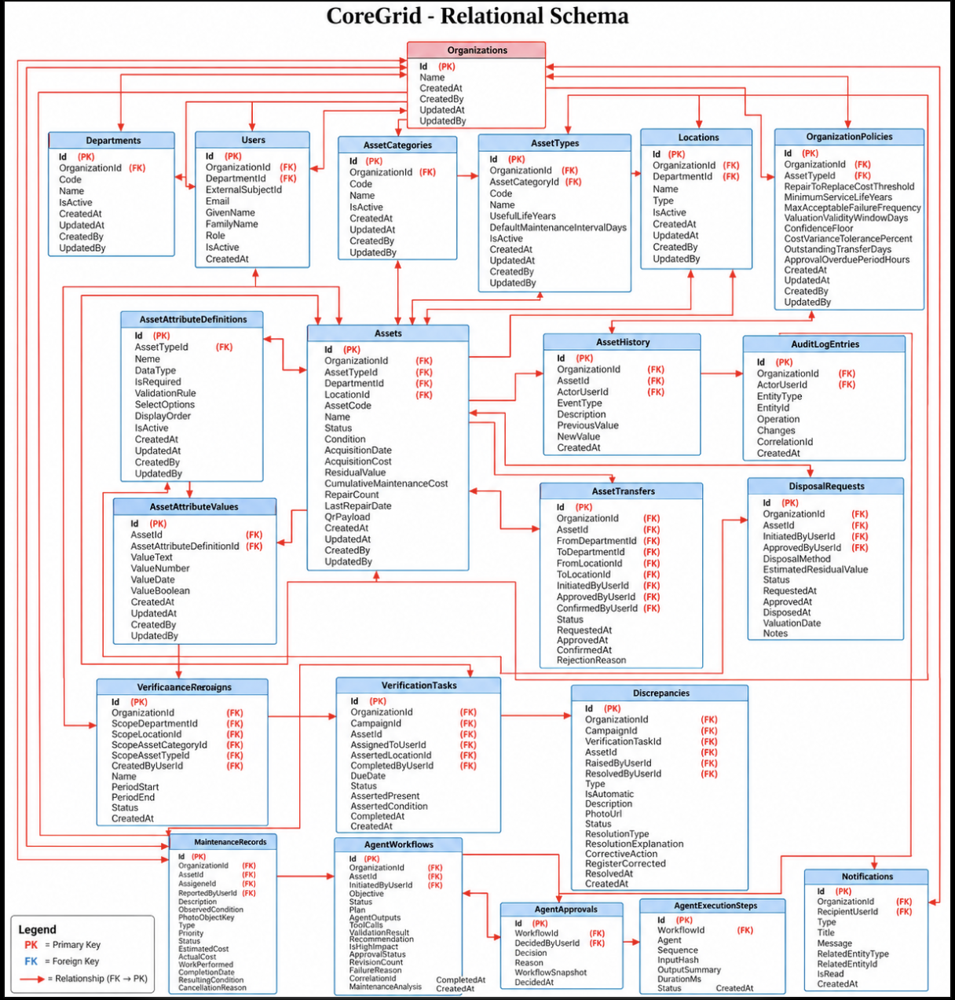
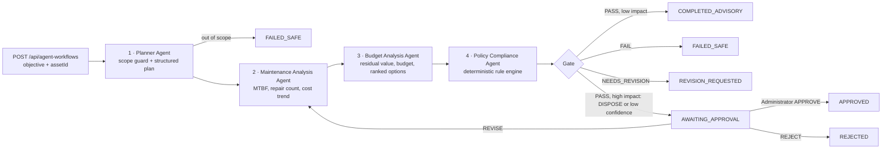
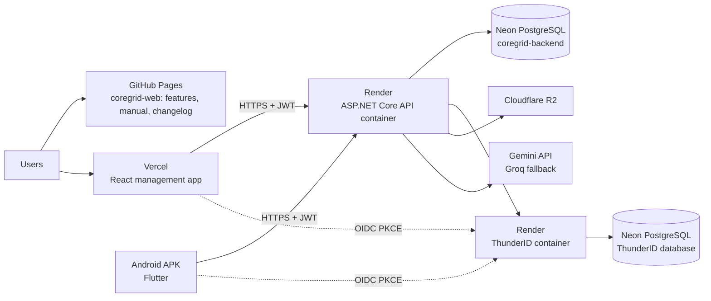

# SE3090 Assignment 1 — Group Report

## CoreGrid — Agentic-AI-Assisted Asset Lifecycle Management Platform

| Item | Detail |
|---|---|
| Module | SE3090 – Software Engineering Frameworks (Year 3, Semester 1, 2026) |
| Group | SE3090_G⟦NN⟧ |
| Product | Open-source (Apache 2.0), self-hosted, single-tenant: each organisation runs its own deployment |
| Repositories | `CoreGrid-org/CoreGrid` (API, database, React, CI) · `CoreGrid-org/coregrid-mobile` (Flutter) · `CoreGrid-org/coregrid-web` (public static site: features, user manual, changelog) |
| Report baseline | `CoreGrid` @ `36e7ebf` · `coregrid-mobile` @ `3636c5e` (`development`, 2026-10-04) |

### Group members

| Student | Name | Student ID | GitHub | Primary component | Agent owned |
|---|---|---|---|---|---|
| 1 | Jayashan Guruge | ⟦ID⟧ | `jguruge` | A — Asset Registry & QR Identification | Planner Agent |
| 2 | Seneja ⟦Ramanayaka / Thehansi — use one name consistently⟧ | ⟦ID⟧ | `seneja` | B — Maintenance Management & Notifications | Maintenance Analysis Agent |
| 3 | Nipuna Bhanuka | ⟦ID⟧ | `NipunaBhanuka18` | C — Transfer & Disposal | Budget Analysis Agent |
| 4 | Hasitha Erandika (Group Leader) | ⟦ID⟧ | `HasithaErandika` | D — Audit & Compliance, Org Configuration, User Administration | Policy Compliance Agent + human-approval checkpoint |

### Submission links

| Item | Hosted on | Link |
|---|---|---|
| GitHub — API, database, React | GitHub | ⟦https://github.com/CoreGrid-org/CoreGrid⟧ |
| GitHub — Flutter | GitHub | ⟦https://github.com/CoreGrid-org/coregrid-mobile⟧ |
| Public static site (features, user manual, changelog) | GitHub Pages | ⟦https://coregrid-org.github.io/…⟧ |
| React management application | Vercel | https://demo-coregrid.vercel.app |
| ASP.NET Core API — health | Render | https://coregrid-v7jn.onrender.com/health |
| ASP.NET Core API — Swagger | Render | https://coregrid-v7jn.onrender.com/swagger |
| ThunderID (identity provider) | Render | https://coregrid-1.onrender.com |
| PostgreSQL | Neon | Two databases: `coregrid-backend` (API) and a separate ThunderID database ⟦screenshot reference (Appendix)⟧ |
| Flutter APK | ⟦Drive / GitHub Release⟧ | ⟦link⟧ (`SE3090_G⟦NN⟧.apk`) |
| Demonstration video (10 min) | ⟦⟧ | ⟦link — "anyone with the link can view"⟧ |
| CI runs | GitHub Actions | ⟦main repo run⟧ · ⟦mobile repo run⟧ |
| Test accounts | — | §12.5 (shared demo accounts, also listed in the README) |

---

## 1. Project Overview and Scope

### 1.1 Business problem

Public-sector and institutional organisations — hospitals, ministries, universities, local authorities — manage vehicles, machinery, medical devices, IT equipment and furniture through spreadsheets and paper registers. The consequences are predictable: condition data goes stale, physical verification leaves no evidence trail, maintenance is reactive, transfer and disposal decisions are inconsistent, and audit discrepancies stay unresolved for months.

### 1.2 Solution

CoreGrid is a configurable, role-controlled asset lifecycle platform. One authoritative register supports registration, QR identification, maintenance, inter-department transfer, physical verification campaigns, audit, reporting and disposal. Asset domains are configured — categories, types and typed custom attributes — rather than coded, so the same software serves a hospital's medical equipment and a ministry's vehicle fleet.

CoreGrid is released as **open-source software (Apache 2.0)** and is **single-tenant**: each organisation runs its own deployment, with its own database and identity provider. Every record still carries an `OrganizationId` and is filtered by it. This makes data isolation explicit and testable, and leaves room for a hosted multi-organisation edition later.

A four-agent workflow assembles evidence for the highest-stakes lifecycle decision — *repair, retain, transfer or dispose?* — and stops at a deterministic gate and an Administrator approval checkpoint before anything high-impact happens. Agents never write business data directly.

### 1.3 Scope

| In scope (baseline) | Out of scope (future work) |
|---|---|
| Four roles, single-organisation deployment, ThunderID SSO | Multi-tenant hosted (SaaS) edition |
| Asset registry with dynamic attributes and QR labels | ERP / finance-system integration |
| Maintenance, transfer, disposal, verification, discrepancy workflows | Email/SMS notification delivery (in-app notifications only) |
| Dashboards, reports, PDF/CSV export | Offline-first mobile sync |
| Four-agent evaluation workflow with human approval | Automatic execution of the approved action (see §7.6) |

### 1.4 Platform responsibilities

| Client | Users | Purpose |
|---|---|---|
| **React web** | Administrator, Auditor, Inventory Officer | Administrative and back-office: configuration, user administration, asset CRUD, maintenance approval and assignment, transfer/disposal approval, verification campaigns, discrepancy resolution, dashboards, reports, and agent workflow monitoring and approval. |
| **Flutter mobile** | Inventory Officer, Department Staff | Field operations: QR scan to identify an asset, asset search/detail, condition update, physical verification (scan-to-verify), fault reporting with photo evidence, maintenance records, transfer initiation and scan-to-confirm receipt, notifications, and agent workflow initiation and status tracking. |
| **Public site** (`coregrid-web`, Docusaurus on GitHub Pages) | Anyone | Static site: product overview, features, AI decision support, user manual and changelog. No sign-in and no data. |

### 1.5 Team structure and work allocation (Team Roster §18)

The full allocation and required evidence per member are in [`team/team-roster-and-work-allocation.md`](team/team-roster-and-work-allocation.md) (§18 numbering is kept from the original SRS section). The product SRS records the same components as [§12 Component Ownership](../srs/12-component-ownership.md).

Each member owns one SRS component end to end (backend, database, React, Flutter, agent, tests, documentation), as required by SE3090 §3. The Group Leader additionally owns organisation configuration, user administration, the cross-cutting platform, CI and the consolidated submission (Team Roster §18.2, §18.6).

| | **Jayashan Guruge** (Student 1) | **Seneja** (Student 2) | **Nipuna Bhanuka** (Student 3) | **Hasitha Erandika** (Student 4, Leader) |
|---|---|---|---|---|
| Component | A — Asset Registry & QR Identification | B — Maintenance Management | C — Transfer & Disposal | D — Audit & Compliance + Org Configuration + User Administration |
| Requirements | FR-016–032 | FR-033–042, FR-077–080 | FR-043–055 | FR-001–015, FR-056–066, FR-081–086 |
| Backend | Categories, types, attributes, assets, QR lookup, history, condition, depreciation | Maintenance state machine, completion transaction, preventive scheduler, photos, notifications | Transfer state machine, condemnation, disposal, P1–P6 preconditions | Setup, users (SCIM), departments, locations, policies, campaigns, tasks, discrepancies, audit log, reports, dashboards; identity, authorisation, org filter, audit interceptor, error handling, health, rate limiting |
| Database | `AssetCategories`, `AssetTypes`, `AssetAttributeDefinitions`, `AssetAttributeValues`, `Assets`, `AssetHistory` | `MaintenanceRecords`, `Notifications` | `AssetTransfers`, `DisposalRequests` | `Organizations`, `Users`, `Departments`, `Locations`, `OrganizationPolicies`, `VerificationCampaigns`, `VerificationTasks`, `Discrepancies`, `AuditLogEntries`, `AgentWorkflows`, `AgentExecutionSteps`, `AgentApprovals`; global query filter; append-only role |
| Business operation | `POST /api/assets/{id}/verify` | `POST /api/maintenance/{id}/complete` | `POST /api/disposals/{id}/approve` | `PATCH /api/discrepancies/{id}/resolve`, `PATCH /api/agent-workflows/{id}/decide` |
| React | Asset list/detail/register, dynamic attribute forms, configuration, QR labels, inventory report | Maintenance pages and modals, notification centre, maintenance report | Transfers & disposals for three roles, precondition checklist | App shell, sign-in, role routing and permissions, Setup, users, org settings, policies, audit, campaigns, discrepancies, dashboards, reports (audit, disposal), Workflows/approval |
| Flutter | Asset search/lookup/detail, QR scan, condition update, asset verification | Fault reporting with photos, maintenance records, notifications | Initiate transfer, scan-to-confirm receipt | Project setup, OIDC auth + secure storage, app shell and role routing, onboarding, dashboards, verification campaigns/tasks, workflows, password recovery, mobile CI |
| Agent | Planner | Maintenance Analysis | Budget Analysis | Policy Compliance + orchestrator + approval checkpoint |
| Golden cases (Team Roster §18.7) | GC-06, GC-07 | GC-05, GC-09 | GC-02 | GC-01, GC-03, GC-04, GC-08, GC-10, GC-11, GC-12 |
| Leader duties | — | — | — | Repository and CI setup, branch/PR review flow, integration merges, ADR coordination, README, consolidated report, deployment, demo script, link checks |

---

## 2. Requirements and User Roles

### 2.1 User roles

| Role | Web | Mobile | Key permissions |
|---|---|---|---|
| Administrator | ✔ | — | Users and roles, departments/locations, policy parameters, asset configuration; approves transfers, disposals and agent workflows |
| Auditor | ✔ | — | Verification campaigns, discrepancy resolution, audit log, compliance reports (read-only on lifecycle operations) |
| Inventory Officer | ✔ | ✔ | Registers and amends assets, verifies assets, manages maintenance, initiates transfers, condemns assets, submits disposals, initiates agent evaluations |
| Department Staff | — | ✔ | Department-scoped asset lookup and fault reporting (web sign-in redirects to an "use the mobile app" page) |

Enforcement is server-side: named ASP.NET Core policies (`CanReadAssets`, `CanManageAssets`, `CanApproveWorkflow`, …) with a fail-closed fallback policy that denies any endpoint without an explicit attribute. Staff are additionally restricted to their own department by a service-layer `DepartmentScope`.

### 2.2 Functional requirement groups

The SRS (`docs/srs/`) defines 86 functional requirements.

| Range | Capability | Owner |
|---|---|---|
| FR-001–009 | Identity and access (ThunderID OIDC + PKCE, JWT validation, org resolution) | D |
| FR-010–015 | Departments, locations, users, policy parameters | D |
| FR-016–032 | Asset configuration, registry, QR, history, condition, depreciation, verification | A |
| FR-033–042, FR-077–080 | Maintenance lifecycle, photos, preventive scheduling, notifications | B |
| FR-043–055 | Transfers, condemnation, disposal with preconditions P1–P6 | C |
| FR-056–066 | Verification campaigns, discrepancies, append-only audit | D |
| FR-067–076 | Agentic evaluation workflow, approval checkpoint | All (one agent each) |
| FR-081–086 | Dashboards, reports, exports | D (with A/B/C report tabs) |

### 2.3 Status workflows

| Entity | States |
|---|---|
| Asset | `ACTIVE → UNDER_MAINTENANCE → ACTIVE` · `ACTIVE → TRANSFER_REQUESTED → IN_TRANSIT → ACTIVE` · `ACTIVE → CONDEMNED → DISPOSAL_REQUESTED → DISPOSED` |
| Maintenance | `REQUESTED → APPROVED → IN_PROGRESS → COMPLETED` (or `CANCELLED`) |
| Transfer | `REQUESTED → APPROVED → COMPLETED` (or `REJECTED`, `CANCELLED`) |
| Disposal | `PENDING → APPROVED` (asset `DISPOSED`), or `REVISION_REQUESTED`, `REJECTED` (asset back to `CONDEMNED`) |
| Agent workflow | `PLANNING → ANALYZING → VALIDATING → AWAITING_APPROVAL → APPROVED / REJECTED / REVISION_REQUESTED`, or `COMPLETED_ADVISORY` / `FAILED_SAFE` |

### 2.4 Assignment minimum-complexity mapping

| Spec requirement (§4.1) | CoreGrid evidence |
|---|---|
| ≥ 3 roles | 4 roles (§2.1) |
| ≥ 4 business components | Components A–D, one per student |
| CRUD + status workflows + search/filter/sort/pagination + reporting | All list endpoints are server-side paged/sorted/filtered (`PagedResult`), five status machines (§2.3), Reports page with Inventory / Maintenance / Disposal / Audit tabs and PDF/CSV export |
| Distinct React vs Flutter purpose | §1.4 |
| ≥ 1 third-party integration | ThunderID, Cloudflare R2, Google Gemini with an optional Groq fallback (§8); hosting on Vercel, Render, Neon and GitHub Pages (§12) |
| Cross-platform workflow | Flutter initiates evaluation → API + PostgreSQL + agents → React Administrator approves → Flutter shows final status (§7.7) |

---

## 3. System Architecture

### 3.1 Integrated architecture

Both clients talk **only** to the ASP.NET Core API. Neither client holds database, storage or model credentials. The agent subsystem runs in-process inside the API (ADR-010), so there is no separately exposed agent service for a client to call.

### 3.2 Backend layering

Each SRS component is one `Features/<Name>/` folder containing `Controllers/`, `Services/` (interface + implementation, registered through a per-feature `*Module.cs`) and `DTOs/`. Domain entities live in `Domain/`. Cross-cutting concerns live in `Features/Shared/`:

| Concern | Implementation |
|---|---|
| Caller identity | `RoleEnrichmentMiddleware` resolves the token `sub` against `Users.ExternalSubjectId` once per request into a scoped `ICurrentUser`; every controller reads it through `CoreGridControllerBase.GetCurrentUserAsync()` |
| Organisation isolation | EF Core `HasQueryFilter` on every organisation-scoped entity, so even a single-tenant deployment can never return another organisation's row |
| Audit | `AuditSaveChangesInterceptor` writes an append-only `AuditLogEntries` row for every entity mutation |
| Errors | `ApiExceptionFilter` maps domain exceptions (`NotFound`, `Validation`, `Conflict`, `BusinessRule`, `Forbidden`, `ServiceUnavailable`) to a uniform JSON error envelope and correct status codes |
| Validation | DTO validation with a custom `InvalidModelStateResponseFactory` producing the same envelope |
| Observability | `CorrelationIdMiddleware` (`X-Correlation-Id` on every response, shared with audit rows), structured `ILogger` logging, `AuthorizationOutcomeLoggingMiddleware` (every 401/403, never the token) |
| Health | `GET /health` — anonymous JSON per dependency (database, ThunderID issuer) |
| Rate limiting | Per-user+org policies on workflow initiation, photo uploads and first-run setup |

### 3.3 Frontend architecture (React)

Feature folders (`src/features/<name>/{api,hooks,components,pages,lib}`) mirror the backend. React Router v7 defines role-specific layouts (`AdminLayout` at `/admin`, `InventoryLayout` at `/inventory`, `AuditLayout` at `/audit`); `RoleRoute` guards each one. Staff accounts are mobile-only. `features/auth/lib/permissions.ts` (`usePermissions()`) mirrors the backend's grants, so action buttons are hidden consistently — the backend remains the enforcement point.

**State management.** Server state is held in feature-scoped custom hooks (`useWorkflowsList`, `useAssets`, …) built on `useState`/`useEffect` with cancellation guards and retry counters, plus a shared `useStubMutation` mutation helper exposing `isPending`/`isError`/`data`. Each hook returns `{ data, error, isError, isLoading, refetch }`. Session and token state come from the ThunderID React SDK provider (`useThunderID().getAccessToken()`). No Redux, Zustand or TanStack Query is used. See ADR-003.

### 3.4 Mobile architecture (Flutter)

Feature-first structure under `lib/features/` (assets, scan, verification, maintenance, transfers, notifications, workflows, dashboard, account, onboarding) with shared `api/`, `auth/`, `media/`, `theme/` and `widgets/` (`state_views.dart` provides loading / empty / error views). Riverpod 3 providers own all state; `go_router` handles navigation with a role-gated redirect. Dio is the HTTP client, with a bearer-token interceptor. Authentication uses `flutter_appauth` (OIDC + PKCE, custom-scheme redirect); tokens are stored with `flutter_secure_storage` (Android Keystore).

Device features: rear-camera QR scanning (`mobile_scanner`) with manual-entry fallback, camera/gallery photo capture with compression (`image_picker`, `flutter_image_compress`), runtime permissions (`permission_handler`), and connectivity detection for offline messaging (`connectivity_plus`).

---

## 4. Database Design

### 4.1 ER diagram (conceptual)

The full Chen-notation ER diagram, showing entities, attributes and relationship cardinalities, is in [`diagrams/er-diagram.html`](diagrams/er-diagram.html) (open in a browser; export to PNG for the PDF). The overview below shows the same entities and cardinalities in crow's-foot notation.

### 4.2 Relational schema (logical)

*Figure 4.2 — Relational schema: every table with its primary key (PK), foreign keys (FK) and FK → PK relationships. Source: [`diagrams/relational-schema.png`](diagrams/relational-schema.png). The authoritative physical DDL is generated from the EF Core migrations into `backend/db/schema.sql`; see SRS Appendix E for the column-level reference design.*

### 4.3 Schema facts (from `backend/db/schema.sql`)

| Property | Value |
|---|---|
| Tables | 23 (excluding EF migrations history) |
| Indexes | 92 |
| CHECK constraints | 16 (status/condition enumerations, non-negative money) |
| Migrations | 17 EF Core migrations, 2026-08-09 → 2026-09-25, with numbered SQL exports in `backend/db/migrations/` |

### 4.4 Design decisions

- **Keys.** UUID primary keys on every API-exposed entity; every tenant-scoped table carries `OrganizationId` with a FK to `Organizations`.
- **Uniqueness.** `(OrganizationId, AssetCode)` unique; asset codes are org prefix + monotonic sequence.
- **Types.** Money is `numeric(18,2)`; timestamps are `timestamptz` (UTC); agent artefacts (`Plan`, `MaintenanceAnalysis`, `BudgetAnalysis`, validation results, tool results) are `jsonb`.
- **Dynamic attributes.** Entity-attribute-value tables (`AssetAttributeDefinitions` / `AssetAttributeValues`) rather than one JSON blob, so attribute definitions are FK-enforced and searchable (ADR-006).
- **Concurrency.** PostgreSQL `xmin` is the optimistic-concurrency token; a lost update returns HTTP 409.
- **Transactions.** Maintenance completion (status + asset condition + cumulative cost/repair count + history) and disposal approval are single transactions.
- **Append-only.** `AuditLogEntries` and `AssetHistory` have no update/delete code paths; a restricted DB role with `INSERT/SELECT`-only grants is created and verified by `AppendOnlyTests` against real PostgreSQL.
- **Audit fields.** `CreatedAt` / `UpdatedAt` on all mutable entities.
- **What is not stored.** No passwords (ThunderID owns credentials), no tokens, no raw prompts, no chain-of-thought, no raw model responses.

### 4.5 Seed data

⟦Describe how the demonstration organisation is created. The current tree has no `HasData`/seeder; first-run provisioning goes through `POST /api/setup/complete` (creates the organisation, the first Administrator in ThunderID and in CoreGrid). If a seed script or SQL fixture is added for the evaluation dataset, document it here.⟧

---

## 5. API, React and Flutter Design

### 5.1 REST API surface

23 controllers, 113 endpoints. All are `async`, use DTOs, and declare an authorisation policy.

| Component | Base route | Endpoints | Business-specific operation |
|---|---|---|---|
| A | `/api/asset-categories`, `/api/asset-types` (+ `/attributes`), `/api/assets` | CRUD, activate/deactivate, `PATCH {id}/condition`, `GET {id}/history`, `GET qr/{code}` | `POST /api/assets/{id}/verify` |
| B | `/api/maintenance`, `/api/notifications` | faults, photos, `my-reports`, approve, start, cancel, unread-count, read-all | `POST /api/maintenance/{id}/complete` (BR1–BR3 in one transaction) |
| C | `/api/transfers`, `/api/disposals`, `/api/assets/{id}/condemn` | create, approve, reject, confirm-receipt, request-revision, history | `POST /api/disposals/{id}/approve` (preconditions P1–P6 + separation of duties) |
| D | `/api/departments`, `/api/locations`, `/api/users`, `/api/organization-policies`, `/api/verification-campaigns`, `/api/verification-tasks`, `/api/discrepancies`, `/api/audit-log`, `/api/reports/audit`, `/api/dashboard` | CRUD, reset-password, campaign report + export | `PATCH /api/discrepancies/{id}/resolve` |
| Agents | `/api/agent-workflows` | list, get, `execution-summary`, create, `evaluate`, `run-maintenance-agent`, `run-budget-agent`, `run-policy-agent` | `PATCH /api/agent-workflows/{id}/decide` (APPROVE / REJECT / REVISE) |
| Agent tools | `/api/agent-tools/*` | 8 read-only tools (§7.3) | — |
| Ops | `/health`, `/swagger`, `/api/me`, `/api/setup` | | |

### 5.2 Status codes

`200/201/204` success · `400` validation (uniform envelope with field errors) · `401` no/invalid token · `403` policy failure · `404` not found **or other organisation** (no existence leak) · `409` invalid state transition, concurrency conflict, workflow already running · `422` business-rule violation · `429` rate limit · `503` dependency unavailable.

### 5.3 React

19 feature areas, Carbon Design System components, protected and role-based routes, server-side search/filter/sort/pagination tables, Carbon form validation, and explicit loading (skeleton), empty, success (toast) and error (inline notification with retry) states. The Workflows page shows each agent node's output, the execution summary, and — for Administrators only — Approve / Reject / Request revision with a mandatory reason.

### 5.4 Flutter

Role-specific dashboards (Officer, Staff); QR scan → asset detail → condition update / verify / report fault; verification campaigns and tasks with scan-to-verify and discrepancy raising; maintenance records; transfer list, initiate and scan-to-confirm receipt; notifications with an unread bell; workflow list, initiation and detail with live status.

---

## 6. Technical Report

### 6.1 Technology justification

| Layer | Choice | Why |
|---|---|---|
| API | ASP.NET Core 10, C# | Mandated; policy-based authorisation, DI and middleware pipeline fit a rules-heavy domain |
| ORM / DB | EF Core 10 + Npgsql, PostgreSQL 16 | Mandated; global query filters give multi-tenancy in one place; `jsonb` for agent state; `xmin` concurrency |
| Identity | ThunderID (OIDC/OAuth 2.0, PKCE) | Credentials never touch CoreGrid; one IdP for web and mobile; SCIM for admin-driven provisioning |
| Web | React 19, Vite 8, React Router 7, Carbon | Carbon gives accessible enterprise components out of the box (ADR-008) |
| Mobile | Flutter 3.47, Riverpod 3, go_router, Dio | Compile-time-safe providers, testable without a widget tree (ADR-004) |
| Agents | Custom in-process C# orchestrator; Gemini as the primary model and Groq `gpt-oss-120b` as an optional fallback, both via the OpenAI-compatible protocol | One deployable, no extra runtime, deterministic fallbacks (ADR-010) |
| Storage | Cloudflare R2 (S3 API) | Free tier, private objects, short-lived signed URLs (ADR-009) |

### 6.2 Notable engineering decisions

- **One identity lookup per request.** Resolving `sub → User` once in middleware removed duplicate queries from every controller, the audit interceptor and the tenant filter provider.
- **Tenant filter in the DbContext, not at call sites.** Entities without their own `OrganizationId` (`AssetAttributeDefinition`, `AssetAttributeValue`, `AgentExecutionStep`, `AgentApproval`) are filtered through their required parent navigation.
- **Generic audit.** New entities are audited automatically once they are added to the `DbContext`.
- **Agent migration.** The Planner and Budget agents began as Python/LangGraph services (ADR-005). They were migrated in-process to C# (ADR-010) after the team found that the graph primitives — typed state, persisted checkpoints, conditional edges, approval interrupt — were simple to express directly, and that a second runtime doubled deployment and secret-handling effort.

### 6.3 Known limitations

| Limitation | Impact |
|---|---|
| Approving a workflow records the decision and closes it, but does not yet invoke the business action (e.g. disposal) automatically | The Administrator executes the approved action through the ordinary guarded endpoint; P6 links the disposal to the approved workflow |
| Email/SMS notifications (FR-077–079) not implemented | In-app notifications only |
| Runtime DB connection still uses the migration-owner role | Append-only grants are proven by tests but not yet in force at runtime |
| Mobile FR-049 (condemnation) not present in the mobile tree | Condemnation is available on web only |

---

## 7. Agentic AI Subsystem

### 7.1 Assessed workflow — Asset Lifecycle Evaluation

**Domain objective (example):** *"Evaluate whether ambulance AMB-0042 should be repaired, retained or disposed of, given its repair history and the department's budget."*

### 7.2 Distinct agents

| # | Agent | Owner | Responsibility | Input contract | Output contract | Allowed tools | Model use |
|---|---|---|---|---|---|---|---|
| 1 | Planner | Jayashan | Reject out-of-scope objectives; produce an ordered, typed execution plan | `EvaluationScope` (asset type, optional asset) + objective text | `ExecutionPlan { steps[], inScope, rejectionReason? }` | `get_asset_type_summary` | Gemini, then the optional Groq fallback; deterministic fallback plan if both fail (error, 429, timeout, invalid JSON) or no key is set |
| 2 | Maintenance Analysis | Seneja | Quantify reliability per asset: repair count, MTBF, cost trend, 12-month projection; roll a fleet up into one figure | `EvaluationScope` | `FailureStatistics` per asset + aggregate (jsonb) | `get_maintenance_history`, `compute_failure_statistics` | None (deterministic) |
| 3 | Budget Analysis | Nipuna | Triage each asset (projected 12-month repair cost against residual value and the policy threshold) and rank the lifecycle options | `EvaluationScope` + Node 2 per-asset statistics | `FinancialAssessmentResult { rankedOptions[], proposedRecommendation, assets[], source }` | `get_asset_financials`, `get_department_budget_summary`, `compute_depreciation`; reads the policy threshold through `get_organization_policies` | All figures are deterministic (`BudgetTriage`); Gemini, then the optional Groq fallback, only re-scores the options, and `BudgetAssessmentValidator` rejects an invalid reply; deterministic ranking if both fail or no key is set |
| 4 | Policy Compliance | Hasitha | For each asset, try candidate actions in order and keep the first one the rule engine passes; decide whether approval is required | `EvaluationScope` + Node 2/3 outputs | `PolicyValidation { verdict, ruleResults[], blockingReasons[], isHighImpact }` + per-asset fleet result | `get_asset_compliance_state`, `get_organization_policies` | None (deterministic rule engine, by design) |

The code is in `backend/Features/Agents/Services/`, one folder per agent: `Planner/` (`IPlannerAgent`), `Maintenance/` (`MaintenanceAggregation` over `IMaintenanceTools`), `Budget/` (`IBudgetAgent`) and `Policy/` (`IPolicyComplianceEvaluator`, `PolicyRuleEngine`). `Orchestration/` holds `AgentWorkflowService` (the API-facing service), `WorkflowPipeline` (runs the nodes in plan order) and `WorkflowRouting` (the gate and the approval decisions). Every node writes its own `AgentExecutionStep` row. `run-maintenance-agent` and `run-budget-agent` re-run one analysis node; `run-policy-agent` resumes the remaining plan (Policy Compliance, then the gate).

### 7.3 Tools

Each agent receives only its own tool interface — `IPlannerTools`, `IMaintenanceTools`, `IBudgetTools`, `IPolicyTools` (`backend/Features/AgentTools/Services/`) — so a call outside its allow-list does not compile. The same tools are exposed read-only at `/api/agent-tools/*`. Every tool takes the organisation id from persisted workflow state, never from agent output, so a manipulated plan cannot reach another organisation's data. Tools return typed DTOs; none mutates business data.

### 7.4 Persisted state

| Table | Contents |
|---|---|
| `AgentWorkflows` | Id, objective, asset type and optional asset, initiator, status, approval status, revision count, `Plan`, `MaintenanceAnalysis`, `BudgetAnalysis`, `ValidationResult`, `AgentOutputs` (per-asset fleet result), recommendation, high-impact flag, failure reason, correlation id, timings |
| `AgentExecutionSteps` | Per-node sequence, agent name, one-line output summary, duration, status, error |
| `AgentApprovals` | Decision, decider, mandatory reason, full workflow snapshot at decision time, timestamp |

### 7.5 Validation and safety controls

| Control | Implementation |
|---|---|
| Objective scope / prompt injection | `PlannerScopeGuard` rejects, before any model call, objectives with no lifecycle term and objectives containing forbidden phrases ("approve disposal", "delete database", "modify policy", …). `ValidatePlan` then rejects any plan that delegates to an agent outside the allow-list {Maintenance, Budget, Policy, DeterministicGate}. `BudgetAssessmentValidator` applies the same idea to Node 3's model reply |
| Output schema | Planner and Budget outputs are deserialised into typed records; malformed output → next provider, then deterministic fallback, never partial state |
| Business rules | `PolicyRuleEngine` (17 unit tests) — PR-01 to PR-09: condition, minimum service life and valuation validity for DISPOSE; repair-to-replace ratio for REPLACE; budget headroom for REPAIR (N/A while department budgets aren't tracked); terminal state; open maintenance/transfer records; confidence floor; DISPOSE always needs approval. Thresholds come from `OrganizationPolicies` |
| Revision bound | At most 2 revisions, then `REVISION_REQUESTED` (terminal) |
| Approval authority | `CanApproveWorkflow` — Administrator only, verified by `AuthorizationMatrixTests` |
| Concurrency | One in-flight workflow per target, an asset type or a single asset (409 `workflow_already_running`) |
| Timeouts / limits | Model HTTP client timeout 30 s per call; rate-limited initiation per user+org |
| Secrets | Model keys (primary and fallback) read only from the git-ignored `backend/.env` or environment variables |
| Safe failure | A Planner or Policy Compliance failure → `FAILED_SAFE` with the reason recorded; a Maintenance or Budget failure is recorded as a failed step and the pipeline degrades (Policy falls back to condition-based proposals). No business data is touched |

### 7.6 Human approval

High-impact recommendations — DISPOSE always, or any action whose model confidence is below the policy floor (PR-08) — pause at `AWAITING_APPROVAL`; low-impact, policy-compliant ones complete as advisory. Only an Administrator can call `PATCH /api/agent-workflows/{id}/decide` with `APPROVE`, `REJECT` or `REVISE` and a reason of at least 10 characters. `REVISE` re-runs the analysis straight away without re-proposing the returned action, at most twice before `REVISION_REQUESTED`. The decision and a full workflow snapshot are written to `AgentApprovals`, and the audit interceptor logs the change. On approval, the Administrator carries out the disposal through `POST /api/disposals/{id}/approve`. Its precondition P6 requires a linked workflow that reached `AWAITING_APPROVAL` with a PASS validation result, so the agent workflow gates the real business action.

### 7.7 Cross-platform end-to-end workflow

1. **Flutter (Inventory Officer)** scans the asset QR, opens it and starts *Evaluate asset* with an objective.
2. **ASP.NET Core** validates the token, policy and rate limit, persists the workflow in **PostgreSQL**, and runs Planner → Maintenance → Budget → Policy.
3. The workflow pauses at `AWAITING_APPROVAL` and appears in the Administrator's *Awaiting approval* filter on the React Workflows page.
4. **React (Administrator)** opens Workflows, reviews the plan, the three analyses and the rule outcomes, then approves, rejects or requests revision.
5. **Flutter** workflow detail shows the updated status and decision to the initiating officer.

---

## 8. Third-Party Integration

| Service | Business purpose | Integration and safeguards |
|---|---|---|
| **ThunderID** (OIDC/OAuth 2.0, SCIM) | Single sign-on for web and mobile; admin-driven user provisioning and password reset | PKCE public clients; API validates issuer, audience, lifetime and RS256 signature via JWKS; SCIM client secret server-side only; health check probes issuer reachability |
| **Cloudflare R2** (S3 API) | Store fault and verification photo evidence outside the database | Backend-only access via `IFileStorageService`; MIME/size checks; private objects; fresh short-lived signed URL minted only on an authorised read; rate-limited upload |
| **Google Gemini** (OpenAI-compatible chat completions) | Planner plan generation, Budget option reasoning | Server-side key; only asset facts, no personal data; 30 s timeout per call. On 4xx/5xx/429, timeout or invalid JSON the agent moves to the fallback provider |
| **Groq** (optional fallback, `openai/gpt-oss-120b`) | Keeps model-backed planning available when Gemini is rate-limited or unavailable | Same OpenAI-compatible call and safeguards; enabled only when `LlmFallback__ApiKey` is set. If it also fails, the deterministic fallback is used, so a provider outage degrades rather than breaks the workflow |

---

## 9. Software Testing Report

### 9.1 Results (executed locally on 2026-10-04, after pulling the latest `development`)

| Suite | Command | Result |
|---|---|---|
| Backend build | `dotnet build backend.Tests` | **0 warnings, 0 errors** |
| Backend tests (xUnit, InMemory + real PostgreSQL 16) | `dotnet test backend.Tests` | **452 passed / 0 failed** (26 test classes) |
| React tests (Vitest + RTL) | `npm test` | **115 passed / 0 failed** (23 files) |
| React build / typecheck | `npm run build` | Pass (bundle-size warning only) |
| Flutter static analysis | `flutter analyze` | **No issues found** |
| Flutter tests | `flutter test` | **69 passed / 0 failed** (18 files) |
| CI — main repo | GitHub Actions `ci.yml` | ⟦link to passing run on `main`⟧ |
| CI — mobile repo | GitHub Actions `ci.yml` | ⟦link to passing run⟧ |

Component A's detailed verification evidence (emulator walkthroughs, scanner widget tests) is in [`evidence/component-a-test-results.md`](evidence/component-a-test-results.md).

### 9.2 Coverage by layer

| Required layer (spec §12) | Evidence |
|---|---|
| Unit / service | `AssetServiceTests`, `MaintenanceServiceTests`, `TransferServiceTests`, `DisposalServiceTests`, `DisposalPreconditionServiceTests` (20), `DiscrepancyResolutionServiceTests`, `PolicyRuleEngineTests` (17), `StraightLineDepreciationTests`, `BudgetAssessmentTests` (15) |
| Validation | `RecordRequestValidationTests`, `ValidationAndErrorEnvelopeTests`, `AuditDateRangeValidationTests` |
| AuthN / AuthZ | `AuthorizationMatrixTests` (15, through `WebApplicationFactory` + `TestAuthHandler`), `DepartmentScopeTests`, `UserMirrorProvisioningTests` |
| Controller / API integration | `CoreGridWebApplicationFactory`-based tests over real routes and status codes |
| Database | `AppendOnlyTests` (real PostgreSQL, restricted role), `QueryFilterTests` (cross-organisation isolation), migrations applied in CI before tests |
| React | Component (`AssetComponents`, `AssetModals`, audit panels), protected-route/role (`RoleLayout`, `ReportsPage`, `TransfersPage`), form validation (`PolicyParametersPanel`, `AssetModals`), API error states (`AuditReportPanel`, `WorkflowsPage`) |
| Flutter | Widget (asset detail/search/lookup, QR scanner incl. permission refusal/unknown code/offline/manual fallback, fault report, campaigns, scan-to-verify), navigation (`app_shell_test`), validation (`report_fault_screen_test`), API error/offline states, role gating |
| End-to-end | ⟦Attach the recorded run of §7.7: screenshots/API responses + DB rows for `AgentWorkflows`, `AgentExecutionSteps`, `AgentApprovals`⟧ |

### 9.3 Representative cases

| Test | Asserts |
|---|---|
| `DisposalServiceTests.FullHappyPath_Condemn_Submit_Approve_TransitionsToDisposedAtomically` | Condemn → submit → approve reaches `DISPOSED` atomically only when P1–P6 and separation of duties pass |
| `TransferServiceTests.AtomicityIntent_WhenInitiateFailsValidation_NoPartialStateIsSaved` | No partial state on validation failure |
| `AuthorizationMatrixTests.DecideAgentWorkflow_EnforcesAI14_AdministratorOnly` | Only Administrators can decide a paused workflow; others receive 403 |
| `AppendOnlyTests.AuditLogEntries_DeleteIsRejected_ForTheRestrictedRole` | PostgreSQL rejects `DELETE` on the audit table for the runtime role |
| `QueryFilterTests` | Another organisation's rows are invisible |
| `asset_lookup_screen_test` "non-leaking message for a code not in the org" | Mobile does not reveal other organisations' assets |

---

## 10. Agentic AI Evaluation Report

### 10.1 Method

Evaluation uses deterministic assertions on persisted state and rule outcomes, not on model wording. LLM-as-a-judge is not used.

### 10.2 Golden cases

Owners follow Team Roster §18.7 (also listed in SRS §12).

| ID | Scenario | Assertion | Owner | Automated evidence | Result |
|---|---|---|---|---|---|
| GC-01 | Correct disposal recommendation | Old, high-cost asset → `AWAITING_APPROVAL`, recommendation DISPOSE | Hasitha | `AgentWorkflowServiceTests`, `PolicyRuleEngineTests` | ⟦PASS + output ref⟧ |
| GC-02 | Correct repair recommendation | Healthy asset → `COMPLETED_ADVISORY`, no approval | Nipuna | `BudgetAgentTests`, `PolicyRuleEngineTests` | ⟦⟧ |
| GC-03 | Policy blocks disposal | Rule FAIL recorded with rule id | Hasitha | `PolicyRuleEngineTests` | ⟦⟧ |
| GC-04 | Revision path | REVISE ≤ 2, then `REVISION_REQUESTED` | Hasitha | `AgentWorkflowServiceTests` | ⟦⟧ |
| GC-05 | Insufficient data | Sparse history → cost trend `INSUFFICIENT_DATA`; no policy → Policy step fails safe with `no_policy_configured` | Seneja | ⟦⟧ | ⟦⟧ |
| GC-06 | Tool allow-list | Plan delegating to a non-allow-listed agent is rejected | Jayashan | Planner `ValidatePlan` | ⟦⟧ |
| GC-07 | Prompt injection | Forbidden-phrase objective rejected before any model call | Jayashan | Planner scope guard (`PlannerScopeGuard`) | ⟦⟧ |
| GC-08 | Schema violation | Malformed model JSON → deterministic fallback, no partial state | Hasitha | `BudgetAgentTests` | ⟦⟧ |
| GC-09 | Tool / model timeout | Fallback, no business change | Seneja | ⟦⟧ | ⟦⟧ |
| GC-10 | Approval authorisation | Non-admin decide → 403 | Hasitha | `AuthorizationMatrixTests` | ⟦⟧ |
| GC-11 | Approval → execution gate | Disposal P6 passes only with an approved workflow | Hasitha | `DisposalPreconditionServiceTests` | ⟦⟧ |
| GC-12 | Rejection | REJECT → `REJECTED`, snapshot stored, nothing else changes | Hasitha | `AgentWorkflowServiceTests` | ⟦⟧ |

### 10.3 Latency

⟦Median / p95 workflow duration from `AgentWorkflows.StartedAt → CompletedAt` over N runs, with and without a model key.⟧

---

## 11. Performance Report

### 11.1 Method

The suite lives in `scripts/perf/` and runs with one command (`make perf`, see `scripts/perf/README.md`). It:

1. checks `/health`;
2. seeds an idempotent dataset of 600 assets across three asset types and 1,800 maintenance records (`seed-perf-data.sql`);
3. resets `pg_stat_statements`;
4. runs a **k6** load test with **50 virtual users for 5 minutes** and a **70:30 read/write mix**:
   - reads: 30 % single asset, 25 % paginated list, 15 % QR lookup;
   - writes: 20 % condition update, 10 % fault report;
   - plus an audit-report PDF export 4 times a minute;
5. runs **N sequential end-to-end agent workflows**: create (Planner → Maintenance → Budget), then run the Policy agent;
6. collects the **five slowest SQL statements**;
7. writes `results/<timestamp>/report.md`, which contains the table below with PASS/FAIL against each target.

k6 thresholds encode the targets, so a missed target fails the run.

| Item | Value |
|---|---|
| API under test | ⟦https://coregrid-v7jn.onrender.com (Render free tier) or local⟧ |
| Database | ⟦Neon free tier / local Docker⟧ |
| Load generator | ⟦machine, region⟧ |
| Command | `API_URL=… PG_URL=… CG_TOKEN=… make perf` |

### 11.2 Results

⟦Paste the table from `scripts/perf/results/<timestamp>/report.md`.⟧

| Metric | Target | Measured | Result |
|---|---|---|---|
| Single-resource read p95 | ≤ 500 ms | ⟦⟧ | ⟦⟧ |
| Paginated list p95 | ≤ 800 ms | ⟦⟧ | ⟦⟧ |
| QR lookup p95 | ≤ 1 s | ⟦⟧ | ⟦⟧ |
| 50 concurrent users, 5 min, 70:30 read/write | ≥ 99 % success | ⟦⟧ | ⟦⟧ |
| Report generation (audit PDF) | ≤ 5 s | ⟦⟧ | ⟦⟧ |
| Agent workflow | median ≤ 60 s, max 120 s | ⟦⟧ | ⟦⟧ |
| Slowest 5 DB queries | — | ⟦from `slow-queries.txt`⟧ | — |

### 11.3 Analysis

⟦Discuss any FAIL rows, the slowest queries, and remediation (e.g. an index or a projection change).⟧

---

## 12. Deployment Report

CoreGrid is open-source and self-hostable on any container host. For this assignment, the group deployed it on free/student tiers as follows.

### 12.1 Topology

| Component | Platform | Configuration |
|---|---|---|
| ASP.NET Core API | **Render** web service (Docker, free tier) | Image built from `backend/Dockerfile` (port 8080); all secrets in Render environment variables; `/health` reports PostgreSQL, ThunderID and R2 |
| PostgreSQL | **Neon** (free tier), two databases | `coregrid-backend` for the API; a separate database for ThunderID. TLS required; the schema is applied from `dotnet ef migrations script --idempotent` |
| React | **Vercel** | Vite static build from `frontend/`; `VITE_API_URL` and `VITE_THUNDERID_*` set as Vercel environment variables; SPA rewrite to `index.html` |
| Public static site | **GitHub Pages** | Docusaurus build of `coregrid-web` (features, user manual, changelog) |
| ThunderID | **Render** web service (Docker, free tier) | `infra/thunderid/render/`: data in Neon PostgreSQL, `http_only` behind Render's TLS, signing keys and config as Render Secret Files; CoreGrid configuration imported from `infra/thunderid/coregrid.yaml`; Vercel origin in CORS, mobile custom-scheme redirect registered |
| Flutter | Release APK | `flutter build apk --release --dart-define-from-file=<env>.json` with `API_BASE_URL=https://coregrid-v7jn.onrender.com` and the ThunderID issuer and client id |

**Platform rationale (coursework addendum to ADR-011).** The product ADR keeps CoreGrid platform-neutral, because customers self-host it. For the evaluation deployment the group chose:
- **Render** for the API and ThunderID: both ship as containers, and Render builds them from the repository with HTTPS included on the free tier. The free tier has no persistent disk, so ThunderID stores its data in PostgreSQL rather than its default SQLite files.
- **Neon** for PostgreSQL: managed, free, TLS-only PostgreSQL. CoreGrid and ThunderID each get their own database, as in a self-hosted install.
- **Vercel** for the React build: free static hosting with HTTPS, preview deployments per pull request, and simple environment-variable injection at build time.
- **GitHub Pages** for the public static site (features, user manual, changelog): free and versioned with its repository.

None of these choices required code changes, which confirms ADR-011's portability goal.

### 12.2 Startup order

1. Neon PostgreSQL (both databases)
2. CoreGrid schema from `dotnet ef migrations script --idempotent`; ThunderID schema from its `dbscripts`
3. ThunderID on Render (one-time `setup.sh`, then the `coregrid.yaml` import)
4. API on Render, then check `/health`
5. `POST /api/setup/complete`: first organisation and Administrator
6. Vercel React build
7. Install the APK

Local alternative: `./setup.sh` (dependencies, `.env` files, Docker, migrations, test accounts), then `make dev`.

### 12.3 Environment variables (names only)

- **API (Render environment variables):**
  - `ConnectionStrings__CoreGrid`, `Cors__AllowedOrigins__0` (the Vercel URL)
  - `ThunderID__Issuer`, `ThunderID__Resource`, `ThunderID__OuId`, `ThunderID__ScimClientId`, `ThunderID__ScimClientSecret`, `ThunderID__RoleIds__<Role>`
  - `Llm__ApiKey`, optional `LlmFallback__ApiKey` (Groq)
  - `CloudflareR2__AccountId`, `CloudflareR2__AccessKeyId`, `CloudflareR2__SecretAccessKey`, `CloudflareR2__BucketName`
- **React (Vercel):** `VITE_API_URL`, `VITE_THUNDERID_BASE_URL`, `VITE_THUNDERID_CLIENT_ID`, `VITE_THUNDERID_APPLICATION_ID`, `VITE_THUNDERID_AFTER_SIGN_IN_URL`, `VITE_THUNDERID_AFTER_SIGN_OUT_URL`
- **ThunderID (Render Secret Files):** `deployment.yaml` plus its signing, TLS and encryption keys (`docs/setup/deployment.md`)
- **Mobile (build-time):** `API_BASE_URL`, `THUNDERID_ISSUER`, `THUNDERID_CLIENT_ID`, `THUNDERID_APPLICATION_ID`

### 12.4 CI/CD

- **Main repo** (`.github/workflows/ci.yml`, runs on push/PR to `main` and `development`):
  - Backend job: restore, `build -warnaserror`, apply migrations to a PostgreSQL 16 service container, `dotnet test`.
  - Frontend job: `npm ci`, Vitest, `tsc -b && vite build`.
  - Vercel builds the frontend automatically from the connected repository.
- **Mobile repo:** `flutter analyze` and `flutter test`. On push to `main`, it also runs `flutter build apk --release`, with the API URL and client id taken from repository secrets, and uploads the APK as an artifact.

### 12.5 Test accounts

| Role | Username | Password |
|---|---|---|
| Administrator | `admin@coregrid.test` | `Login@123456` |
| Auditor | `auditor@coregrid.test` | `Login@123456` |
| Inventory Officer | `officer@coregrid.test` | `Login@123456` |
| Department Staff (mobile) | `staff@coregrid.test` | `Login@123456` |

### 12.6 Rollback

Render keeps previous deploys, and the API can be rolled back to any of them from its dashboard. Migrations are additive, so the previous image runs against the current schema. Vercel keeps every previous deployment and can promote any of them instantly.

---

## 13. Architecture Decision Records

Full records: [`docs/architecture/decision-records.md`](../architecture/decision-records.md).

| ADR | Decision | Owner |
|---|---|---|
| ADR-001 | One authoritative public ASP.NET Core API; clients never reach DB, storage or model | Hasitha |
| ADR-002 | ThunderID (OIDC + PKCE, SCIM) for authentication and directory; authorisation stays in CoreGrid | Hasitha |
| ADR-003 | **React state:** feature-scoped custom hooks (`useState`/`useEffect`, `refetch`) for server state; ThunderID SDK context for session. TanStack Query + Zustand considered and not adopted (revised 2026-10-04 to match the code) | Jayashan (revised by Hasitha) |
| ADR-004 | **Flutter state:** Riverpod 3 (`AsyncValue`, provider overrides in widget tests, auth state driving `go_router` redirects) | Hasitha, Jayashan |
| ADR-005 | LangGraph agent runtime: **superseded by ADR-010** | — |
| ADR-006 | **Agent workflow state schema:** attribute-value tables for dynamic attributes; `jsonb` columns on `AgentWorkflows` for plan and per-agent outputs; relational `AgentExecutionSteps` / `AgentApprovals` | Jayashan, Hasitha |
| ADR-007 | Single hosting platform: **superseded by ADR-011** | — |
| ADR-008 | IBM Carbon Design System for the React client | Hasitha |
| ADR-009 | S3-compatible object storage (Cloudflare R2 by default) behind `IFileStorageService` for photo evidence | Seneja |
| ADR-010 | **Agentic framework:** in-process .NET orchestrator with four agent services; model access through `LlmSettings` to any OpenAI-compatible endpoint (supersedes ADR-005) | Hasitha |
| ADR-011 | **Deployment:** container-friendly, platform-neutral product; evaluation deployment on Vercel + Render + Neon + GitHub Pages (§12.1) | Hasitha |

This covers all four decisions the specification requires (§14.2): React and Flutter state management, the agentic framework, the agent-state schema, and the deployment platform.

---

## 14. Security Considerations

| Threat | Control |
|---|---|
| Credential theft | No passwords stored; OIDC + PKCE; mobile tokens in Android Keystore via `flutter_secure_storage` |
| Token forgery / replay | RS256 signature, issuer, audience and lifetime validated against JWKS |
| Privilege escalation | Named policies on every endpoint; fail-closed fallback; deactivated users denied even with a valid token; last-active-Administrator guard |
| Cross-tenant access | Global EF query filter; 404 (not 403) for other organisations' resources |
| Injection | EF Core parameterised queries; DTO validation; prompt objective scope guard |
| Agent misuse | Read-only tools; org id from persisted state; deterministic gate; Administrator approval; bounded revisions |
| Tampering with history | Append-only audit and asset history; restricted DB role |
| Abuse / DoS | Per-user rate limits on expensive endpoints |
| Secrets in Git | User-secrets / environment only; ⟦attach secret-scan result (e.g. gitleaks)⟧ |
| Transport | HTTPS redirection and HSTS outside Development; security headers middleware |
| Traceability | Correlation ids across responses, logs and audit rows; 401/403 outcome logging |

---

## 15. Git and Collaboration

| Repo | Commits | Pull requests |
|---|---|---|
| CoreGrid | 180 | 39 (see [`team/contribution-history.md`](team/contribution-history.md)) |
| coregrid-mobile | 44 | 11 |

Branch model: `feature/<component>-*` → `development` → `main`, with PR review. ⟦Add project-board screenshot, a merge-conflict resolution example and reviewer names per PR.⟧

---

## 16. References

1. CoreGrid Software Requirements Specification v1.8, `docs/srs/`.
2. CoreGrid ER diagram and relational schema, `docs/coursework/diagrams/`.
3. SE3090 rubric → SRS mapping, [`rubric-traceability.md`](rubric-traceability.md).
4. Microsoft, *ASP.NET Core documentation*, https://learn.microsoft.com/aspnet/core
5. Microsoft, *Entity Framework Core — Global Query Filters*, https://learn.microsoft.com/ef/core/querying/filters
6. Npgsql, *EF Core provider — concurrency tokens (xmin)*, https://www.npgsql.org/efcore/
7. React, https://react.dev · React Router, https://reactrouter.com · IBM Carbon, https://carbondesignsystem.com
8. Flutter, https://docs.flutter.dev · Riverpod, https://riverpod.dev
9. ThunderID documentation ⟦URL⟧
10. Cloudflare R2 S3 API, https://developers.cloudflare.com/r2/api/s3/
11. Perkins, M., Furze, L., Roe, J., & MacVaugh, J. (2024). *The AI Assessment Scale.*

---

## 17. Group AI Usage Declaration

We, the members of SE3090_G⟦NN⟧, declare that:

1. AI tools were used during development at Level 4 (Full AI) as permitted by Section 18.1 of the assignment specification. The tools used were Claude Code (Sonnet 5, Opus 5.5), Codex, ChatGPT (GPT-5.6), Claude Opus 5 and Antigravity. Each member's individual log is in their Individual Report.
2. All AI use has been disclosed. AI output was treated as a proposal, reviewed against the SRS and the existing code, and verified by builds, automated tests, API requests and manual testing before it was committed.
3. Every member can explain, test, modify and debug the work submitted under their name.
4. No credentials, API keys or private data were shared with AI tools or committed to the repositories.
5. No external AI assistant, chatbot, IDE copilot or agentic coding tool will be used during the demonstration or viva; the only AI executed will be CoreGrid's own agentic subsystem.

| Name | Student ID | Signature | Date |
|---|---|---|---|
| Jayashan Guruge | ⟦⟧ | | |
| Seneja ⟦⟧ | ⟦⟧ | | |
| Nipuna Bhanuka | ⟦⟧ | | |
| Hasitha Erandika | ⟦⟧ | | |
