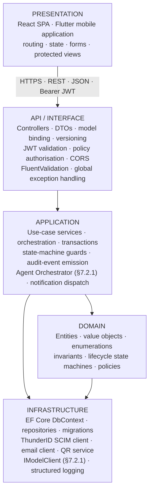
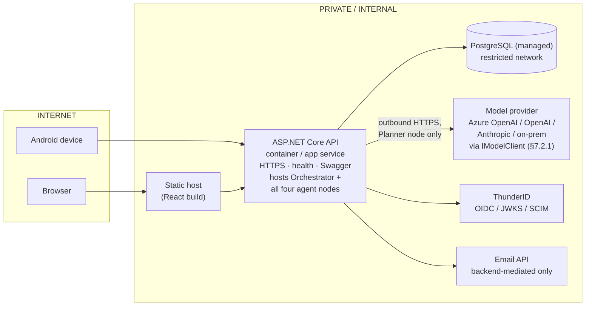

# 3. System Architecture

## 3.1 Architectural Overview

CoreGrid follows a layered, service-oriented architecture with a single authoritative backend. The arrangement is deliberately conventional: the value of the system lies in its domain model, its configurability and its controlled use of agents, not in architectural novelty, and a conventional structure is one that four engineers can each fully understand and defend.

Four architectural rules govern every design decision that follows. They are stated here once and are assumed throughout the remainder of this document.

| Rule | Statement | Consequence |
|---|---|---|
| AR-1 | The ASP.NET Core API is the only authoritative application layer. | Business rules, authorisation and validation exist in exactly one place. A rule cannot be satisfied on the web and bypassed on mobile. |
| AR-2 | Clients hold no privileged knowledge. | No client stores a database connection, an agent-service address or a third-party key. Compromise of a client cannot escalate beyond the permissions of the signed-in user. |
| AR-3 | Identity is external; authorisation is internal. | ThunderID establishes who the user is and which organisation they belong to. CoreGrid decides what they may do, using its own policy layer over the claims in the token. |
| AR-4 | The agent subsystem advises; the API decides. | No agent writes to the database. Every state change originates from an API endpoint executing a validated, authorised command. |

## 3.2 Logical Layering



Figure 2 — Logical layering of the ASP.NET Core backend. Dependencies point inward; the domain layer references nothing outside itself. The Agent Orchestrator and all four agent nodes (§7.2.1) live in the Application layer like any other use-case service; only the outbound model call crosses into Infrastructure, via `IModelClient`.

Dependency inversion is applied between the application and infrastructure layers: the application layer declares interfaces (`INotificationService`, `IAgentGateway`, `IQrCodeService`, `IIdentityDirectory`) and the infrastructure layer supplies implementations that are registered in the dependency-injection container at startup. This is what makes the email provider replaceable, the agent service mockable in tests, and the identity directory substitutable if the contingency in Section 4.10 is ever invoked.

## 3.3 Component Responsibilities

| Component | Responsibilities | Explicit non-responsibilities |
|---|---|---|
| React SPA | Administration and configuration; asset, maintenance, transfer and disposal management; audit dashboards and reporting; user and role administration; agentic workflow monitoring and the approve / reject / revise decision. | Does not perform QR scanning, does not capture field photographs, does not hold business rules beyond input validation for user feedback. |
| Flutter application | Field identification by QR scan; physical verification; fault reporting with photograph; task list execution; transfer confirmation; submission of an agentic evaluation request and display of its status. | Does not administer users, does not approve anything, does not orchestrate the agent workflow, does not produce analytics or reports. |
| ASP.NET Core API | Token validation; authorisation policy evaluation; request validation; execution of every business rule and state transition; persistence and transaction control; **hosts the Agent Orchestrator and all four agent nodes in-process** — sequences them in order, enforces per-node timeouts and retries (AI-06), runs the deterministic gate (§7.6), persists checkpoints and drives the human-approval interrupt (§7.7); calls out to the configured model provider through `IModelClient` only from the one node (Planner) whose criteria in §7.2.1 require it; agent workflow initiation, approval signalling and resumption; audit logging; third-party mediation. | Does not render user interface, does not hold user credentials. No agent node calls a business tool outside its own allow-list (§7.4), and the Orchestrator itself never calls a business tool or reasons about the asset — see §7.2.1. |
| PostgreSQL | Durable storage of configuration, business data, custom attribute values, workflow state and audit records; enforcement of referential integrity, uniqueness and check constraints; concurrency arbitration. | Contains no business logic in stored procedures or triggers other than integrity constraints; holds no passwords or tokens. |
| Model provider (via `IModelClient`) | An external LLM API (Azure OpenAI, OpenAI, Anthropic, or an on-prem/local model), selected by configuration per deployment. Called only by the Planner node, only with the sanitised, delimited objective text (AI-22), never with credentials, chain-of-thought or raw prompts persisted (AI-10, AI-26). | Is not a CoreGrid-operated service, never reached by any client directly, never holds business data, never decides a verdict — see §7.2.1. |
| ThunderID | Authentication of human users; organisation and user directory; role assignment; issuance and signing of OIDC tokens; session termination. | Does not authorise individual CoreGrid operations; holds no business data. |

## 3.4 The React / Flutter Responsibility Boundary

The assignment requires the web and mobile applications to serve meaningfully different purposes. CoreGrid draws that line along a single question: is the user at a desk making a decision, or standing in front of an asset recording a fact? React is the management and control centre; Flutter is the field operations application. The boundary is normative — it is a requirement, not a description — and any proposal to add a management capability to Flutter or a field capability to React must be raised as a scope change.

| Capability | React | Flutter |
|---|---|---|
| Sign in, sign out, session handling | Yes | Yes |
| Dashboard | Full analytics and KPIs | Task-focused summary |
| User and role administration | Yes | No |
| Department, location, category configuration | Yes | No |
| Asset type and custom attribute configuration | Yes | No |
| Asset creation and amendment | Full | Limited — condition and location only |
| Asset search and filtering | Advanced, server-side, exportable | Basic lookup and recent list |
| QR label generation and printing | Yes | No |
| QR scanning | No | Yes — signature capability |
| Physical verification of an asset | Review and manage results | Perform |
| Photographic evidence capture | View only | Capture and upload |
| Maintenance request creation | Yes | Yes |
| Maintenance assignment, costing, completion | Yes | Progress update only |
| Transfer request creation | Yes | Yes |
| Transfer approval | Yes | No |
| Transfer physical confirmation (scan on receipt) | No | Yes |
| Disposal request and approval | Yes | No |
| Verification campaign management | Yes | No |
| Discrepancy resolution | Yes | Raise only |
| Agentic workflow initiation | Yes | Yes |
| Agentic workflow monitoring detail | Full execution trace | Status and recommendation summary |
| Agentic approval decision | Yes | No |
| Reports and export | Yes | No |
| Notifications | In-app list | In-app list |

**Viva answer — why two clients?**

React is the management and control interface; Flutter is the field operations interface. They optimise different workflows for different users at different moments, but they consume the same ASP.NET Core API, the same identity, the same permission model and the same business rules. The mobile application exists because verification is a physical act performed away from a desk; the web application exists because approval and analysis are deliberative acts performed at one.

This table states which *capability* exists per client, not which *role* uses which client for it. Following this same principle, Auditor and Administrator — management/control roles with no field task — are web-console-only; Inventory Officer uses both clients (office and field work); Staff is mobile-only. FR-059, FR-067 and FR-069 record the resulting per-role client split explicitly where a capability's client differs by role.

### 3.4.1 Users by Role and Platform

| Role | Platform(s) | Why |
|---|---|---|
| Administrator | React only | Organisation/user/role administration, configuration, and workflow approval (FR-071/072) are deliberative, desk-based decisions with no field task. |
| Auditor | React only | Campaign management, discrepancy resolution and reporting (FR-056, FR-062, FR-065) are independent review work performed after the fact, not in front of the asset. |
| Inventory Officer | React and Flutter | The only role with both a desk task (transfer/maintenance management, evaluation initiation) and a field task (scanning, verification, transfer receipt) — spans both clients. |
| Staff | Flutter only | Ground-level field work — fault reporting and basic lookup (FR-024, FR-025, FR-033) — with no administrative capability and no need for the web console. |

Every role authenticates through the same identity provider regardless of platform (Section 4) — ThunderID's
`CoreGridUser` type is not itself scoped per role, so it cannot restrict *which client* a role may sign into.
The platform restriction above is therefore enforced by each client after sign-in, not by ThunderID: the
Flutter application checks the resolved role from `GET /api/me` and routes Auditor/Administrator to an
access-restricted screen instead of the dashboard (`coregrid-mobile/doc/MOBILE-SPECIFICATION.md` §4.1).

```
   USERS BY ROLE                          CLIENT(S)

   Administrator ─────────────────────────  React (web) only
   Auditor ────────────────────────────────  React (web) only
   Inventory Officer ─────────────┬────────  React (web)
                                   └────────  Flutter (mobile)
   Staff ──────────────────────────────────  Flutter (mobile) only

           │                                        │
           ▼                                        ▼
   ┌────────────────────┐                 ┌───────────────────────┐
   │      React SPA       │                 │  Flutter application  │
   │  Authorization Code  │                 │  Authorization Code   │
   │  + PKCE, hosted      │                 │  + PKCE, external     │
   │  login redirect      │                 │  user agent (RFC 8252)│
   └──────────┬────────────┘                 └───────────┬────────────┘
              │ 1. authorize + PKCE                       │ 1. authorize + PKCE
              ▼                                           ▼
   ┌─────────────────────────────────────────────────────────────┐
   │                          ThunderID                            │
   │   issues a JWT (sub, roles, email, given_name, family_name,   │
   │   scope, jti, …) — same claim contract for both clients        │
   │   (Section 4.4)                                                │
   └────────────────────────────┬────────────────────────────────┘
                                │ 2. Authorization: Bearer <token>
                                │    on every API call
                                ▼
                  ┌───────────────────────────────────┐
                  │           ASP.NET Core API           │
                  │  validate JWKS + issuer → resolve    │
                  │  `sub` against the local Users        │
                  │  mirror → role, OrganizationId         │
                  │  (Section 4.5) → evaluate policy       │
                  └────────────────────┬──────────────────┘
                                       │ 3. EF Core, OrganizationId-filtered
                                       ▼
                              ┌─────────────────┐
                              │   PostgreSQL      │
                              └─────────────────┘
```

Figure 10 — Role-to-platform integration. Both clients share one identity provider, one claim contract and
one API; only the Flutter client adds a fourth, client-side step — a role check against `GET /api/me` — to
enforce the platform restriction ThunderID itself has no mechanism to express.

## 3.5 The Configurable Platform Model

CoreGrid is specified as a platform rather than as a single-domain application. The distinction matters architecturally: a transport department and a hospital hold entirely different asset attributes, but they perform the same lifecycle operations — register, identify, maintain, transfer, verify, condemn, dispose. CoreGrid therefore fixes the lifecycle engine in code and expresses the domain in configuration.

```
                         COREGRID PLATFORM
                                │
           ┌────────────────────┴────────────────────┐
           │                                         │
     FIXED IN CODE                            CONFIGURED BY ADMIN
           │                                         │
   ┌───────┼────────┬──────────┐          ┌──────────┼──────────┬────────────┐
   │       │        │          │          │          │          │            │
 Identity Asset  Lifecycle  Agent      Departments Asset     Attribute   Organisation
 & access engine states     graph     & locations  types     definitions   policies
   │       │        │          │          │          │          │            │
   └───────┴────────┴──────────┘          └──────────┴──────────┴────────────┘
           │                                         │
           └────────────────────┬────────────────────┘
                                ▼
                    One deployment serves:
        Transport (Bus · Truck · Workshop equipment)
        Healthcare (MRI · Ventilator · Ambulance)
        Railway (Locomotive · Coach · Track equipment)
        — through configuration, without a new build
```

Figure 3 — Fixed engine, configured domain. Adding an asset domain requires configuration only.

Three levels of change are recognised, and the boundary between them is a security control as much as a design convenience.

| Level | What changes | Who may change it | Mechanism |
|---|---|---|---|
| Platform | Identity integration, API contract, database relationships, lifecycle state machines, the agent graph, security architecture, the audit engine. | CoreGrid engineering team only. | Source code, reviewed pull request, EF Core migration, release. |
| Organisation | Departments, locations, asset categories, asset types, custom attribute definitions, organisation policy thresholds, role assignment. | Administrator, within their own organisation. | React configuration screens; persisted as data; effective immediately. |
| Operational | Assets, maintenance records, transfers, disposals, verifications, workflow runs. | Inventory Officer, Department Staff, Auditor within permission. | React and Flutter business screens. |

What is deliberately not configurable is as important as what is. An administrator cannot redefine authentication, token handling, the API contract, database relationships, the agent execution engine, the audit mechanism or the security model. Permitting that would turn CoreGrid into a general-purpose low-code platform — an unbounded problem, and one whose security properties could not be reasoned about.

## 3.6 Technology Stack and Justification

| Layer | Selection | Justification |
|---|---|---|
| Backend | C# / ASP.NET Core 10 Web API | Mandated. Provides first-class dependency injection, a mature authentication and policy-based authorisation pipeline, minimal-API and controller options, and native OpenAPI generation. |
| ORM | Entity Framework Core with Npgsql | Mandated. Migrations give reviewable, version-controlled schema evolution; parameterised queries eliminate injection by construction; JSONB mapping supports custom attributes and workflow state. |
| Database | PostgreSQL 15+ | Mandated. ACID guarantees, rich constraint support, JSONB with GIN indexing for the configurable attribute model, and system-column optimistic concurrency for concurrent field verification. |
| Web client | React 18 with Vite, React Router, TanStack Query for server state and Zustand for client state | Mandated framework. The state split is deliberate: most CoreGrid web state is cached server data with caching, invalidation and background refresh needs that a query library solves directly, leaving only session and UI preference state for a lightweight store. Recorded in ADR-003. |
| Design system | IBM Carbon Design System (`@carbon/react`, `@carbon/icons-react`), IBM Plex Sans / IBM Plex Mono typography | Mandated. Carbon supplies a WCAG 2.1 AA–compliant, enterprise-grade component set — `Grid`/`Column`, `Header`, `Tile` / `ClickableTile`, `Tag`, `Button`, `StructuredList`, `InlineNotification`, `Theme` — so the React client is assembled from audited, accessible primitives rather than bespoke styling, which is what NFR-26 relies on. The White theme is used throughout, with the `g100` theme applied locally to the agentic-AI monitoring surface for visual separation of AI-generated content. Recorded in ADR-008. |
| Mobile client | Flutter 3 with Riverpod, go_router, flutter_secure_storage, mobile_scanner, image_picker | Mandated framework. Riverpod gives compile-time-safe dependency injection and testable providers without the boilerplate of event-driven alternatives; recorded in ADR-004. |
| Agentic AI | .NET-native, in-process, single deployable — the Agent Orchestrator (`AgentWorkflowService`) and all four agent nodes run inside the ASP.NET Core API (§7.2.1). Only the Planner node calls a model, through a provider-agnostic `IModelClient` abstraction (Azure OpenAI / OpenAI / Anthropic / on-prem, chosen by configuration); the other three nodes are pure C#. | LangGraph (Python) was originally selected because the assignment's acceptance criteria map directly onto its primitives: an explicit graph of distinct nodes, a typed shared state object, checkpointed persistence, conditional edges for validation-driven routing, and a first-class interrupt mechanism for human approval — none of which, it turned out, require a separate Python runtime or the node itself to call a model. Recorded in ADR-005; the decision below supersedes ADR-005's original Python-LangGraph scope, not its underlying primitives — the graph shape it describes is still exactly what `AgentWorkflowService` implements, in C#. The Policy Compliance Agent, built .NET-native with a deterministic rule engine standing in for the model call, is what exposed this: a graph node is just a typed function, and CoreGrid's M0 deployment model (§4.1, §19.10 — one instance per customer, sold on operational simplicity as much as capability) makes "fewest possible independently-deployed runtimes" the right default, not merely an acceptable one. Team decision as of 2026-09-15 (§7.2.1) is therefore a single deployable for the whole subsystem, with model access behind `IModelClient` so a customer's procurement policy — not the codebase — decides which model vendor is used, including an on-prem option for data-residency-constrained buyers. Planner genuinely needs the model (classifying and planning over free-text objectives) and is the only node that keeps one. This is a target architecture: the currently-built Planner and Budget Analysis implementations predate it and still run as standalone Python/LangGraph services (`planner-agent/`, `agent-service/`); migrating them in-process is tracked per-agent in `docs/progress.md`, on each owner's own schedule, not a rewrite mandated by this document. |
| Identity | ThunderID (OIDC / OAuth 2.0) | Removes credential storage from CoreGrid entirely and supplies standards-based tokens the API validates with published keys. Recorded in ADR-002. |
| CI | GitHub Actions | Mandated. Restores, builds and runs the backend test suite on every push and pull request to main, with additional jobs for the React build and Flutter analyse. |

## 3.7 Deployment View



Figure 4 — Deployment topology. Only the static host and the API are publicly addressable (solid internet-facing edges above); everything inside the private/internal boundary is reached only from the API. The API is the only backend deployable: it hosts the Agent Orchestrator and all four agent nodes in-process, and makes one outbound HTTPS call to the configured model provider only from the Planner node (§7.2.1) — there is no separate agent container to secure, patch or take an ingress rule for.

| Deployment requirement | Evidence to be produced |
|---|---|
| API deployed to a cloud platform with HTTPS. | Live base URL, `/health` returning 200 with dependency status, and `/swagger` rendering the full operation set. |
| PostgreSQL deployed with restricted credentials. | Migration output, connection restricted to the API, and documented initialisation and seeding instructions. |
| React deployed and configured against the deployed API. | Live URL, verified in a private browser session with the evaluation accounts. |
| Flutter release APK produced. | Installable APK plus installation instructions and the API base URL it targets. |
| Model provider configured for the API's in-process agent nodes; any agent node not yet migrated in-process (currently: Planner) deployed or documented for local execution separately. | `IModelClient` provider/API-key configuration for the API; for Planner specifically, container image or run instructions, environment variable list, model requirements and the required startup order until its in-process migration (§7.2.1) lands. |
| Evaluator access preserved. | All URLs, the repository and the demonstration video remain accessible for at least three weeks after submission. |
