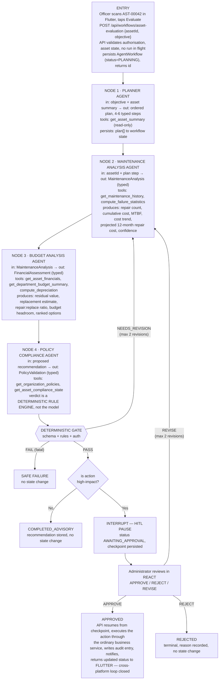
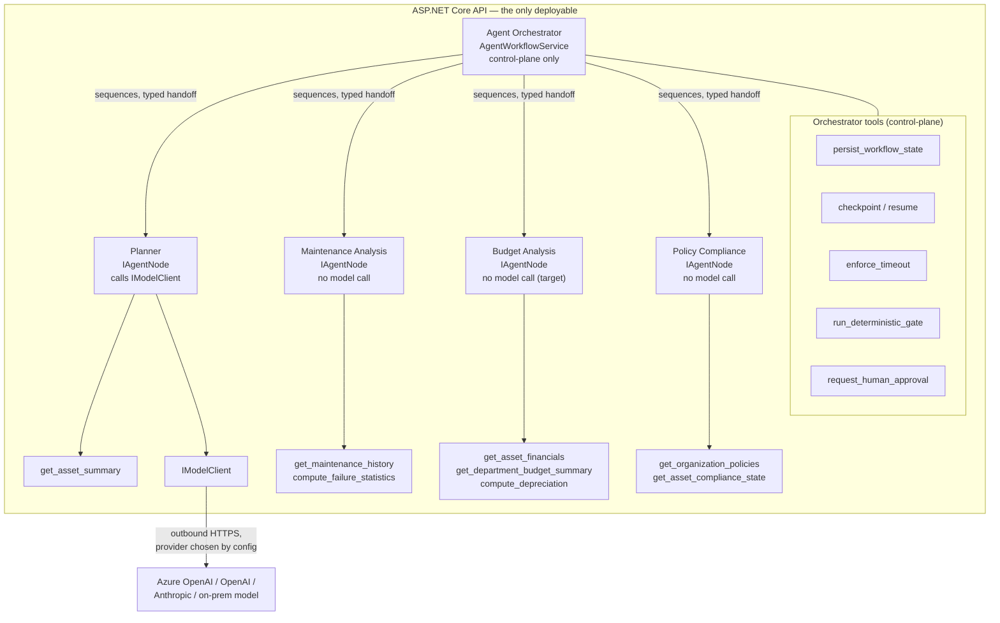

# 7. Agentic AI Subsystem Requirements

## 7.1 Purpose and Boundary

The agentic subsystem exists to answer one difficult, recurring question well: given everything the organisation knows about a particular asset, should it be repaired, replaced, transferred or disposed of — and does the answer comply with the organisation's own policy? Today that judgement is made inconsistently, by different people, with incomplete evidence, and it is rarely documented. CoreGrid's workflow assembles the evidence in a fixed sequence, produces a structured recommendation with its supporting factors, validates the recommendation against declarative rules, and then stops and asks a person.

The subsystem is deliberately not a chatbot, not a question-answering interface over documentation, and not a single-prompt summariser. It is a stateful graph with distinct nodes, controlled tools, durable state, deterministic validation and an interrupt for human approval — which is precisely what the assignment requires, and also what makes the output defensible to an auditor.

| The subsystem may | The subsystem may never |
|---|---|
| Read asset, maintenance, financial and policy data through allow-listed tools | Write, update or delete any business record |
| Produce a structured plan and delegate steps to specialised agents | Choose which tools exist or extend its own permissions |
| Compute projections, comparisons and cost analyses | Approve its own recommendation |
| Evaluate configured policy predicates and report the outcome | Invent, reinterpret or override an organisation policy |
| Recommend an action and explain the factors behind it | Execute a high-impact action without human approval |
| Record a safe, explicit failure | Fail silently or leave a partially applied change |

## 7.2 The Assessed Workflow — Asset Lifecycle Decision

One workflow is designated as the assessed workflow and satisfies every element of the assignment's minimum acceptance rule. It is initiated from either client, executes through the four agents, validates deterministically, pauses for approval, and returns an updated status to the user who started it.



Figure 8 — The assessed Asset Lifecycle Decision workflow, satisfying the minimum acceptance rule end to end.

## 7.2.1 Orchestrator, Agent Nodes, and When a Node May Call a Model

**Target architecture, decided 2026-09-15, superseding ADR-005's original "Python LangGraph" scope (appendix D):** the entire agent subsystem — the Orchestrator and all four agent nodes — runs in-process inside the single ASP.NET Core API deployable. There is no separate agent runtime, container or network hop. This follows directly from CoreGrid's M0 deployment model (§4.1, §19.10): one deployment per customer, so the fewer independently-deployed services a customer has to install, patch and secure, the better — an enterprise buyer's security review has one process boundary to evaluate, not several, and AI-21's "private network path" requirement becomes structurally true rather than something to configure.



Each agent's tool box is that agent's own allow-list (§7.4) — disjoint from every other agent's, and never touched by the Orchestrator directly.

**The Orchestrator** is `AgentWorkflowService`. It owns the `AgentWorkflow` row, sequences the four nodes in order, enforces the per-tool timeout and retry budget (AI-06) and the overall 120-second budget (AI-25), runs the three-stage deterministic gate (§7.6), persists every checkpoint (AI-08/AI-09) and drives the human-approval interrupt (§7.7). It holds a small set of its own tools, and they are control-plane only — it never holds a business tool and never reasons about the asset itself:

| Orchestrator tool | Purpose |
|---|---|
| `persist_workflow_state` | Write the current `AgentWorkflow`/`AgentExecutionStep` row |
| `checkpoint` / `resume` | AI-09 — resume a paused workflow without re-executing completed steps |
| `enforce_timeout` | AI-06, AI-25 — per-tool and per-workflow deadlines |
| `run_deterministic_gate` | §7.6 — schema, business-rule and authorisation stages |
| `request_human_approval` | AI-13 — raise the AWAITING_APPROVAL interrupt |

**The four agents** (§7.3) are the Orchestrator's workers, each implementing a common `IAgentNode<TIn, TOut>` contract (one typed input, one typed output — exactly the contracts already in §7.3's table). Each holds its own disjoint allow-list of *business* tools (§7.4) that the Orchestrator itself never touches directly. A node's own reasoning step may or may not call a model; that's a property of the node, decided by the criteria below, not a property of "being an agent" — nothing about the pattern requires a model call, and a node that doesn't need one is just a typed method.

**`IModelClient` — the only place a model call is made.** A node that needs one calls a single abstraction, not a provider SDK directly:

```
IModelClient.CompleteAsync<TOut>(ModelRequest request, CancellationToken ct) : Task<TOut>
```

The concrete provider — Azure OpenAI, OpenAI, Anthropic, or an on-prem/local model for a data-residency-constrained customer — is selected by configuration per deployment, never hardcoded into a node. This is what makes "which model vendor" a deployment decision for a customer's procurement team, not an engineering decision baked into the product, and it is the direct extension of the "provider-agnostic model call" principle already used for the Budget Analysis Agent (§7.3).

**When a node may call a model.** A node calls one only when all four hold; if any fails, it must be deterministic:

1. **Unstructured input** — the node has to interpret free text or another genuinely open-ended signal a fixed predicate can't parse (an objective typed by a human, not a set of typed fields).
2. **Unenumerable output space** — the decision can't be written as `if <field> <operator> <threshold> then <outcome>` over the node's own input contract. If it can, write that rule instead; it is faster, free, reproducible and directly satisfies AI-12 (a reviewer must be able to reconstruct *why* from the persisted artefacts, not from a model's mood on the day) — and, commercially, every rule-based node is one fewer inference call in the product's cost of goods sold.
3. **Advisory, not compliance-or-irreversible** — the node's output is never itself the verdict that permits a high-impact action. This is the existing rationale in §7.3 ("Why the Policy Agent does not decide"), generalised: nothing that gates an irreversible action may originate from a probabilistic call.
4. **Non-determinism is acceptable for that specific output** — reviewers can tolerate two runs producing differently-phrased-but-equivalent output; they cannot tolerate two runs producing different *recommendations* from identical facts.

Applied to the four agents:

| Agent | Calls `IModelClient`? | Why |
|---|---|---|
| Planner | Yes | Free-text objective (criterion 1), plan shape isn't enumerable from a handful of predicates (2), output is advisory — a rejected/accepted plan, never an executed action (3) |
| Maintenance Analysis | No | Repair count, MTBF, cost trend and 12-month projection are closed-form statistics over typed maintenance records — criterion 2 fails, so a model would add cost, latency, non-reproducibility and per-run inference spend for zero benefit. Same shape as Policy Compliance. |
| Budget Analysis | No, target design — presently yes in the existing implementation | Residual value, replacement estimate, ratio and headroom are arithmetic (criterion 2 fails); the one generative part — rationale text on each ranked option — doesn't decide anything, it explains numbers already computed deterministically, so it can be templated instead of modelled. Target design moves this node in-process with the other three; the currently-built implementation (§7.3) predates this decision and is migrated on its own owner's schedule, not rewritten by this document. |
| Policy Compliance | No | The verdict gates a potentially irreversible action — criterion 3 forbids a model outright, independent of how enumerable the rules are. |

Under the target design, only **one** agent — Planner — calls a model at all. That is not a compromise; it is the criteria applied honestly, and it is also the cheapest and easiest-to-audit shape the subsystem could take while still satisfying the assignment's requirement for a genuine agentic reasoning step (§7.11).

## 7.3 Agent Specifications

An agent counts as distinct only where it has an identifiable responsibility, a defined input and output contract, controlled tool permissions and visible participation in the workflow. The four agents below satisfy that test: each consumes a different input, produces a different typed artefact, holds a different tool allow-list, and appears as a separate node with its own recorded execution in the workflow trace. None is a renamed copy of another.

| Agent | Owner | Target implementation (§7.2.1) | Current implementation | Responsibility | Input contract | Output contract | Allow-listed tools |
|---|---|---|---|---|---|---|---|
| Planner Agent | Student 1 | `IAgentNode` in-process in the API, calling `IModelClient` | Python/FastAPI/LangGraph standalone service, called by the Orchestrator over HTTP (`PlannerAgentClient`) — built and wired before this target was set; migration to in-process is tracked in `docs/progress.md`, not yet done | Interpret the objective, confirm it is in scope, and produce an ordered, typed plan naming which agent executes each step. Rejects out-of-scope objectives before any analysis is performed. | `EvaluationObjective { assetId, objectiveText, initiatedBy, organizationId }` | `ExecutionPlan { steps[]: { seq, agent, purpose, expectedOutput }, inScope, rejectionReason? }` | `get_asset_summary` |
| Maintenance Analysis Agent | Student 2 | `IAgentNode` in-process in the API, no `IModelClient` call — closed-form statistics, same shape as Policy Compliance | Not started | Quantify the asset's maintenance behaviour: how often it fails, what it has cost, whether the trend is worsening, and what the next twelve months are likely to cost. | `MaintenanceAnalysisRequest { assetId, windowMonths }` | `MaintenanceAnalysis { repairCount, cumulativeCost, meanTimeBetweenFailuresDays, costTrend, projectedAnnualCost, dataQuality, confidence }` | `get_maintenance_history`, `compute_failure_statistics` |
| Budget Analysis Agent | Student 3 | `IAgentNode` in-process in the API; deterministic computation, with rationale text templated rather than modelled | Python/LangGraph standalone service (`agent-service/`), built and unit-tested, model call used for option-rationale text; not yet wired into the Orchestrator; migration to in-process is its owner's call | Convert the maintenance picture into a financial comparison: residual value against projected repair cost against replacement cost, within the department's budget reality, and rank the options. | `FinancialAssessmentRequest { assetId, maintenanceAnalysis }` | `FinancialAssessment { residualValue, replacementEstimate, repairToReplaceRatio, budgetHeadroom, rankedOptions[]: { action, score, rationale }, proposedRecommendation }` | `get_asset_financials`, `get_department_budget_summary`, `compute_depreciation` |
| Policy Compliance Agent | Student 4 | `IAgentNode` in-process in the API, no `IModelClient` call — deterministic rule engine | Matches target already — built in-process, deterministic | Establish whether the proposed recommendation is permitted by the organisation's configured policy and by the asset's compliance state. Assembles the facts; the verdict itself is computed deterministically. | `PolicyValidationRequest { assetId, proposedRecommendation, financialAssessment }` | `PolicyValidation { verdict: PASS \| FAIL \| NEEDS_REVISION, ruleResults[]: { ruleId, expected, actual, outcome }, blockingReasons[], isHighImpact }` | `get_organization_policies`, `get_asset_compliance_state` |

**Why the Policy Agent does not decide**

The Policy Compliance Agent gathers policy parameters and compliance facts, but the PASS / FAIL / NEEDS_REVISION verdict is produced by a rule engine evaluating declarative predicates against those facts. A language model is probabilistic; a statement about whether an organisation's policy permits an irreversible action must not be. This separation is what allows the group to claim, and demonstrate, that the same inputs always produce the same verdict — and it is the answer to the viva question about trusting an LLM with a compliance decision.

## 7.4 Tool Allow-List

Tools are the only mechanism by which an agent may reach system data, and every tool is read-only with a JSON-schema-validated request and response, regardless of how it's invoked. Under the target architecture (§7.2.1) a node calls its tools in-process, and the allow-list is enforced at dependency-injection registration — a node's constructor only accepts the tool-service interfaces its row in §7.3 lists, so an out-of-allow-list call is a compile error, not a runtime one. For any agent still running out-of-process (§7.3's "current implementation" column), the same tools are exposed as `/api/agent-tools/*` endpoints, authenticated as the agent service principal, with a call outside that agent's allow-list rejected by the gateway before it reaches business logic. Both paths produce the identical audit record (AI-07).

| Tool | Available to | Input schema (summary) | Returns | Side effects |
|---|---|---|---|---|
| `get_asset_summary` | Planner | `assetId (uuid)`, `organizationId (uuid)` | Code, name, type, category, status, condition, department, location, acquisition date and cost. | None |
| `get_maintenance_history` | Maintenance | `assetId`, `windowMonths (1–120)` | Completed maintenance records with dates, classification, actual cost and resulting condition. | None |
| `compute_failure_statistics` | Maintenance | `records[] (typed)` | Repair count, mean time between failures, cost trend coefficient, projected annual cost. | None — pure computation |
| `get_asset_financials` | Budget | `assetId` | Acquisition cost, accumulated depreciation, residual value, cumulative maintenance cost, replacement estimate for the asset type. | None |
| `get_department_budget_summary` | Budget | `departmentId`, `fiscalYear` | Allocated maintenance budget, committed and remaining amounts. | None |
| `compute_depreciation` | Budget | `acquisitionCost`, `acquisitionDate`, `usefulLifeYears` | Straight-line residual value at the current date. | None — pure computation |
| `get_organization_policies` | Policy | `organizationId`, `assetTypeId` | Configured thresholds and predicates: repair-to-replace ratio limit, minimum service life, maximum failure frequency, valuation requirement. | None |
| `get_asset_compliance_state` | Policy | `assetId` | Condemnation status, valuation presence and date, open maintenance and transfer counts, elapsed service life. | None |

| ID | Tool control requirement | Priority |
|---|---|---|
| AI-01 | Every tool input shall be validated against its JSON schema before dispatch; an invalid input shall be rejected without invoking the tool and shall be recorded as a tool error. | Must |
| AI-02 | Every tool output shall be validated against its response schema; an output failing validation shall be treated as a tool failure and shall not enter agent state. | Must |
| AI-03 | A tool invocation by an agent that does not hold it in its allow-list shall be refused and recorded as a security event. | Must |
| AI-04 | Tools shall be read-only; no tool shall exist that creates, updates or deletes business data. | Must |
| AI-05 | Every tool call shall be scoped to the organisation of the initiating user, taken from the persisted workflow state and never from agent-generated content. | Must |
| AI-06 | Each tool call shall be subject to a 15-second timeout and at most two retries with exponential backoff; exhaustion routes the workflow to safe failure. | Must |
| AI-07 | Each tool call shall be recorded with tool name, calling agent, input hash, outcome, duration and retry count. | Must |

## 7.5 Workflow State Persistence

Workflow state is durable, structured and inspectable. It is held in PostgreSQL — the plan, results and validation outcomes in JSONB columns for flexibility, and the queryable facts in typed columns so that dashboards and reports do not have to parse JSON.

```
  AgentWorkflows
    Id                uuid        PK
    OrganizationId    uuid        FK, indexed, global query filter
    AssetId           uuid        FK, indexed
    Objective         text        the user-supplied objective
    Status            enum        PLANNING | ANALYZING | VALIDATING |
                                  AWAITING_APPROVAL | APPROVED | REJECTED |
                                  COMPLETED_ADVISORY | REVISION_REQUESTED |
                                  FAILED_SAFE
    Plan              jsonb       ordered typed steps from the Planner
    AgentOutputs      jsonb       keyed by agent: the typed artefact each produced
    ToolCalls         jsonb       name, agent, outcome, duration, retries
    ValidationResult  jsonb       verdict + per-rule expected/actual/outcome
    Recommendation    varchar     REPAIR | REPLACE | TRANSFER | DISPOSE | RETAIN
    IsHighImpact      boolean     drives the approval interrupt
    ApprovalStatus    enum        NOT_REQUIRED | PENDING | APPROVED | REJECTED
    RevisionCount     int         capped at 2
    FailureReason     text        populated only on FAILED_SAFE
    CorrelationId     varchar     links API logs, agent logs and audit entries
    InitiatedByUserId uuid        FK
    StartedAt / CompletedAt / CreatedAt / UpdatedAt

  AgentExecutionSteps   one row per node execution: agent, sequence,
                        input hash, output summary, duration, status, error
  AgentApprovals        decision, decider, reason, decided-at, workflow snapshot
```

| ID | State requirement | Priority |
|---|---|---|
| AI-08 | The workflow identifier, objective, plan, completed steps, tool results, validation results, errors, approval status and final outcome shall be persisted durably and shall survive a restart of the agent service. | Must |
| AI-09 | A paused workflow shall be resumable from its persisted checkpoint without re-executing completed steps. | Must |
| AI-10 | Chain-of-thought, raw prompts, raw model responses, credentials and tokens shall not be persisted. Only structured artefacts and summaries are stored. | Must |
| AI-11 | Workflow state shall be scoped to the initiating organisation and shall be subject to the same global query filter as business data. | Must |
| AI-12 | The execution trace shall be sufficient to reconstruct why a recommendation was made, from the persisted artefacts alone. | Must |

## 7.6 Deterministic Validation

Between the agents' analysis and any consequence there is a deterministic gate. It runs in three stages, and a failure at any stage prevents progression.

| Stage | Check | Failure behaviour |
|---|---|---|
| 1 — Schema | Every agent artefact conforms to its declared output contract: required fields present, types correct, enumerations within range, numeric values non-negative and finite. | Fatal. Workflow terminates as FAILED_SAFE with the offending field named. No state change. |
| 2 — Business rules | The declarative rule set below is evaluated against the collected facts. | FAIL blocks the recommendation; NEEDS_REVISION returns the workflow to analysis with the failing rules as context. |
| 3 — Authorisation | The recommended action is one the initiating user could have performed manually, and the asset is in a state that permits it. | Fatal. Recorded as a security event and terminated as FAILED_SAFE. |

| Rule | Predicate | Outcome when violated |
|---|---|---|
| PR-01 | A DISPOSE recommendation requires the asset condition to be Poor or Unserviceable. | FAIL — blocking reason recorded |
| PR-02 | A DISPOSE recommendation requires elapsed service life ≥ the minimum configured for the asset type. | FAIL |
| PR-03 | A DISPOSE recommendation requires a recorded valuation with a date within the configured validity window. | NEEDS_REVISION — valuation can be obtained |
| PR-04 | A REPLACE recommendation requires repair-to-replace ratio ≥ the organisation threshold. | NEEDS_REVISION |
| PR-05 | A REPAIR recommendation requires projected repair cost ≤ available departmental budget headroom. | NEEDS_REVISION |
| PR-06 | No recommendation may be produced for an asset in a terminal state. | FAIL — fatal |
| PR-07 | No recommendation may be produced where an open maintenance or transfer record exists. | NEEDS_REVISION |
| PR-08 | Confidence below the configured floor requires human review regardless of the recommended action. | Forces `IsHighImpact = true` |
| PR-09 | DISPOSE is always high-impact and always requires approval. | n/a — sets the interrupt |

Every rule evaluation is recorded with its identifier, the expected condition, the actual value and the outcome, so that a reviewer sees not merely that validation passed but exactly what was checked and against what.

## 7.7 Human Approval Checkpoint

| ID | Requirement | Priority |
|---|---|---|
| AI-13 | A workflow whose validated recommendation is high-impact shall interrupt before any consequence, persist a checkpoint and set its status to AWAITING_APPROVAL. | Must |
| AI-14 | Only a user holding `workflow:approve` — the Administrator role — may decide a paused workflow. Any other caller receives 403. | Must |
| AI-15 | The approval interface shall present the objective, the plan, each agent's findings, the recommendation, the supporting factors and the complete rule-by-rule validation result before the decision controls. | Must |
| AI-16 | A decision shall require a recorded reason of at least 10 characters, and shall be captured with the decider, the timestamp and a snapshot of the workflow state at the moment of decision. | Must |
| AI-17 | On approval, the API — not the agent service — shall execute the authorised action through the ordinary business service, applying the identical validation, state guards and audit logging as a manual action. | Must |
| AI-18 | A paused workflow shall change no business state; the asset shall remain fully operable through ordinary interfaces while a workflow awaits approval. | Must |
| AI-19 | A workflow awaiting approval for longer than a configurable period shall be surfaced on the administrator dashboard as overdue. | Should |
| AI-20 | Revision shall be capped at two cycles, after which the workflow terminates as REVISION_REQUESTED for manual handling. | Must |

## 7.8 Observability

- Every workflow exposes an execution summary containing the objective, the plan, each agent execution with duration and status, every tool call with its outcome and timing, the full validation result, the recommendation, the approval decision and the final outcome.
- Every log entry emitted by the agent service carries the workflow identifier and the correlation identifier of the originating request, so that a single user action can be followed from the Flutter tap through the API, the agent graph, each tool call and back to the React approval screen.
- Timings are recorded per node and per tool call, supporting the agent-latency measurements required by the performance test in Section 13.5.
- Errors, retries and their outcomes are recorded as first-class state rather than only as log lines, so that failure analysis does not depend on log retention.
- Safe failures are visible in the React workflow list with their reason, and are distinguishable at a glance from rejected and completed workflows.

## 7.9 Agent Security Requirements

| ID | Requirement | Priority |
|---|---|---|
| AI-21 | The agent service shall not be reachable from the public internet; it shall accept requests only over the private network path from the API, authenticated by a shared secret supplied through environment configuration. | Must |
| AI-22 | User-supplied objective text shall be treated as data, never as instruction. It shall be length-limited, sanitised of control characters and delimited within the prompt, and the system prompt shall instruct the model to ignore instructions appearing inside it. | Must |
| AI-23 | Agent output shall never determine which tool exists, which organisation is queried or which user is acting; those are taken exclusively from persisted workflow state. | Must |
| AI-24 | A prompt-injection attempt — an objective containing instruction-like content attempting to alter tool use, scope or approval — shall be resisted, recorded as a security event, and shall not change the workflow's tool permissions or organisation scope. This is covered by a dedicated golden case. | Must |
| AI-25 | Total workflow execution shall be bounded by a 120-second timeout; exceeding it terminates the workflow as FAILED_SAFE. | Must |
| AI-26 | Model API credentials shall be held only in the agent service environment and shall never be transmitted to a client, recorded in state or written to a log. | Must |
| AI-27 | Workflow initiation shall be rate-limited per user and per organisation to prevent cost exhaustion. | Should |
| AI-28 | The agent service principal shall hold read-only tool permissions and no business permission whatsoever, verified by an automated authorisation test. | Must |

## 7.10 Safe Failure

The system's behaviour when the agentic subsystem fails is as much a requirement as its behaviour when it succeeds. Every failure mode below terminates in a recorded state, changes no business data and leaves the asset fully manageable through ordinary interfaces.

| Failure mode | Detection | Terminal state and recorded outcome |
|---|---|---|
| Agent service unreachable | HTTP connection failure at initiation. | Initiation returns 503; no workflow record is created; the user is told the evaluation service is unavailable and may retry. |
| Model provider error or rate limit | Non-success response after two retries. | FAILED_SAFE with reason MODEL_UNAVAILABLE; steps completed so far are retained for inspection. |
| Tool timeout or repeated tool failure | Timeout or two consecutive failures on one tool. | FAILED_SAFE with reason TOOL_FAILURE and the tool named. |
| Agent output fails schema validation | Stage 1 of the deterministic gate. | FAILED_SAFE with reason SCHEMA_VIOLATION and the offending field named. |
| Insufficient data to analyse | Maintenance Analysis reports `dataQuality INSUFFICIENT`. | COMPLETED_ADVISORY with recommendation RETAIN and an explicit statement that evidence was inadequate. No approval is requested. |
| Policy validation fatal failure | Stage 2 returns FAIL on a fatal rule. | FAILED_SAFE with the blocking rule identifiers recorded. |
| Revision limit exhausted | Third revision attempt. | REVISION_REQUESTED terminal state, flagged for manual handling. |
| Overall timeout | 120-second budget exceeded. | FAILED_SAFE with reason TIMEOUT and the last completed step recorded. |
| Approval never given | No decision within the configured period. | Remains AWAITING_APPROVAL and is surfaced as overdue; it never expires into an action. |

## 7.11 Mapping to the Assignment's Minimum Acceptance Rule

| Required element (SE3090 §9.1) | Where satisfied | Demonstrable evidence |
|---|---|---|
| Receives a domain objective | FR-067; workflow entry | Officer initiates the evaluation from Flutter with a stated objective. |
| Creates a structured multi-step plan | Planner Agent, §7.3 | Plan array persisted in `AgentWorkflows.Plan` and rendered in the React execution summary. |
| Delegates steps to distinct agent roles | §7.3, four agents with different contracts and tool sets | `AgentExecutionSteps` shows four separate executions with different inputs, outputs and tools. |
| Calls allow-listed tools with validated inputs and structured outputs | §7.4, AI-01 to AI-07 | `ToolCalls` trace; negative test showing an out-of-allow-list call refused. |
| Persists workflow state | §7.5, AI-08 to AI-12 | Database inspection during the demonstration; resumption after restart. |
| Applies deterministic checks | §7.6, three-stage gate and rules PR-01 to PR-09 | `ValidationResult` showing every rule with expected, actual and outcome. |
| Pauses a high-impact action for authorised approval | §7.7, AI-13 to AI-20; FR-071, FR-072 | AWAITING_APPROVAL state; Administrator decides in React; non-administrator receives 403. |
| Produces an auditable result or a safe recorded failure | §7.8, §7.10 | Execution summary for the success path; FAILED_SAFE golden cases for the failure paths. |
| Cross-platform end-to-end journey | FR-067 to FR-076 | Flutter initiates → API → PostgreSQL → agents → React approval → API executes → Flutter shows updated status. |
